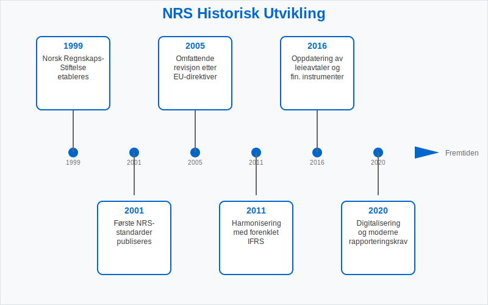
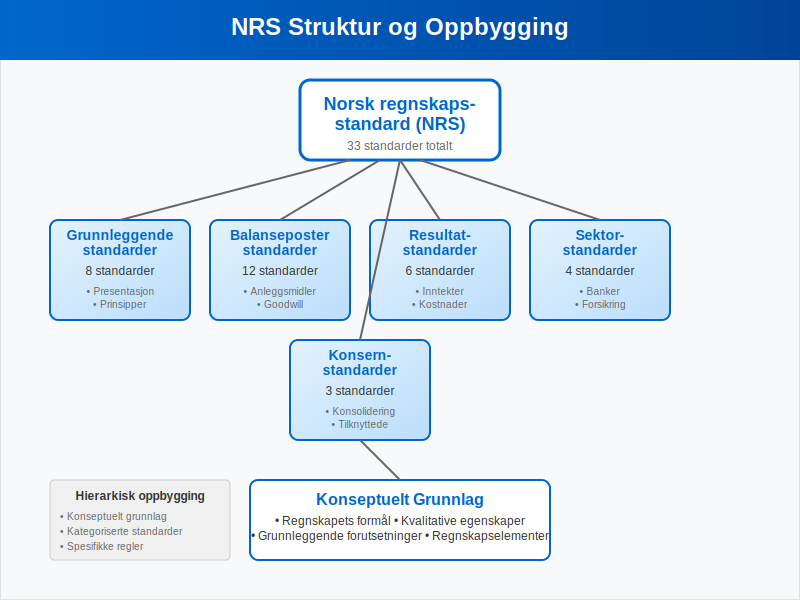
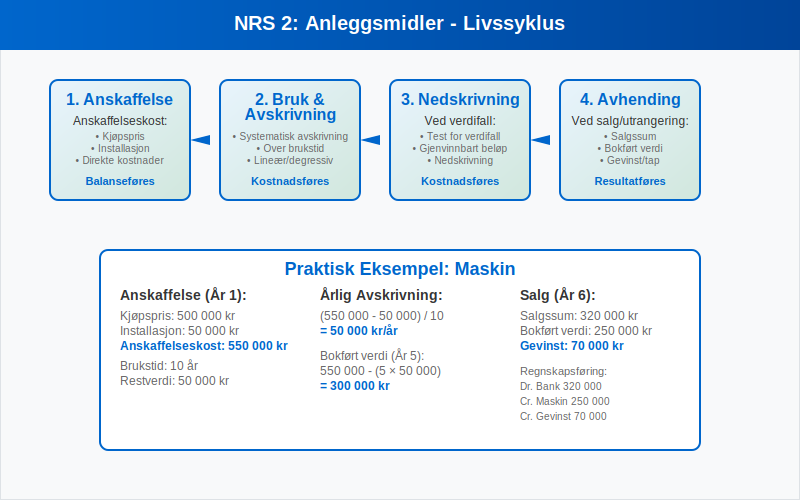
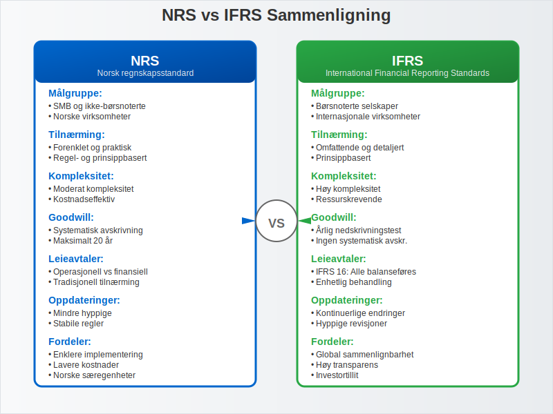
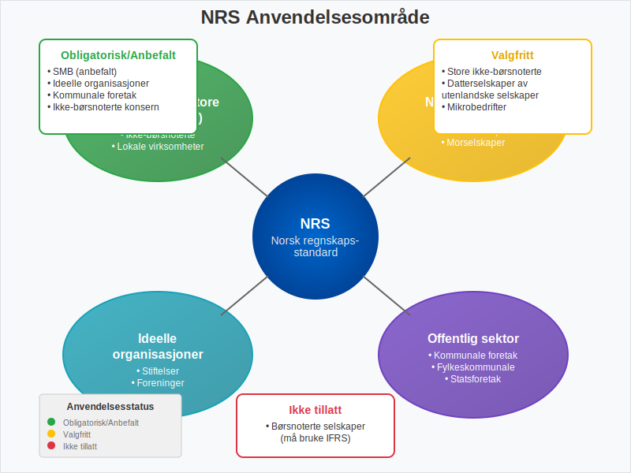
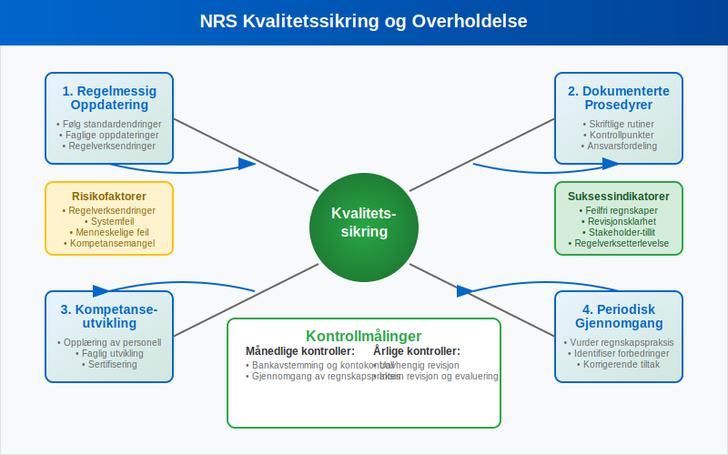

**Norsk regnskapsstandard (NRS)** er det nasjonale rammeverket for regnskapsføring i Norge, utviklet spesielt for norske virksomheter som ikke er pålagt å følge [IFRS](/blogs/regnskap/hva-er-ifrs "Hva er IFRS? Komplett Guide til International Financial Reporting Standards"). NRS representerer en balanse mellom internasjonale regnskapsprinsipper og norske særegenheter, og sikrer at norske bedrifter kan føre [regnskap](/blogs/regnskap/hva-er-regnskap "Hva er Regnskap? En Dybdeanalyse for Norge") som både oppfyller nasjonale krav og gir sammenlignbar finansiell informasjon.

Standardene er utviklet av Norsk RegnskapsStiftelse (NRS) i samarbeid med regnskapsmiljøet og bygger på [god regnskapsskikk](/blogs/regnskap/god-regnskapsskikk "God Regnskapsskikk - Prinsipper, Standarder og Beste Praksis i Norge") og internasjonale beste praksis. For de fleste norske virksomheter utgjør NRS det primære regelverket for [bokføring](/blogs/regnskap/hva-er-bokforing "Hva er Bokføring? En Komplett Guide til Norsk Bokføringspraksis") og regnskapsrapportering.

## Historisk Utvikling og Bakgrunn

Norsk regnskapsstandard har sin opprinnelse i behovet for å modernisere og harmonisere norsk regnskapspraksis med internasjonale standarder, samtidig som man beholdt tilpasninger til norske forhold.

### Viktige Milepæler i NRS-utviklingen

* **1999**: Norsk RegnskapsStiftelse etableres
* **2001**: Første NRS-standarder publiseres
* **2005**: Omfattende revisjon etter EU-direktiver
* **2011**: Harmonisering med forenklet IFRS
* **2016**: Oppdatering av leieavtaler og finansielle instrumenter
* **2020**: Digitalisering og moderne rapporteringskrav

### Formål og Målsetting

NRS har som hovedformål å:

* **Sikre kvalitet** i norsk regnskapsrapportering
* **Redusere kompleksitet** sammenlignet med full IFRS
* **Bevare norske særegenheter** i regnskapsføring
* **Fremme sammenlignbarhet** mellom norske virksomheter
* **Støtte små og mellomstore bedrifter** med praktiske løsninger

## NRS' Struktur og Oppbygging

Norsk regnskapsstandard er organisert som et helhetlig system av standarder som dekker alle vesentlige områder av regnskapsføring.

### Standardkategorier

| Kategori | Beskrivelse | Antall Standarder |
|----------|-------------|-------------------|
| **Grunnleggende standarder** | Fundamentale prinsipper og rammeverk | 8 standarder |
| **Balansepoststandader** | Spesifikke regler for [balanse](/blogs/regnskap/hva-er-balanse "Hva er Balanse i Regnskap? Komplett Guide til Balansens Oppbygging og Funksjon")poster | 12 standarder |
| **Resultatstandarder** | Inntekts- og kostnadsføring | 6 standarder |
| **Sektorstandarder** | Bransjespesifikke regler | 4 standarder |
| **Konsernstandarder** | [Konsern](/blogs/regnskap/hva-er-konsern "Hva er Konsern? Komplett Guide til Konsernregnskap og Konsernstruktur")regnskap | 3 standarder |

### Det Konseptuelle Grunnlaget

NRS bygger på et konseptuelt grunnlag som definerer:

* **Regnskapets formål** - Gi beslutningsnyttig informasjon
* **Kvalitative egenskaper** - Relevans, pålitelighet og sammenlignbarhet
* **Grunnleggende forutsetninger** - Periodisering og fortsatt drift
* **Regnskapselementer** - [Aktiva](/blogs/regnskap/hva-er-aktiva "Hva er Aktiva? En Komplett Guide til Eiendeler i Regnskap"), gjeld, [egenkapital](/blogs/regnskap/hva-er-egenkapital "Hva er Egenkapital? Komplett Guide til Egenkapital i Regnskap"), inntekter og kostnader

## Sentrale NRS-Standarder

### NRS 1: Presentasjon av Regnskapet

Denne grunnleggende standarden etablerer krav til:

* **Regnskapsoppstilling** - Format og innhold
* **Sammenligningstall** - Krav til foregående år
* **Noteopplysninger** - Minimumskrav til tilleggsinformasjon
* **Konsistens** - Ensartet presentasjon over tid

### NRS 2: Anleggsmidler

NRS 2 dekker regnskapsføring av [anleggsmidler](/blogs/regnskap/hva-er-anleggsmidler "Hva er Anleggsmidler? Komplett Guide til Anleggsmidler i Regnskap") og omfatter:

* **Anskaffelseskost** - Hva som skal inkluderes i [anskaffelseskost](/blogs/regnskap/hva-er-anskaffelseskost "Hva er Anskaffelseskost? Komplett Guide til Anskaffelseskost i Regnskap")
* **Avskrivninger** - Systematisk [avskrivning](/blogs/regnskap/hva-er-avskrivning "Hva er Avskrivning? Komplett Guide til Avskrivninger i Regnskap") over brukstid
* **Nedskrivninger** - Test for verdifall
* **Avhending** - Regnskapsføring ved salg eller utrangering

### NRS 8: Goodwill og Andre Immaterielle Eiendeler

Denne standarden regulerer [immaterielle eiendeler](/blogs/regnskap/hva-er-imaterielle-eiendeler "Hva er Immaterielle Eiendeler? Komplett Guide til Immaterielle Eiendeler i Regnskap"):

* **[Goodwill](/blogs/regnskap/hva-er-goodwill "Hva er Goodwill? Komplett Guide til Goodwill i Regnskap")** - Systematisk avskrivning over maksimalt 20 år
* **Utviklingskostnader** - Strenge kriterier for [aktivering](/blogs/regnskap/hva-er-aktivering "Hva er Aktivering i Regnskap?")
* **Patenter og lisenser** - Avskrivning over juridisk eller økonomisk levetid
* **Varemerker** - Vurdering av verdi og levetid

### NRS 13: Leieavtaler

NRS 13 gir regler for regnskapsføring av leieavtaler:

| Type Leieavtale | Regnskapsføring Leietaker | Regnskapsføring Utleier |
|-----------------|---------------------------|-------------------------|
| **Operasjonell leie** | Kostnadsføring av leie | Inntektsføring av leie |
| **Finansiell leie** | Balanseføring av eiendel | Fordring på leietaker |
| **Sale and leaseback** | Spesielle regler | Kjøp og utleie |

### NRS 15A: Pensjonskostnader

Denne standarden dekker regnskapsføring av pensjonsforpliktelser:

* **Innskuddsbaserte ordninger** - Kostnadsføring av innbetalinger
* **Ytelsesbaserte ordninger** - Aktuarmessig beregning av forpliktelser
* **Premieavvik** - Periodisering over gjennomsnittlig opptjeningstid
* **Estimatavvik** - Behandling av aktuarmessige gevinster og tap

## NRS vs. IFRS - Hovedforskjeller

### Sammenligning av Tilnærminger

| Aspekt | NRS | [IFRS](/blogs/regnskap/hva-er-ifrs "Hva er IFRS? Komplett Guide til International Financial Reporting Standards") |
|--------|-----|------|
| **Kompleksitet** | Forenklet | Omfattende |
| **Målgruppe** | SMB og nasjonale selskaper | Internasjonale og børsnoterte |
| **Fleksibilitet** | Moderat | Høy |
| **Detaljnivå** | Praktisk orientert | Prinsippbasert |
| **Oppdateringsfrekvens** | Mindre hyppig | Kontinuerlig |

### Spesifikke Forskjeller

**Goodwill og Immaterielle Eiendeler:**
* **NRS**: Systematisk avskrivning av goodwill over maksimalt 20 år
* **IFRS**: Årlig nedskrivningstest uten systematisk avskrivning

**Leieavtaler:**
* **NRS**: Skiller mellom operasjonelle og finansielle leieavtaler
* **IFRS 16**: Alle vesentlige leieavtaler balanseføres

**Finansielle Instrumenter:**
* **NRS**: Forenklet tilnærming med fokus på anskaffelseskost
* **IFRS 9**: Kompleks klassifisering basert på forretningsmodell

**Inntektsføring:**
* **NRS**: Tradisjonell tilnærming basert på risiko og kontroll
* **IFRS 15**: Femtrinns modell basert på ytelsesforpliktelser

## Anvendelsesområde og Målgrupper

### Hvem Bruker NRS?

NRS er primært utviklet for:

* **Små og mellomstore bedrifter** som ikke er børsnoterte
* **Datterselskaper** av utenlandske selskaper (valgfritt)
* **Norske konsern** som ikke er pålagt IFRS
* **Ideelle organisasjoner** og stiftelser
* **Kommunale og fylkeskommunale foretak**

### Frivillig vs. Obligatorisk Anvendelse

| Virksomhetstype | NRS Status | Alternativ |
|-----------------|------------|------------|
| **Børsnoterte selskaper** | Ikke tillatt | Obligatorisk IFRS |
| **Store ikke-børsnoterte** | Valgfritt | IFRS eller forenklet IFRS |
| **SMB** | Anbefalt | Forenklet regnskap |
| **Mikrobedrifter** | Valgfritt | Forenklet regnskap |

## Implementering og Praktisk Anvendelse

### Overgangsprosessen

Overgang til NRS krever systematisk planlegging:

1. **Kartlegging** av eksisterende regnskapspraksis
2. **Gap-analyse** mot NRS-krav
3. **Implementeringsplan** med tidsfrister
4. **Opplæring** av regnskapspersonell
5. **Testing** av nye prosedyrer
6. **Dokumentasjon** av endringer

### Praktiske Utfordringer

**Kompetansekrav:**
* Forståelse av NRS-prinsipper
* Oppdatering av regnskapssystemer
* Endring av interne rutiner
* Kommunikasjon med interessenter

**Systemtilpasninger:**
* Oppdatering av [kontoplan](/blogs/regnskap/hva-er-kontoplan "Hva er Kontoplan? Komplett Guide til Kontoplaner i Norsk Regnskap")
* Tilpasning av rapporteringsformater
* Automatisering av beregninger
* Integrasjon med eksisterende systemer

## Kvalitetssikring og Overholdelse

### Internkontroll for NRS-Overholdelse

Effektiv internkontroll sikrer korrekt anvendelse av NRS:

* **Regelmessig oppdatering** på standardendringer
* **Dokumenterte prosedyrer** for alle NRS-områder
* **Kompetanseutvikling** for regnskapspersonell
* **Periodisk gjennomgang** av regnskapspraksis

### Vanlige Feil og Fallgruver

| Område | Vanlig Feil | Korrekt Praksis |
|--------|-------------|-----------------|
| **Anleggsmidler** | Feil avskrivningstid | Vurder økonomisk levetid |
| **Goodwill** | Manglende avskrivning | Maksimalt 20 år |
| **Leieavtaler** | Feil klassifisering | Vurder risiko og kontroll |
| **Pensjoner** | Manglende periodisering | Bruk aktuarberegninger |

## Fremtidige Utviklingstrekk

### Planlagte Endringer og Oppdateringer

NRS utvikles kontinuerlig for å møte nye behov:

* **Digitalisering** - Tilpasning til automatiserte prosesser
* **Bærekraftsrapportering** - Integrering av ESG-faktorer
* **Internasjonalisering** - Økt harmonisering med IFRS
* **Forenkling** - Redusert kompleksitet for SMB

### Teknologiske Påvirkninger

**Kunstig Intelligens:**
* Automatisk klassifisering av transaksjoner
* Prediktiv analyse for nedskrivninger
* Intelligent dokumentgjenkjenning

**Blockchain og Distribuerte Systemer:**
* Økt sporbarhet i regnskapsføring
* Automatiserte kontroller og avstemminger
* Redusert behov for manuell verifikasjon

## Sektorspesifikke Tilpasninger

### Finansielle Institusjoner

Banker og finansinstitusjoner har særlige krav:

* **Kredittap** - Spesielle regler for nedskrivninger
* **Finansielle instrumenter** - Komplekse verdsettelsesregler
* **Kapitaldekning** - Rapportering til finanstilsynet
* **Likviditetsstyring** - Særlige krav til [likviditet](/blogs/regnskap/hva-er-likviditet "Hva er Likviditet? Komplett Guide til Likviditetsstyring og Likviditetsgrad")

### Forsikringsselskaper

Forsikringsbransjen har unike regnskapskrav:

* **Tekniske avsetninger** - Aktuarmessige beregninger
* **Premiereserver** - Periodisering av forsikringspremier
* **Erstatningsavsetninger** - Estimering av fremtidige utbetalinger
* **Solvensrapportering** - Overholdelse av kapitalkrav

### Offentlig Sektor

Kommuner og fylkeskommuner følger tilpassede regler:

* **Målstyring** - Fokus på tjenesteproduksjon
* **Balanserte budsjetter** - Krav til økonomisk balanse
* **Investeringsregnskap** - Særlige regler for infrastruktur
* **Transparens** - Økt åpenhet om ressursbruk

## Internasjonale Sammenhenger

### Nordisk Samarbeid

NRS koordineres med andre nordiske land:

* **Felles prinsipper** - Harmonisering av grunnleggende tilnærminger
* **Erfaringsutveksling** - Deling av beste praksis
* **Koordinert utvikling** - Felles respons på EU-direktiver
* **Sammenlignbarhet** - Økt transparens på tvers av landegrenser

### EU-Direktiver og Påvirkning

Europeiske regnskapsdirektiver påvirker NRS:

* **Regnskapsdirektivet** - Grunnleggende krav til regnskapsføring
* **Revisjonsforordningen** - Krav til revisjonstjenester
* **Transparensdirektivet** - Økt åpenhet for børsnoterte selskaper
* **Taksonomiforordningen** - Bærekraftsrapportering

## Praktiske Eksempler og Case-studier

### Case 1: Implementering i Produksjonsbedrift

En mellomstor produksjonsbedrift implementerte NRS med følgende tilnærming:

**Utfordringer:**
* Kompleks [lagerbeholdning](/blogs/regnskap/hva-er-lagerbeholdning "Hva er Lagerbeholdning? Komplett Guide til Lagerregnskapet") med work-in-progress
* Omfattende anleggsmidler med ulik levetid
* Langsiktige produksjonskontrakter

**Løsninger:**
* Implementerte systematisk kostkalkulering
* Etablerte avskrivningsplaner basert på teknisk levetid
* Utviklet rutiner for prosjektregnskapsføring

### Case 2: Overgang fra Forenklet til NRS

Et voksende IT-selskap gikk over fra forenklet regnskap til NRS:

**Motivasjon:**
* Økt kompleksitet i forretningsmodellen
* Behov for mer detaljert finansiell informasjon
* Forberedelse til eventuell børsnotering

**Implementering:**
* Oppgraderte regnskapssystem
* Implementerte månedlig rapportering
* Etablerte internkontrollrutiner

## Ressurser og Veiledning

### Offisielle Kilder

* **Norsk RegnskapsStiftelse** - Utgiver av standardene
* **Regnskapsloven** - Juridisk grunnlag
* **[Bokføringsforskriften](/blogs/regnskap/hva-er-bokforingsforskriften "Hva er Bokføringsforskriften? Detaljert Guide til Norske Bokføringsregler")** - Detaljerte regler

### Faglige Ressurser

* **Den norske Revisorforening** - Faglig veiledning
* **Regnskapsprodusentenes Forening** - Praktisk støtte
* **Universiteter og høyskoler** - Utdanning og forskning

### Digitale Verktøy

* **Regnskapssystemer** - Integrert NRS-støtte
* **Opplæringsplattformer** - Online kurs og sertifisering
* **Faglige databaser** - Tilgang til standarder og tolkninger

Norsk regnskapsstandard representerer en balansert tilnærming til regnskapsføring som kombinerer internasjonale beste praksis med norske særegenheter. For de fleste norske virksomheter gir NRS et praktisk og kostnadseffektivt rammeverk for å sikre [god regnskapsskikk](/blogs/regnskap/god-regnskapsskikk "God Regnskapsskikk - Prinsipper, Standarder og Beste Praksis i Norge") og transparent finansiell rapportering. Ved å følge NRS kan bedrifter sikre både lovmessig overholdelse og høy kvalitet i sin regnskapsføring.
