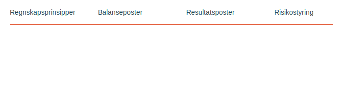

**Noter** er en integrert del av årsregnskapet som gir **detaljerte forklaringer** og tilleggsinformasjon til tallene i balanse, resultatregnskap og kontantstrømoppstilling. Noter er ikke bare et lovpålagt krav, men et viktig verktøy for å sikre **transparens**, **sammenlignbarhet** og **forståelse** i finansiell rapportering.

## Hva er Noter?

Noter i regnskap er tekstlige og numeriske opplysninger som utdyper og supplerer de aggregerte tallene i hovedoppstillingene. De fungerer som en bro mellom **primeroppsett** og **detaljerte analyser**, slik at investorer, kreditorer og andre interessenter kan ta informerte beslutninger.

## Lovpålagte krav til Noter

I Norge reguleres noteopplysninger primært av [regnskapsloven § 7-1 til § 7-45](/blogs/regnskap/hva-er-regnskapsloven "Hva er Regnskapsloven? Oversikt og Veiledning") og bokføringsloven, med krav som varierer etter selskapstype og størrelse:

### Store foretak
* **Detaljerte regnskapsprinsipper** – beskrivelse av måle- og vurderingsregler
* **Estimatusikkerhet** – områder med betydelig usikkerhet og skjønnsmessige vurderinger
* **Segmentrapportering** – informasjon om forretnings- og geografiske segmenter (se [Hva er IFRS?](/blogs/regnskap/hva-er-ifrs "Hva er IFRS? Komplett Guide til International Financial Reporting Standards"))
* **Risikostyring** – omfattende beskrivelse av finansiell risiko (kredittrisik o, likviditetsrisiko, markedsrisiko)

### Små foretak
* **Grunnleggende prinsipper** – kort oversikt over anvendte regnskapsprinsipper
* **Vesentlige poster** – forklaring av hovedposter i balanse og resultat
* **Pantstillelser og garantier** – oversikt over sikkerhetsstillelser og forpliktelser

## Kategorier av Noter

| Kategori                    | Innholdseksempler                                                        |
|-----------------------------|---------------------------------------------------------------------------|
| **Regnskapsprinsipper**         | Beskrivelse av prinsipper, avskrivningsmetoder, valutaomregning          |
| **Balansepostspesifikasjoner**  | Anskaffelseskost, akkumulerte avskrivninger, aldersfordeling av fordringer |
| **Resultatspesifikasjoner**     | Lønnskostnader, inntektsfordeling, finansposter                           |
| **Ikke-balanseførte forpliktelser** | Eventualforpliktelser, leieavtaler, garantier                         |
| **Risikostyring**               | Kredittrisiko, likviditetsrisiko, sensitivitetsanalyser                   |

## Planlegging og struktur

God noteutarbeidelse krever systematisk planlegging og struktur:

1. **Identifiser notekrav** basert på selskapets størrelse og gjeldende regelverk
2. **Kartlegg vesentlige poster** som krever utdypning
3. **Innhent data** fra relevante avdelinger og kilder
4. **Nummerer og referer** noter konsistent i hovedoppstillingene ved bruk av [romertall](/blogs/regnskap/romertall "Romertall i Regnskap: Bruk av Romertall i Noter og Kapittelnummerering")
5. **Kvalitetssikring** via intern revisjon og kontroll mot regelverket

## Beste praksis for Noter

For å sikre at noter er informative og brukervennlige bør du:

- **Fokusere på vesentlighet** og unngå unødvendige detaljer
- **Bruke klart språk** og konsistent terminologi
- **Gi sammenligningsinformasjon** fra tidligere perioder
- **Sikre konsistens** mellom noter og tall i hovedoppstillingene
- **Dokumentere vurderinger** og skjønnsutøvelser

## Intern lenking til relaterte artikler

For mer informasjon, se også:

- [Hva er forklaring?](/blogs/regnskap/forklaring "Hva er forklaring i regnskap? Komplett Guide til Forklaringer og Fotnoter")
- [Hva er balanse?](/blogs/regnskap/hva-er-balanse "Hva er Balanse i Regnskap? Komplett Guide til Balansens Oppbygging og Funksjon")
- [Hva er driftsregnskap?](/blogs/regnskap/hva-er-driftsregnskap "Hva er Driftsregnskap? Komplett Guide til Driftsregnskapet i Norge")

## Konklusjon

**Noter** er mer enn en lovpålagt formalitet; de er nøkkelen til **gjennomsiktighet** og **innsikt** i årsregnskapet. Gjennom systematisk planlegging, konsistent struktur og god internkontroll kan noter bli et strategisk verktøy som styrker tilliten mellom selskapet og dets interessenter.
