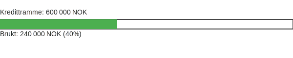

Rammelån er en **fleksibel finansieringsløsning** hvor banken etablerer en **rammekreditt** som virksomheten kan disponere innenfor en forhåndsdefinert grense. Dette gir bedrifter mulighet til å låne etter behov, med flytende rente og _avdragsfrihet_ så lenge kredittrammen ikke overskrides.

## Hva er rammelån?

Et **rammelån** består av følgende hovedelementer:

* **Kredittramme:** Maksimalt beløp som kan benyttes over låneperioden.
* **Flytende rente:** Rente fastsatt med referanse til for eksempel [NIBOR](/blogs/regnskap/nibor "NIBOR") plus margin.
* **Avdragsfrihet:** Mulighet for delvis eller full avdragsfri periode innenfor avtalt tidsrom.
* **Sikkerhet:** Pant i eiendeler som maskiner, varelager eller kundefordringer.

## Bruksområder og fordeler

Rammelån benyttes ofte for:

* Å sikre **kontinuerlig likviditetsbuffer** ved svingende inn- og utbetalinger.
* Å finansiere sesongbaserte behov eller prosjekter uten fast nedbetalingsplan.
* Å erstatte kortsiktige kredittløsninger som [kassekreditt](/blogs/regnskap/kassekreditt "Kassekreditt: Overdraft og Likviditetsstyring i Norske Bedrifter").

**Fordeler med rammelån:**

| **Fordel**                    | **Beskrivelse**                                      |
|-------------------------------|------------------------------------------------------|
| Fleksibilitet                 | Kun rentekostnad på benyttet beløp                   |
| Oversiktlig finansiering      | Klare rammevilkår og begrenset kredittramme          |
| Renteoptimalisering           | Mulighet til å følge renteutvikling via flytende rente|

## Kostnader og gebyrer

| **Kostnadselement** | **Typisk nivå**                         |
|---------------------|-----------------------------------------|
| Rente               | NIBOR + 1–3 % margin                    |
| Etableringsgebyr    | 0–10 000 NOK                            |
| Termingebyr         | 0–1 000 NOK per måned                   |

## Regnskapsføring av rammelån

Rammelån føres som **kortsiktig gjeld** eller **langsiktig gjeld** i balansen, avhengig av avtalt løpetid. Bruk av kredittrammen bokføres slik:

| **Konto**     | **Debet**      | **Kredit**     | **Beskrivelse**             |
|---------------|----------------|----------------|-----------------------------|
| 1920 Bank     | 300 000 NOK    |                | Uttak av rammelån           |
| 2240 Rammelån |                | 300 000 NOK    | Kreditbruk på rammelån      |

## Illustrasjon av utnyttelse

Diagrammet under viser et eksempel på utnyttet andel av kredittrammen:

## Relaterte konsepter

* [Hva er likviditet?](/blogs/regnskap/hva-er-likviditet "Hva er Likviditet? Komplett Guide til Likviditet og Likviditetsstyring")
* [Hva er kassekreditt?](/blogs/regnskap/kassekreditt "Kassekreditt: Overdraft og Likviditetsstyring i Norske Bedrifter")
* [Hva er effektiv rente?](/blogs/regnskap/hva-er-effektiv-rente "Hva er Effektiv rente? Beregning og betydning")
* [Hva er amortisering?](/blogs/regnskap/hva-er-amortisering "Hva er Amortisering? Hvordan nedbetale lån over tid")

For mer informasjon om finansiering, se også [kapitalkostnad](/blogs/regnskap/kapitalkostnad "Kapitalkostnad - Beregning og implikasjoner for bedrifter").
