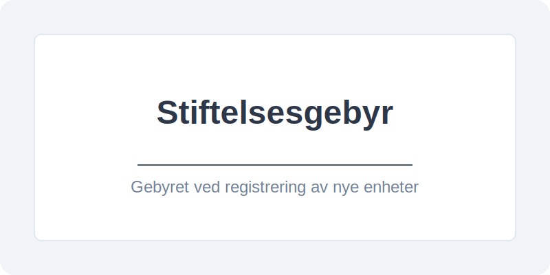
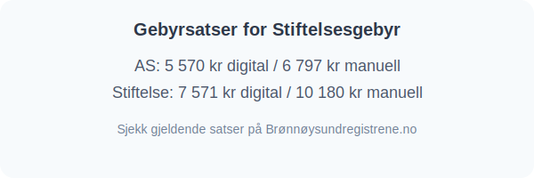

**Stiftelsesgebyr** er gebyret som påløper ved registrering av en ny enhet i [Brønnøysundregistrene](/blogs/regnskap/hva-er-bronnoeysundregistrene "Hva er Brønnøysundregistrene? Org.nr, Registrering og Tjenester"), enten det gjelder en **stiftelse** eller et **aksjeselskap** (AS). Gebyret dekker behandling av stiftelsesdokumenter og registrering i relevante registre.

## Hva er Stiftelsesgebyr?

Stiftelsesgebyret fastsettes av staten og endres jevnlig. Det skilles mellom **digital** og **manuell** (papirbasert) registrering, hvor digital registrering normalt er rimeligere.

## Gebyrsatser

| Registreringstype       | Digitalt gebyr (NOK) | Manuelt gebyr (NOK) |
|-------------------------|----------------------|---------------------|
| Aksjeselskap (AS)       | 5 570                | 6 797               |
| Stiftelse               | 7 571                | 10 180              |

*Tallene er per 2023. Sjekk alltid gjeldende satser på Brønnøysundregistrene.no.*

## Regnskapsføring av Stiftelsesgebyr

Gebyret anses som en del av selskapets eller stiftelsens **etableringskostnader**. I henhold til god regnskapsskikk skal **stiftelsesgebyr**:

* Føres som en egen post under **annen egenkapital** ved stiftelse av aksjeselskap, da det er en direkte kostnad knyttet til egenkapitaltransaksjonen. Les mer om dette i [Hva er Egenkapital?](/blogs/regnskap/hva-er-egenkapital "Hva er Egenkapital? Komplett Guide til Egenkapital i Regnskap").
* Regnskapsføres som en kostnad i resultatregnskapet for stiftelser, som en del av **etableringskostnader**. Se vår artikkel om [Hva er Stiftelse?](/blogs/regnskap/hva-er-stiftelse "Hva er Stiftelse? Juridisk Grunnlag og Regnskapsregler") for nærmere detaljer.

## Slik betaler du Stiftelsesgebyret

1. Gå til Altinn og fyll ut stiftelsesmelding for ønsket enhet.
2. Velg elektronisk innsending for å oppnå lavere gebyr.
3. Betal gebyret via avtalt betalingsløsning i Altinn.
4. Motta kvittering og registreringsbekreftelse fra Brønnøysund.

For en detaljert guide på hvordan du starter et AS, se [Starte AS](/blogs/regnskap/starte-as "Starte AS: Steg-for-steg guide til å stifte aksjeselskap"). For informasjon om stiftelse av fond eller organisasjoner, se [Hva er Stiftelse?](/blogs/regnskap/hva-er-stiftelse "Hva er Stiftelse? Juridisk Grunnlag og Regnskapsregler").
