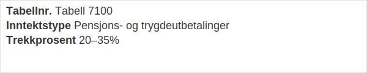
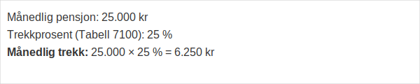

**Tabell 7100** er skattetabellen som brukes for **pensjons-** og **trygdeutbetalinger**. Denne tabellen gir arbeidsgivere og utbetalingsansvarlige en enkel oversikt over hvilke trekkprosent som skal brukes for ulike inntektsnivåer og typer ytelser.



## 1. Struktur og Innhold i Tabell 7100

Tabell 7100 er strukturert med tre hovedkolonner som angir tabellnummer, inntektstype og anbefalt trekkprosent:

| **Tabellnr.** | **Inntektstype**                    | **Trekkprosent** |
|---------------|-------------------------------------|------------------|
| 7100          | Pensjons- og trygdeutbetalinger     | 20–35%           |

## 2. Beregningseksempel

Beregningsmetoden for skattetrekk i Tabell 7100 følger en enkel formel basert på utbetalingsbeløp og prosent:

```
Månedlig pensjon: 25.000 kr
Trekkprosent (Tabell 7100): 25 %
Månedlig trekk: 25.000 × 25 % = 6.250 kr
```



## 3. Integrasjon i Lønnssystemer

De fleste moderne lønnssystemer støtter automatisk bruk av Tabell 7100 via sanntidsoppslag eller regelbaserte innstillinger:

* **Sanntids API-oppslag** til Skatteetaten for å hente oppdaterte trekkprosent
* **Automatisk oppdatering** ved endringer i tabellverdiene per år
* **Validering** av ytelsestype (pensjon vs trygd) før beregning
* **Feilhåndtering** og fallback til manuelt oppsett

## 4. Intern og Ekstern Rapportering

Når Tabell 7100 benyttes, må korrekt skattetrekk rapporteres til Skatteetaten gjennom [A-meldingen](/blogs/regnskap/hva-er-a-meldingen "Hva er A-meldingen? Komplett Guide til Inntekts- og Trekkoppgaver") og registreres i regnskapet:

| **Rapporteringsinstrument** | **Beskrivelse**                    |
|-----------------------------|------------------------------------|
| A-meldingen                 | Månedlig innrapportering av trekk  |
| Årsoppgave for pensjon      | Årlig spesifikasjon av utbetalinger |

## 5. Relaterte Artikler

Se også:

* [Hva er Tabelltrekk?](/blogs/regnskap/hva-er-tabelltrekk "Hva er Tabelltrekk?") for en oversikt over generelle skattetabeller
* [Hva er Pensjon?](/blogs/regnskap/hva-er-pensjon "Hva er Pensjon?") for dypere innsikt i det norske pensjonssystemet
* [Hva er Trygdeytelser?](/blogs/regnskap/hva-er-trygdeytelser "Hva er Trygdeytelser?") for forståelse av trygdegrunnlag og utbetalinger
