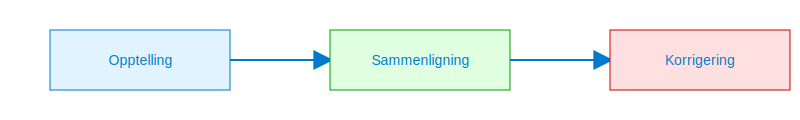

**Varetelling** er en systematisk prosess for å kontrollere og verifisere **lagerbeholdningen** i regnskapet. Gjennom regelmessige opptellinger sikrer virksomheter at det fysiske lageret stemmer med det regnskapsførte, noe som er avgjørende for korrekt [balanseføring](/blogs/regnskap/hva-er-balanse "Hva er Balanse? Komplett Guide til Balanseføring"), [avstemming](/blogs/regnskap/hva-er-avstemming "Hva er Avstemming i regnskap?") og rapportering. Riktig varetelling støtter også nøyaktig kostprisberegning og optimal arbeidskapitalstyring.

Se også artikkelen [Hva er Varelager?](/blogs/regnskap/hva-er-varelager "Hva er Varelager? Komplett Guide til Lagerstyring og Regnskapsføring") for en dypere forståelse av lagerets rolle i regnskapet.

## Seksjon 1: Grunnleggende om Varetelling

**Varetelling** innebærer fysisk opptelling av varer på lager, etterfulgt av sammenligning mot systemdata for å identifisere avvik. Prosessen kan bidra til å avdekke svinn, tyveri, skade og feilregistreringer.

## Seksjon 2: Metoder for Varetelling

Det finnes flere metoder for varetelling, tilpasset ulike behov og lagerstørrelser. Tabellen nedenfor gir en oversikt over de mest brukte metodene:

| **Metode**             | **Beskrivelse**                                                                 | **Fordeler**                             | **Ulemper**                             |
|------------------------|---------------------------------------------------------------------------------|------------------------------------------|-----------------------------------------|
| **Fulltelling**        | Teller alle varer på lager samtidig.                                            | Gir komplett oversikt                    | Tidkrevende, forstyrrelser i drift      |
| **Syklustelling**      | Teller utvalgte artikler med jevne mellomrom (ABC-klassifisering).               | Mindre driftspåvirkning, løpende kontroll| Delvis oversikt, krever planlegging     |
| **Stikkprøvetelling**  | Tilfeldig utvalg av varer som telles for å estimere totalavvik.                 | Rask, kostnadseffektiv                   | Mindre nøyaktig                        |

## Seksjon 3: Planlegging og Frekvens

God planlegging er nøkkelen til en effektiv varetelling. Tips for vellykket gjennomføring inkluderer:

* **Fastlegging av frekvens:** Bestem hvor ofte varetelling skal utføres (årlig, kvartalsvis eller løpende).
* **Ressursallokering:** Tildel ansvar og tid for telling, kontroll og rapportering.
* **Forberedelse:** Klargjør IT-systemer, dokumentasjon og arbeidsinstrukser.
* **Kommunikasjon:** Informer ansatte om datoer, prosedyrer og forventet deltakelse.

## Seksjon 4: Gjennomføring av Varetelling

En typisk varetelling kan gjennomføres i følgende steg:

1. **Opptellingsliste:** Generer liste over alle SKU-er eller puljer som skal telles.
2. **Fysisk telling:** Telle personell noterer antall varer per lokasjon.
3. **Inntasting:** Registrer tellingene i lagersystemet eller regneark.
4. **Sammenligning:** Sammenlign fysisk talt antall med systemverdier.
5. **Avvikshåndtering:** Undersøk årsaker til differanser og dokumenter resultater.
6. **Korrigering:** Juster regnskapet og varelagerregisteret i henhold til faktiske tall.

## Seksjon 5: Avstemming og Korreksjon

Etter varetelling er det avgjørende å gjennomføre [avstemming](/blogs/regnskap/hva-er-avstemming "Hva er Avstemming i regnskap?") av lagerverdier. Dette sikrer at eventuelle avvik blir registrert som justeringer i regnskapet og rapportert korrekt i [balansen](/blogs/regnskap/hva-er-balanse "Hva er Balanse? Komplett Guide til Balanseføring"). Se også artikkelen om [Varekretsløpet](/blogs/regnskap/varekretslopet "Varekretsløpet: Flyt av varer og kapital") for helhetlig oversikt over lagerets økonomiske syklus.

Gjennom regelmessig **varetelling** oppnår bedriften bedre kontroll over lageret, reduserer økonomisk risiko og sikrer pålitelige regnskapstall.
