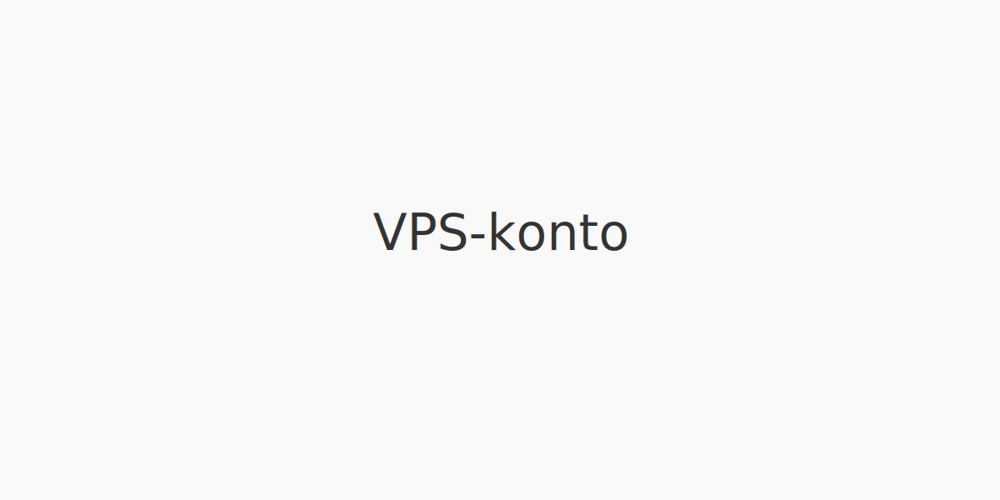

En **VPS-konto** er en sikker digital konto registrert hos **Verdipapirsentralen (VPS)** som brukes til oppbevaring og handel av [**verdipapirer**](/blogs/regnskap/hva-er-verdipapir "Hva er et Verdipapir? En komplett guide") som aksjer, obligasjoner og fondsenheter.

## Hva er Verdipapirsentralen (VPS)?

Verdipapirsentralen (VPS) er Norges offisielle sentralregister for verdipapirer. Etablert for å digitalisere og standardisere kontoføring og handel.

*Se også: [Hva er en aksjesparekonto?](/blogs/regnskap/hva-er-aksjesparekonto "Hva er en Aksjesparekonto (ASK)? En komplett guide til skattefordeler")*
*Se også: [Hva er ISIN-nummer?](/blogs/regnskap/hva-er-isin-nummer "Hva er ISIN-nummer? En guide til identifikatorer for verdipapirer")*

## Typer VPS-kontoer

| **Kontotype**           | **Beskrivelse**                                   | **Bruksområde**                         |
|--------------------------|---------------------------------------------------|-----------------------------------------|
| Individuell konto        | Konto for én person, vanlig i privatmarkedet.     | Aksjer, fond, obligasjoner              |
| Felleskonto              | Delt konto for flere personer, f.eks. ektefeller. | Aksjeplassering i fellesskap            |
| Verdipapirfondkonto      | Konto for fondsenheter, registrering via forvalter.| Fondsenheter                            |
| Bedriftskonto            | Konto registrert på juridisk enhet/selskap.       | Selskapsinvesteringer                   |

## Hvordan opprette en VPS-konto

1. Velg et **bank** eller **verdipapirforetak** som VPS-medlem.
2. Fyll ut kontosøknad elektronisk via nettbank eller papirskjema.
3. Signer med **BankID**.
4. Kontoen tildeles et unikt ISIN-kontonummer.
5. Bekreftelse sendes til din nettbank eller e-post.

*Merk:* Kontoopplysninger kan endres via nettbanken hos din kontoansvarlige.

## Fordeler med VPS-konto

- **Sikkerhet**: Registrering i offisielt sentralregister.
- **Rask oppgjør**: Elektronisk overføring av verdipapirer.
- **Oversikt**: Enhetlig visning av beholdning i nettbank.
- **Likviditet**: Enkelt å overføre og selge verdipapirer.

## Vanlige kostnader og gebyrer

| **Type gebyr**            | **Beskrivelse**                                              |
|---------------------------|--------------------------------------------------------------|
| Førstegangs etablering    | Engangsbeløp for å opprette konto (typisk 0–100 NOK).        |
| Årlig kontoføring         | Fast årsgebyr for oppbevaring (typisk 50–200 NOK).           |
| Transaksjonsgebyr         | Provisjon per kjøp/salg (varierer mellom tilbydere).         |
| Flyttegebyr               | Kostnad ved overføring av verdipapirer mellom VPS-kontoer.   |

## Vanlige spørsmål (FAQ)

**Kan jeg ha flere VPS-kontoer?**  
Ja, du kan ha separate VPS-kontoer for privat og bedriftsformål, eller for ulike investeringsstrategier.

**Er VPS-konto nødvendig for alle investeringer?**  
Ja, alle omsettelige verdipapirer i Norge må registreres på en VPS-konto.
