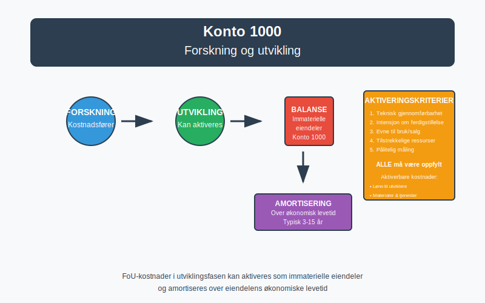
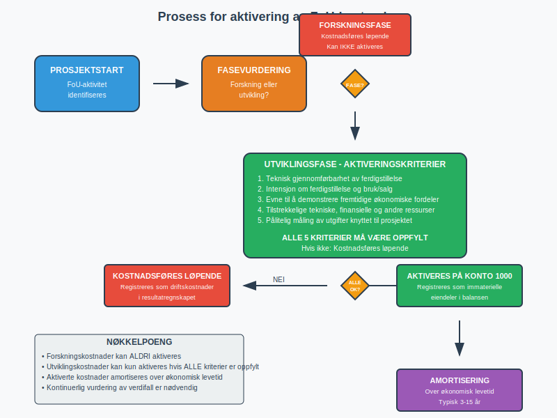
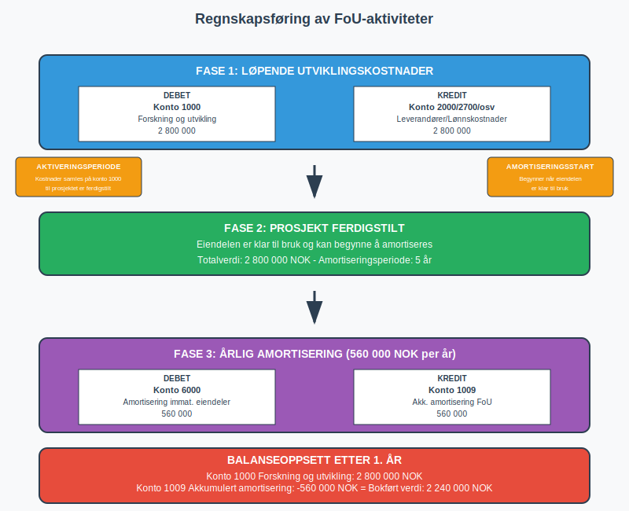

---
title: "1000"
meta_title: "1000"
meta_description: '**Konto 1000 - Forskning og utvikling** er en av de viktigste kontiene for virksomheter som investerer i innovasjon og utvikling av nye produkter, tjenester ell...'
slug: 1000
type: blog
layout: pages/single
---

**Konto 1000 - Forskning og utvikling** er en av de viktigste kontiene for virksomheter som investerer i innovasjon og utvikling av nye produkter, tjenester eller prosesser. Denne kontoen brukes for å registrere [immaterielle eiendeler](/blogs/regnskap/hva-er-imaterielle-eiendeler "Hva er Imaterielle Eiendeler?") knyttet til forsknings- og utviklingsaktiviteter som tilfredsstiller kriteriene for [aktivering](/blogs/regnskap/hva-er-aktivering "Hva er Aktivering i Regnskap?") i [balansen](/blogs/regnskap/hva-er-balanse "Hva er Balanse?").



## Hva er Forskning og utvikling?

**Forskning og utvikling (FoU)** omfatter systematisk, kreativ virksomhet som utføres for å øke kunnskapen og finne nye anvendelser av denne kunnskapen. I regnskapsmessig sammenheng skilles det mellom:

* **Forskning**: Planmessig og kritisk undersøkelse som har til hensikt å oppdage nye vitenskapelige eller tekniske fakta og innsikt
* **Utvikling**: Anvendelse av forskning eller annen kunnskap til å planlegge eller utvikle nye eller vesentlig forbedrede materialer, produkter, tjenester eller prosesser

## Kriterier for aktivering av FoU-kostnader

For at FoU-kostnader kan aktiveres på konto 1000, må de oppfylle strenge kriterier:

### Forskningsfasen
Kostnader i forskningsfasen kan **ikke** aktiveres og må kostnadsføres løpende som [driftskostnader](/blogs/regnskap/hva-er-driftskostnader "Hva er Driftskostnader?").

### Utviklingsfasen
Kostnader i utviklingsfasen kan aktiveres dersom **alle** følgende vilkår er oppfylt:

1. **Teknisk gjennomførbarhet**: Det er teknisk mulig å ferdigstille den immaterielle eiendelen
2. **Intensjon om ferdigstillelse**: Virksomheten har til hensikt å ferdigstille og bruke eller selge eiendelen
3. **Evne til bruk eller salg**: Virksomheten kan demonstrere hvordan eiendelen vil generere fremtidige økonomiske fordeler
4. **Tilstrekkelige ressurser**: Tekniske, finansielle og andre ressurser er tilgjengelige for ferdigstillelse
5. **Pålitelig måling**: Utgiftene kan måles pålitelig



## Hva kan aktiveres på konto 1000?

### Aktiverbare kostnader
* Lønn til personell som arbeider direkte med utviklingsprosjektet
* Materialer og tjenester som forbrukes i utviklingsprosjektet
* Avskrivninger på bygninger og utstyr brukt i prosjektet
* Indirekte kostnader som kan henføres til prosjektet
* Konsulenthonorar knyttet til utviklingsarbeid

### Ikke-aktiverbare kostnader
* Generelle administrative kostnader
* Salgs- og markedsføringskostnader
* Opplæringskostnader
* Vedlikeholdskostnader
* Forskningskostnader (som nevnt over)

## Amortisering og avskrivning

[Immaterielle eiendeler](/blogs/regnskap/hva-er-imaterielle-eiendeler "Hva er Imaterielle Eiendeler?") på konto 1000 skal [amortiseres](/blogs/regnskap/hva-er-amortisering "Hva er Amortisering?") over eiendelens økonomiske levetid. Amortiseringsperioden skal gjenspeile den perioden virksomheten forventer å ha nytte av eiendelen.

### Typiske amortiseringsperioder
| Type utviklingsprosjekt | Vanlig amortiseringsperiode |
|------------------------|----------------------------|
| Programvare og IT-systemer | 3-5 år |
| Produktutvikling | 5-10 år |
| Prosessforbedringer | 3-7 år |
| Teknologiutvikling | 5-15 år |

> **Viktig:** Amortiseringsperioden må vurderes individuelt for hvert prosjekt basert på forventet økonomisk levetid og bransjestandarder.

## Regnskapsføring av FoU-aktiviteter

### Løpende utviklingskostnader
```
Debet: Konto 1000 - Forskning og utvikling
Kredit: Konto 2000 - Leverandører (eller relevant konto)
```

### Amortisering av aktiverte FoU-kostnader
```
Debet: Konto 6000 - Amortisering immat. eiendeler
Kredit: Konto 1009 - Akkumulert amortisering FoU
```



## Nedskrivning og verditest

Aktiverte FoU-kostnader må vurderes for [nedskrivning](/blogs/regnskap/hva-er-nedskrivning "Hva er Nedskrivning?") dersom det foreligger indikasjoner på verdifall. Dette kan være aktuelt hvis:

* Prosjektet ikke lenger forventes å generere økonomiske fordeler
* Teknologiske endringer gjør prosjektet obsolet
* Markedsforholdene endrer seg negativt
* Konkurrerende produkter lanseres

## Eksempel på bruk av konto 1000

**Eksempel:** TechNorway AS utvikler en ny applikasjon for mobile betalinger. Prosjektet startet 1. januar og forventes ferdigstilt 31. desember samme år.

### Kostnader i prosjektet:
* Lønn til utviklere: 2 000 000 NOK
* Konsulenthonorar: 500 000 NOK
* Lisenser og programvare: 300 000 NOK
* **Totalt:** 2 800 000 NOK

### Regnskapsføring:
1. **Løpende registrering** av utviklingskostnader på konto 1000
2. **Ferdigstillelse** av prosjektet 31. desember
3. **Amortisering** over 5 år (560 000 NOK årlig)

## Forskjell fra andre immaterielle eiendeler

| Konto | Beskrivelse | Hovedforskjell |
|-------|-------------|----------------|
| 1000 | Forskning og utvikling | Selv-utviklede eiendeler |
| 1001 | [Goodwill](/blogs/regnskap/hva-er-goodwill "Hva er Goodwill?") | Kjøpt ved virksomhetsoppkjøp |
| 1020 | [Konsesjoner](/blogs/kontoplan/1020-konsesjoner "Konto 1020 - Konsesjoner") | Kjøpte rettigheter og tillatelser |
| 1030 | [Patenter](/blogs/kontoplan/1030-patenter "Konto 1030 - Patenter") | Beskyttede tekniske oppfinnelser |
| 1040 | [Lisenser](/blogs/kontoplan/1040-lisenser "Konto 1040 - Lisenser") | Rettigheter til ekstern IP |
| 1003 | Programvare | Kjøpte programvareløsninger |

## Rapportering i årsregnskapet

FoU-kostnader på konto 1000 rapporteres som [anleggsmidler](/blogs/regnskap/hva-er-anleggsmidler "Hva er Anleggsmidler?") i [balansen](/blogs/regnskap/hva-er-balanseregnskap "Hva er Balanseregnskap?") under immaterielle eiendeler. I notene til årsregnskapet må det opplyses om:

* [Anskaffelseskost](/blogs/regnskap/hva-er-anskaffelseskost "Hva er Anskaffelseskost?") ved årets begynnelse
* Tilgang i løpet av året
* Amortisering i løpet av året
* Balanseført verdi ved årets slutt
* Amortiseringsmetode og -periode

## Skattemessige forhold

**Skattemessig behandling** av FoU-kostnader kan avvike fra regnskapsmessig behandling:

* **Forskningskostnader**: Fradragsberettigede når de påløper
* **Utviklingskostnader**: Kan aktiveres skattemessig, men kan også kostnadsføres direkte
* **Amortiseringsperiode**: Minimum 5 år for aktiverte FoU-kostnader

> **Merk:** Det kan oppstå midlertidige forskjeller mellom regnskapsmessig og skattemessig behandling som påvirker beregning av [utsatt skattfordel](/blogs/kontoplan/1070-utsatt-skattfordel "Konto 1070 - Utsatt skattfordel") eller [utsatt skatt](/blogs/kontoplan/2120-utsatt-skatt "Konto 2120 - Utsatt skatt").

## Internasjonale regnskapsstandarder

Under **IFRS** reguleres FoU-kostnader av IAS 38 "Immaterielle eiendeler". Hovedprinsippene er like norsk GAAP, men det kan være forskjeller i:

* Definisjonen av forsknings- vs. utviklingsfase
* Kriterier for aktivering
* Amortiseringsmetoder
* Verditesting og nedskrivningsregler

## Praktiske tips for virksomheter

### Dokumentasjon
* **Føre detaljerte** records over alle FoU-relaterte kostnader
* **Skille tydelig** mellom forsknings- og utviklingsfase
* **Dokumentere** at aktiveringskriteriene er oppfylt

### Kontroll og oppfølging
* **Regelmessig vurdering** av prosjektets fremgang
* **Kontinuerlig vurdering** av aktiverte verdier
* **Etablere rutiner** for nedskrivningstesting

### Organisering
* **Opprette** separate kostnadsenheter for hvert FoU-prosjekt
* **Implementere** systemer for tidsregistrering
* **Etablere** klare retningslinjer for kostnadsdeling

## Relaterte artikler

* [Hva er Imaterielle Eiendeler?](/blogs/regnskap/hva-er-imaterielle-eiendeler "Hva er Imaterielle Eiendeler?")
* [Konto 1020 - Konsesjoner](/blogs/kontoplan/1020-konsesjoner "Konto 1020 - Konsesjoner")
* [Konto 1030 - Patenter](/blogs/kontoplan/1030-patenter "Konto 1030 - Patenter")
* [Konto 1040 - Lisenser](/blogs/kontoplan/1040-lisenser "Konto 1040 - Lisenser")
* [Konto 1050 - Varemerker](/blogs/kontoplan/1050-varemerker "Konto 1050 - Varemerker")
* [Konto 1060 - Andre rettigheter](/blogs/kontoplan/1060-andre-rettigheter "Konto 1060 - Andre rettigheter")
* [Hva er Aktivering i Regnskap?](/blogs/regnskap/hva-er-aktivering "Hva er Aktivering i Regnskap?")
* [Hva er Amortisering?](/blogs/regnskap/hva-er-amortisering "Hva er Amortisering?")
* [Hva er Anleggsmidler?](/blogs/regnskap/hva-er-anleggsmidler "Hva er Anleggsmidler?")
* [Hva er Goodwill?](/blogs/regnskap/hva-er-goodwill "Hva er Goodwill?")
* [Hva er Balanse?](/blogs/regnskap/hva-er-balanse "Hva er Balanse?")
* [Hva er Anskaffelseskost?](/blogs/regnskap/hva-er-anskaffelseskost "Hva er Anskaffelseskost?")
