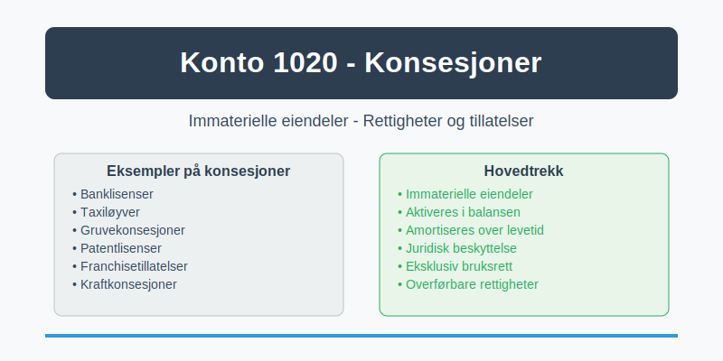
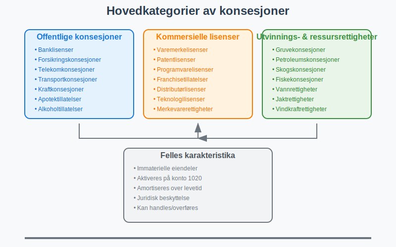
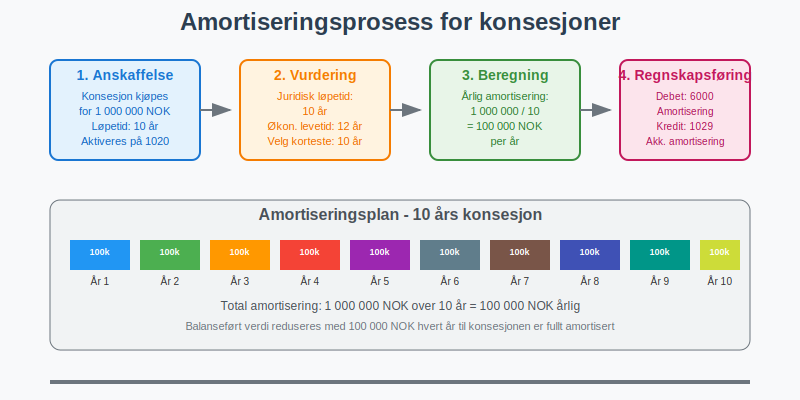

---
title: "Hva er Konto 1020 - Konsesjoner?"
seoTitle: "1020"
meta_description: '**Konto 1020 - Konsesjoner** er en viktig konto for virksomheter som har ervervede rettigheter, lisenser og konsesjoner som gir dem spesielle forrettigheter ell...'
slug: 1020
type: blog
layout: pages/single
---

**Konto 1020 - Konsesjoner** er en viktig konto for virksomheter som har ervervede rettigheter, lisenser og konsesjoner som gir dem spesielle forrettigheter eller eksklusive bruksrettigheter. Denne kontoen brukes for å registrere [immaterielle eiendeler](/blogs/regnskap/hva-er-imaterielle-eiendeler "Hva er Imaterielle Eiendeler?") i form av konsesjoner som kan [aktiveres](/blogs/regnskap/hva-er-aktivering "Hva er Aktivering i Regnskap?") og amortiseres over tid i [balansen](/blogs/regnskap/hva-er-balanse "Hva er Balanse?").



## Hva er konsesjoner?

**Konsesjoner** er offisielle tillatelser eller rettigheter som gir innehaveren en eksklusiv eller begrenset rett til å utøve bestemte aktiviteter. I regnskapsmessig sammenheng omfatter konsesjoner:

* **Konsesjoner fra myndigheter**: Tillatelser til å drive bestemte typer virksomhet
* **Driftskonsesjoner**: Rettigheter til å drive infrastruktur eller offentlige tjenester
* **Utvinningsrettigheter**: Rettigheter til å utvinne naturressurser
* **Lisenser**: Rettigheter til å bruke patenter, varemerker eller teknologi
* **Franchisetillatelser**: Rettigheter til å drive under en etablert merkevare

## Typer konsesjoner som registreres på konto 1020

### Offentlige konsesjoner
* **Banklisenser**: Tillatelse til å drive bankvirksomhet
* **Forsikringskonsesjoner**: Rettighet til å tilby forsikringstjenester
* **Telekomkonsesjoner**: Tillatelse til å drive telekommunikasjonsvirksomhet
* **Transportkonsesjoner**: Rettigheter til å drive kollektivtransport
* **Kraftkonsesjoner**: Tillatelse til produksjon og distribusjon av elektrisk kraft

### Kommersielle lisenser og rettigheter
* **Varemerkelisenser**: Rettighet til å bruke registrerte varemerker
* **Patentlisenser**: Rettighet til å utnytte patentert teknologi (ikke eierskap av [patenter](/blogs/kontoplan/1030-patenter "Konto 1030 - Patenter"))
* **Programvarelisenser**: Rettighet til å bruke og distribuere programvare
* **Franchisetillatelser**: Rettighet til å drive under etablerte konsepter
* **Distributørlisenser**: Eksklusive rettigheter til å distribuere produkter

### Utvinnings- og ressursrettigheter
* **Gruvekonsesjoner**: Rettighet til å utvinne mineraler
* **Petroleumskonsesjoner**: Rettighet til å lete etter og utvinne olje og gass
* **Skogskonsesjoner**: Rettighet til å hogge i bestemte områder
* **Fiskekonsesjoner**: Rettighet til å drive fiske i bestemte farvann



## Kriterier for aktivering på konto 1020

For at konsesjoner kan aktiveres på konto 1020, må de oppfylle følgende kriterier:

### Grunnleggende aktiveringsvilkår
1. **Kontrollerbar ressurs**: Virksomheten må ha kontroll over konsesjonen
2. **Fremtidige økonomiske fordeler**: Konsesjonen må forventes å generere økonomiske fordeler
3. **Pålitelig måling**: [Anskaffelseskost](/blogs/regnskap/hva-er-anskaffelseskost "Hva er Anskaffelseskost?") må kunne måles pålitelig
4. **Separat identifiserbar**: Konsesjonen må kunne identifiseres separat fra [goodwill](/blogs/regnskap/hva-er-goodwill "Hva er Goodwill?")

### Spesifikke krav for konsesjoner
* **Juridisk eksistens**: Konsesjonen må ha juridisk grunnlag
* **Overførbarhet**: Konsesjonen bør kunne overføres eller selges
* **Varig verdi**: Konsesjonen må ha verdi utover ett regnskapsår
* **Dokumentert eierskap**: Klare bevis på eierskap eller bruksrett

## Verdsettelse og anskaffelseskost

### Kjøpte konsesjoner
**Anskaffelseskost** for kjøpte konsesjoner inkluderer:

* Kjøpesum til selger
* Juridiske honorarer og advokatkostnader
* Registreringsgebyrer og offentlige avgifter
* Konsulenthonorar for verdivurdering
* Transaksjonsrelaterte kostnader

### Tildelte konsesjoner
For konsesjoner tildelt av myndigheter:

* **Gebyr til myndigheter**: Beløp betalt for konsesjonsprosessen
* **Søknadskostnader**: Kostnader for utarbeidelse av søknader
* **Juridisk bistand**: Advokathjelp i konsesjonsprosessen
* **Teknisk dokumentasjon**: Kostnader for tekniske utredninger

| Konsesjontype | Typisk anskaffelseskost | Vanlige tilleggskostnader |
|---------------|------------------------|---------------------------|
| Banklisens | Søknadsgebyr + juridisk bistand | Teknisk IT-vurdering |
| Gruvekonsesjoner | Auksjonssum + geologisk kartlegging | Miljøvurderinger |
| Franchisetillatelser | Franchiseavgift + opplæring | Markedsføringsbidrag |
| Programvarelisenser | Lisenspris + implementering | Opplæring og support |

## Amortisering av konsesjoner

[Konsesjoner](/blogs/kontoplan/1020-konsesjoner "Konto 1020 - Konsesjoner") skal [amortiseres](/blogs/regnskap/hva-er-amortisering "Hva er Amortisering?") over deres økonomiske levetid eller juridiske løpetid, avhengig av hvilken som er kortest.

### Amortiseringsperioder
* **Tidsbegrenset konsesjon**: Amortiseres over konsesjonens løpetid
* **Tidsubegrenset konsesjon**: Amortiseres over forventet økonomisk levetid
* **Fornybar konsesjon**: Vurderes individuelt basert på fornybarhet

### Typiske amortiseringsperioder
| Konsesjontype | Juridisk løpetid | Økonomisk levetid | Amortiseringsperiode |
|---------------|------------------|-------------------|---------------------|
| Taxiløyve | 10 år | 15 år | 10 år |
| Patentlisens | 20 år | 10 år | 10 år |
| Franchisetillatelse | 5 år | 8 år | 5 år |
| Gruvekonsesjoner | 25 år | 20 år | 20 år |



## Regnskapsføring av konsesjoner

### Anskaffelse av konsesjon
```
Debet: Konto 1020 - Konsesjoner
Kredit: Konto 1900 - Bank (eller 2000 - Leverandører)
```

### Amortisering av konsesjoner
```
Debet: Konto 6000 - Amortisering immaterielle eiendeler
Kredit: Konto 1029 - Akkumulert amortisering konsesjoner
```

### Salg av konsesjon
```
Debet: Konto 1900 - Bank
Kredit: Konto 1020 - Konsesjoner
Kredit: Konto 8000 - Gevinst ved salg av anleggsmidler
```

## Nedskrivning og verditest

Konsesjoner må vurderes for [nedskrivning](/blogs/regnskap/hva-er-nedskrivning "Hva er Nedskrivning?") når det foreligger indikasjoner på verdifall:

### Indikatorer på verdifall
* **Regulatoriske endringer**: Nye regler som reduserer konsesjonens verdi
* **Teknologiske endringer**: Ny teknologi som gjør konsesjonen mindre verdifull
* **Markedsendringer**: Endret etterspørsel etter tjenester under konsesjonen
* **Konkurranse**: Økt konkurranse som reduserer lønnsomhet
* **Politiske endringer**: Endret politikk som påvirker konsesjonens verdi

### Nedskrivningstest
1. **Identifisere indikatorer**: Vurder om det foreligger indikatorer på verdifall
2. **Beregne gjenvinnbart beløp**: Høyeste av bruksverdi og virkelig verdi
3. **Sammenligne med balanseført verdi**: Nedskrivning hvis balanseført verdi er høyere
4. **Regnskapsføre nedskrivning**: Reduser balanseført verdi til gjenvinnbart beløp

## Skattemessig behandling

### Skattemessig amortisering
* **Saldogruppe**: Konsesjoner inngår vanligvis i saldogruppe d (20% avskrivning)
* **Avskrivningsmetode**: Degressiv avskrivning etter skatteloven
* **Maksimal avskrivning**: 20% av gjenstående saldo årlig

### Forskjeller mellom regnskap og skatt
| Aspekt | Regnskapsmessig | Skattemessig |
|--------|-----------------|--------------|
| Avskrivningsmetode | Lineær amortisering | Degressiv avskrivning |
| Avskrivningssats | Basert på levetid | Maksimalt 20% |
| Nedskrivning | Når verdifall foreligger | Ikke tillatt |

> **Viktig:** Forskjeller mellom regnskapsmessig og skattemessig behandling kan medføre [utsatt skatt](/blogs/kontoplan/2120-utsatt-skatt "Konto 2120 - Utsatt skatt").

## Eksempel på bruk av konto 1020

**Eksempel:** NorTech AS kjøper en eksklusiv distributørlisens for nordiske land for 5 000 000 NOK. Lisensen har en juridisk løpetid på 10 år og kan fornyes.

### Regnskapsføring ved anskaffelse:
```
Debet: Konto 1020 - Konsesjoner     5 000 000 NOK
Kredit: Konto 1900 - Bank           5 000 000 NOK
```

### Årlig amortisering:
* **Amortiseringsperiode**: 10 år
* **Årlig amortisering**: 500 000 NOK
* **Regnskapsføring**:
```
Debet: Konto 6000 - Amortisering    500 000 NOK
Kredit: Konto 1029 - Akk. amort.    500 000 NOK
```

### Balanseført verdi etter 3 år:
* **Opprinnelig kostpris**: 5 000 000 NOK
* **Akkumulert amortisering**: 1 500 000 NOK
* **Balanseført verdi**: 3 500 000 NOK

## Forskjell fra andre immaterielle eiendeler

| Konto | Beskrivelse | Hovedkarakteristikk |
|-------|-------------|---------------------|
| 1000 | [Forskning og utvikling](/blogs/kontoplan/1000-forskning-og-utvikling "Konto 1000 - Forskning og utvikling") | Selv-utviklede eiendeler |
| 1001 | [Goodwill](/blogs/regnskap/hva-er-goodwill "Hva er Goodwill?") | Kjøpt ved virksomhetsoppkjøp |
| **1020** | **Konsesjoner** | **Ervervede rettigheter og tillatelser** |
| 1003 | Programvare | Kjøpte programvareløsninger |
| 1004 | Kundemasse | Kunderelasjoner og -lister |

## Internasjonale regnskapsstandarder

### IFRS-behandling
Under **IFRS** (IAS 38) behandles konsesjoner som immaterielle eiendeler med følgende særtrekk:

* **Årlig verditest**: For konsesjoner med ubegrenset levetid
* **Omvurderingsmodell**: Kan velges som alternativ til kostmodell
* **Komponenttilnærming**: Komplekse konsesjoner kan deles i komponenter

### US GAAP
Under **US GAAP** (ASC 350) er behandlingen liknende, men med noen forskjeller:

* **Ikke-amortisering**: Konsesjoner med ubegrenset levetid amortiseres ikke
* **Årlig verditest**: Obligatorisk for ikke-amortiserte konsesjoner
* **Ingen omvurdering**: Kostmodell er eneste tillatte verdsettelsesmodell

## Rapportering i årsregnskapet

### Balansepresentasjon
Konsesjoner presenteres som [anleggsmidler](/blogs/regnskap/hva-er-anleggsmidler "Hva er Anleggsmidler?") under immaterielle eiendeler:

```
ANLEGGSMIDLER
  Immaterielle eiendeler
    Konsesjoner                     XXX
    Akkumulert amortisering        (XXX)
    Balanseført verdi               XXX
```

### Noteopplysninger
I notene må det opplyses om:

* **Kostpris ved årets begynnelse**
* **Tilgang i løpet av året**
* **Amortisering i løpet av året**
* **Balanseført verdi ved årets slutt**
* **Amortiseringsmetode og -periode**
* **Vesentlige konsesjoner og deres løpetid**

## Praktiske tips for virksomheter

### Konsesjonsstyring
* **Opprett konsesjonsoversikt**: Følg med på løpetider og fornyelsesfrister
* **Planlegg fornyelser**: Start fornyelsesprosessen i god tid
* **Dokumenter verdiskapning**: Spor hvordan konsesjoner bidrar til resultat

### Verdivurdering
* **Regelmessig verditest**: Vurder konsesjonenes verdi årlig
* **Markedsovervåkning**: Følg med på markedsendringer som påvirker verdi
* **Ekspertbistand**: Bruk eksterne eksperter for komplekse verdivurderinger

### Juridisk compliance
* **Oppfyll konsesjonskrav**: Sikre at alle vilkår overholdes
* **Overvåk regelendringer**: Følg med på nye regulatoriske krav
* **Juridisk rådgivning**: Bruk advokater for komplekse konsesjoner

## Utfordringer og risikofaktorer

### Regulatorisk risiko
* **Endrede regler**: Nye reguleringer kan påvirke konsesjonens verdi
* **Politisk risiko**: Politiske endringer kan true konsesjoner
* **Miljøkrav**: Strengere miljøkrav kan påvirke utvinningskonsesjoner

### Markedsrisiko
* **Teknologiske endringer**: Ny teknologi kan gjøre konsesjoner obsolete
* **Konkurranseendringer**: Økt konkurranse kan redusere lønnsomhet
* **Etterspørselsendringer**: Endret etterspørsel påvirker konsesjonens verdi

### Finansiell risiko
* **Høye anskaffelseskostnader**: Store investeringer i konsesjoner
* **Usikker avkastning**: Fremtidige økonomiske fordeler er usikre
* **Nedskrivningsrisiko**: Risiko for at konsesjoner mister verdi

## Relaterte artikler

* [Hva er Imaterielle Eiendeler?](/blogs/regnskap/hva-er-imaterielle-eiendeler "Hva er Imaterielle Eiendeler?")
* [Konto 1000 - Forskning og utvikling](/blogs/kontoplan/1000-forskning-og-utvikling "Konto 1000 - Forskning og utvikling")
* [Konto 1030 - Patenter](/blogs/kontoplan/1030-patenter "Konto 1030 - Patenter")
* [Konto 1040 - Lisenser](/blogs/kontoplan/1040-lisenser "Konto 1040 - Lisenser")
* [Konto 1050 - Varemerker](/blogs/kontoplan/1050-varemerker "Konto 1050 - Varemerker")
* [Konto 1060 - Andre rettigheter](/blogs/kontoplan/1060-andre-rettigheter "Konto 1060 - Andre rettigheter")
* [Hva er Aktivering i Regnskap?](/blogs/regnskap/hva-er-aktivering "Hva er Aktivering i Regnskap?")
* [Hva er Amortisering?](/blogs/regnskap/hva-er-amortisering "Hva er Amortisering?")
* [Hva er Anleggsmidler?](/blogs/regnskap/hva-er-anleggsmidler "Hva er Anleggsmidler?")
* [Hva er Goodwill?](/blogs/regnskap/hva-er-goodwill "Hva er Goodwill?")
* [Hva er Balanse?](/blogs/regnskap/hva-er-balanse "Hva er Balanse?")
* [Hva er Anskaffelseskost?](/blogs/regnskap/hva-er-anskaffelseskost "Hva er Anskaffelseskost?")
* [Hva er Nedskrivning?](/blogs/regnskap/hva-er-nedskrivning "Hva er Nedskrivning?")


