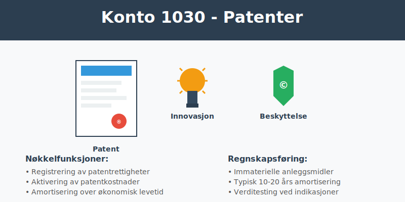
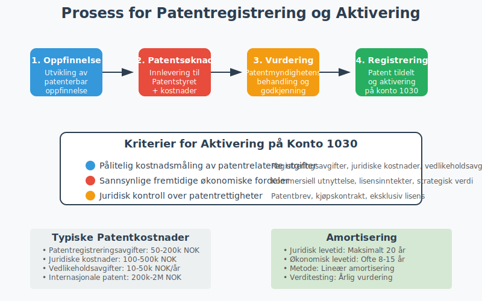
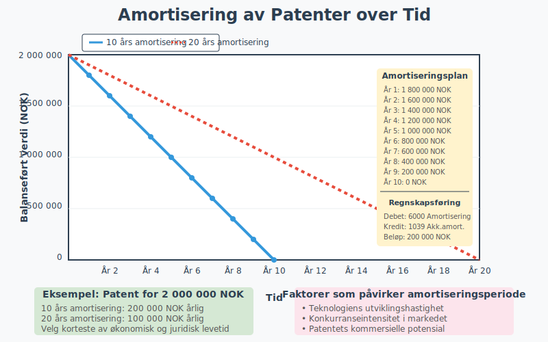

---
title: "Hva er Konto 1030 - Patenter?"
seoTitle: "1030"
description: '**Konto 1030 - Patenter** er en sentral konto i norsk kontoplan for virksomheter som eier eller utvikler patentrettigheter. Denne kontoen brukes for å registre...'
---

**Konto 1030 - Patenter** er en sentral konto i norsk kontoplan for virksomheter som eier eller utvikler patentrettigheter. Denne kontoen brukes for å registrere [immaterielle eiendeler](/blogs/regnskap/hva-er-imaterielle-eiendeler "Hva er Imaterielle Eiendeler?") knyttet til patenter som kan [aktiveres](/blogs/regnskap/hva-er-aktivering "Hva er Aktivering i Regnskap?") i [balansen](/blogs/regnskap/hva-er-balanse "Hva er Balanse?") og [amortiseres](/blogs/regnskap/hva-er-amortisering "Hva er Amortisering?") over patentets levetid.



## Hva er patenter?

Et **patent** er en eksklusiv rettighet som gir oppfinneren enrett til å utnytte en oppfinnelse kommersielt i en bestemt periode. I Norge administreres patenter av Patentstyret, og et patent gir oppfinneren eneret til å:

* **Produsere** produkter som benytter oppfinnelsen
* **Selge** eller **lisensiere** ut patentrettigheter
* **Hindre** andre fra å bruke oppfinnelsen uten tillatelse
* **Søke** erstatning ved patentbrudd

### Patentperioden i Norge

| Patenttype | Maksimal varighet | Fornyelseskrav |
|------------|-------------------|----------------|
| **Vanlige patenter** | 20 år | Årlige fornyelsesavgifter |
| **Legemiddelpatenter** | 20 år + 5 års forlengelse | Spesielle regler for SPC |
| **Brukermodeller** | 10 år | Årlige fornyelsesavgifter |

## Kriterier for aktivering av patenter

For at patenter kan aktiveres på konto 1030, må de oppfylle følgende kriterier:

### 1. Pålitelig kostnadsmåling
**Anskaffelseskostnaden** må kunne måles pålitelig og inkludere:

* Patentregistreringsavgifter
* Advokathonorar og konsulentutgifter
* Oversettelseskostnader
* Vedlikeholdsavgifter
* Utviklingskostnader knyttet til patentsøknad

### 2. Fremtidige økonomiske fordeler
Patentet må ha **sannsynlig** økonomisk verdi gjennom:

* Kommersiell utnyttelse i egen produksjon
* Lisensinntekter fra andre aktører
* Salg av patentrettigheter
* Strategisk verdi som konkurransefortrinn

### 3. Kontrollert ressurs
Virksomheten må ha **juridisk kontroll** over patentet gjennom:

* Registrerte patentrettigheter
* Kjøpskontrakt eller overføring
* Eksklusiv lisensavtale
* Selvstendig utvikling



## Hva kan aktiveres på konto 1030?

### Aktiverbare kostnader

* **Patentregistreringsavgifter** til nasjonale og internasjonale patentmyndigheter
* **Juridiske kostnader** for patentsøknad og forsvar
* **Konsulenthonorar** for patentrådgivning
* **Oversettelseskostnader** for internasjonale patenter
* **Vedlikeholdsavgifter** for opprettholdelse av patent
* **Utviklingskostnader** direkte knyttet til patenterbar oppfinnelse
* **Kjøpspris** for ervervede patenter

### Ikke-aktiverbare kostnader

* **Forskningskostnader** i tidlig fase
* **Generelle administrative kostnader**
* **Markedsføringskostnader**
* **Opplæring** av ansatte
* **Vedlikeholdskostnader** for eksisterende produkter

## Amortisering av patenter

[Immaterielle eiendeler](/blogs/regnskap/hva-er-imaterielle-eiendeler "Hva er Imaterielle Eiendeler?") på konto 1030 skal [amortiseres](/blogs/regnskap/hva-er-amortisering "Hva er Amortisering?") over patentets **økonomiske levetid** eller **juridiske levetid**, avhengig av hva som er kortest.

### Amortiseringsperioder

| Patenttype | Juridisk levetid | Typisk økonomisk levetid |
|------------|------------------|--------------------------|
| **Teknologipatenter** | 20 år | 8-15 år |
| **Prosesspatenter** | 20 år | 10-20 år |
| **Produktpatenter** | 20 år | 5-12 år |
| **Farmasøytiske patenter** | 20 år + SPC | 12-25 år |

### Amortiseringsmetoder

**Lineær amortisering** er den vanligste metoden:

```
Årlig amortisering = Anskaffelseskost / Amortiseringsperiode
```

**Eksempel:** Patent anskaffet for 2 000 000 NOK med 10 års økonomisk levetid:
- Årlig amortisering = 2 000 000 / 10 = 200 000 NOK



## Regnskapsføring av patenter

### Anskaffelse av patent
```
Debet: Konto 1030 - Patenter
Kredit: Konto 1900 - Bank/Kasse
```

### Årlig amortisering
```
Debet: Konto 6000 - Amortisering immat. eiendeler
Kredit: Konto 1039 - Akkumulert amortisering patenter
```

### Salg av patent
```
Debet: Konto 1900 - Bank/Kasse
Debet: Konto 1039 - Akkumulert amortisering patenter
Kredit: Konto 1030 - Patenter
Kredit: Konto 8000 - Gevinst ved salg av anleggsmidler
```

## Verditest og nedskrivning

Patenter på konto 1030 må regelmessig vurderes for [nedskrivning](/blogs/regnskap/hva-er-nedskrivning "Hva er Nedskrivning?") dersom det foreligger indikasjoner på verdifall:

### Indikatorer på verdifall

* **Teknologiske endringer** som gjør patentet obsolet
* **Konkurrerende teknologier** som reduserer patentets verdi
* **Markedsendringer** som påvirker kommersielt potensial
* **Juridiske utfordringer** mot patentets gyldighet
* **Regulatoriske endringer** som begrenser patentets anvendelse

### Nedskrivningstest

1. **Identifiser** indikasjon på verdifall
2. **Beregn** gjenvinnbart beløp (høyeste av bruksverdi og virkelig verdi)
3. **Sammenlign** med balanseført verdi
4. **Regnskapsføre** nedskrivning hvis nødvendig

```
Debet: Konto 6900 - Nedskrivning av anleggsmidler
Kredit: Konto 1030 - Patenter
```

## Forskjell fra andre immaterielle eiendeler

| Konto | Beskrivelse | Hovedforskjell |
|-------|-------------|----------------|
| 1000 | [Forskning og utvikling](/blogs/kontoplan/1000-forskning-og-utvikling "Konto 1000 - Forskning og utvikling") | Intern utvikling, ikke patentert |
| 1020 | [Konsesjoner](/blogs/kontoplan/1020-konsesjoner "Konto 1020 - Konsesjoner") | Offentlige tillatelser og rettigheter |
| 1030 | **Patenter** | Beskyttede tekniske oppfinnelser |
| 1040 | [Lisenser](/blogs/kontoplan/1040-lisenser "Konto 1040 - Lisenser") | Rettigheter til ekstern IP |
| 1050 | Rettigheter | Andre immaterielle rettigheter |

## Internasjonale patenter

For virksomheter med **internasjonale patenter** gjelder spesielle hensyn:

### PCT-søknader (Patent Cooperation Treaty)
* **Kostnad:** Høyere registreringsavgifter
* **Aktivering:** Kan aktiveres ved innlevering
* **Amortisering:** Må vurderes per jurisdiksjon

### EU-patenter
* **Kostnad:** Avgifter til European Patent Office
* **Validering:** Må valideres i hver medlemsstat
* **Vedlikehold:** Separate vedlikeholdsavgifter

### Valutarisiko
Patenter i utenlandsk valuta må:
* **Omregnes** til NOK ved aktivering
* **Revalueres** ved valutakursendringer
* **Sikres** mot valutarisiko ved behov

## Lisensinntekter og royalties

Patenter på konto 1030 kan generere **lisensinntekter** som skal:

### Regnskapsføring av lisensinntekter
```
Debet: [Konto 1500 - Kundefordringer](/blogs/kontoplan/1500-kundefordringer "Konto 1500 - Kundefordringer")
Kredit: Konto 3000 - Salgsinntekter

**Merk:** Kostnader til lisensavgifter og royalties bokføres på [Konto 7600 - Lisensavgifter og royalties](/blogs/kontoplan/7600-lisensavgifter-og-royalties "Konto 7600 - Lisensavgifter og royalties").
```

### Skattemessig behandling
* **Lisensinntekter** regnes som skattepliktig inntekt
* **Royalties** kan være gjenstand for kildeskatt
* **Internprising** må dokumenteres for konserninternt salg

## Eksempel på bruk av konto 1030

**Eksempel:** TechInnovate AS har utviklet en ny produksjonsmetode og søker patent.

### Kostnader i patentprosessen:
* **Patentregistreringsavgifter:** 150 000 NOK
* **Juridiske kostnader:** 300 000 NOK
* **Konsulenthonorar:** 200 000 NOK
* **Oversettelseskostnader:** 50 000 NOK
* **Totalt:** 700 000 NOK

### Regnskapsføring:
1. **Aktivering** av patentkostnader på konto 1030
2. **Amortisering** over 12 år (58 333 NOK årlig)
3. **Lisensinntekter** fra tredje part: 150 000 NOK årlig

### Lønnsomhetsanalyse:
- **Årlig netto:** 150 000 - 58 333 = 91 667 NOK
- **Tilbakebetalingstid:** 700 000 / 91 667 = 7,6 år

## Skattemessige forhold

**Skattemessig behandling** av patenter kan avvike fra regnskapsmessig behandling:

### Aktivering og amortisering
* **Skattemessig:** Minimum 10 års avskrivning
* **Regnskapsmessig:** Økonomisk levetid (ofte kortere)
* **Forskjell:** Kan gi midlertidige forskjeller

### Spesielle skatteordninger
* **Patentboksskatt:** Redusert skattesats på patent-inntekter
* **SkatteFUNN:** Fradrag for FoU-kostnader
* **Innovasjonsfradrag:** Tilleggsfradrag for visse innovasjoner

## Rapportering i årsregnskapet

Patenter på konto 1030 rapporteres som [anleggsmidler](/blogs/regnskap/hva-er-anleggsmidler "Hva er Anleggsmidler?") i [balansen](/blogs/regnskap/hva-er-balanseregnskap "Hva er Balanseregnskap?"). I notene må det opplyses om:

### Påkrevde opplysninger
* **Anskaffelseskost** ved årets begynnelse
* **Tilgang** i løpet av året
* **Amortisering** i løpet av året
* **Nedskrivninger** hvis aktuelt
* **Balanseført verdi** ved årets slutt
* **Amortiseringsmetode** og restlevetid

### Vurdering av usikkerhet
* **Teknologirisiko** og markedsrisiko
* **Juridisk risiko** ved patenttvister
* **Regulatorisk risiko** ved endringer i lovgivning

## Praktiske tips for virksomheter

### Patentstrategi
* **Kartlegg** konkurransefortrinn som kan patenteres
* **Vurder** kostnader mot forventet avkastning
* **Prioriter** viktigste markeder for patentbeskyttelse

### Dokumentasjon og kontroll
* **Oppbevar** all dokumentasjon knyttet til patenter
* **Overvåk** patentporteføljen for vedlikehold
* **Etabler** rutiner for verditesting

### Organisering
* **Ansvarlig** for patentportefølje
* **Budsjett** for patentvedlikehold
* **Varslingssystem** for fornyelser

## Relaterte artikler

* [Konto 1000 - Forskning og utvikling](/blogs/kontoplan/1000-forskning-og-utvikling "Konto 1000 - Forskning og utvikling")
* [Konto 1020 - Konsesjoner](/blogs/kontoplan/1020-konsesjoner "Konto 1020 - Konsesjoner")
* [Konto 1040 - Lisenser](/blogs/kontoplan/1040-lisenser "Konto 1040 - Lisenser")
* [Konto 1050 - Varemerker](/blogs/kontoplan/1050-varemerker "Konto 1050 - Varemerker")
* [Konto 1060 - Andre rettigheter](/blogs/kontoplan/1060-andre-rettigheter "Konto 1060 - Andre rettigheter")
* [Konto 7610 - Patentkostnad ved egen patent](/blogs/kontoplan/7610-patentkostnad-ved-egen-patent "Konto 7610 - Patentkostnad ved egen patent")
* [Hva er Imaterielle Eiendeler?](/blogs/regnskap/hva-er-imaterielle-eiendeler "Hva er Imaterielle Eiendeler?")
* [Hva er Aktivering i Regnskap?](/blogs/regnskap/hva-er-aktivering "Hva er Aktivering i Regnskap?")
* [Hva er Amortisering?](/blogs/regnskap/hva-er-amortisering "Hva er Amortisering?")
* [Hva er Anleggsmidler?](/blogs/regnskap/hva-er-anleggsmidler "Hva er Anleggsmidler?")
* [Hva er Balanse?](/blogs/regnskap/hva-er-balanse "Hva er Balanse?")
* [Hva er Anskaffelseskost?](/blogs/regnskap/hva-er-anskaffelseskost "Hva er Anskaffelseskost?")


