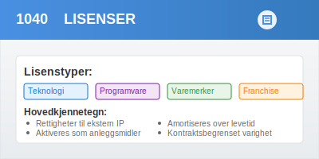
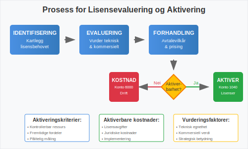
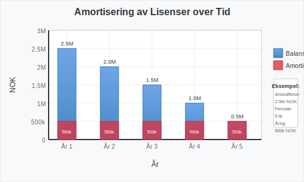
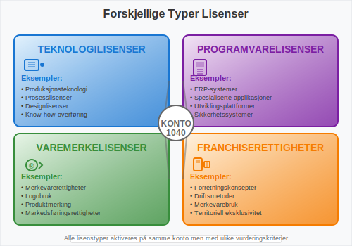

---
title: "Konto 1040 – Lisenser"
seoTitle: "Konto 1040 | Lisenser | Kontoplan"
description: "Konto 1040 i norsk kontoplan (NS 4102) benyttes for lisensrettigheter som immaterielle eiendeler. Les om aktivering, verdsettelse, amortisering, bokføring og vanlige vurderinger."
summary: "Konto 1040 i norsk kontoplan: aktivering, amortisering og bokføring av lisenser for immaterielle eiendeler."
---

**Konto 1040 - Lisenser** er en viktig konto i norsk kontoplan som benyttes for å registrere [immaterielle eiendeler](/blogs/regnskap/hva-er-imaterielle-eiendeler "Hva er Imaterielle Eiendeler?") knyttet til lisensrettigheter. Denne kontoen brukes når virksomheter erverver eller utvikler lisenser som kan [aktiveres](/blogs/regnskap/hva-er-aktivering "Hva er Aktivering i Regnskap?") i [balansen](/blogs/regnskap/hva-er-balanse "Hva er Balanse?") og [amortiseres](/blogs/regnskap/hva-er-amortisering "Hva er Amortisering?") over lisensens levetid.



## Hva er lisenser?

En **lisens** er en juridisk tillatelse som gir rettigheter til å bruke, produsere eller distribuere intellektuell eiendom som eies av en annen part. Lisenser kan omfatte:

* **Teknologilisenser** for bruk av tekniske løsninger
* **Programvarelisenser** for bruk av datasystemer
* **Varemerkelisenser** for bruk av kommersielle merker
* **Patentlisenser** for bruk av patentbeskyttede oppfinnelser
* **Franchiserettigheter** for bruk av forretningskonsepter
* **Medielisenser** for bruk av innhold og kunstverk

### Lisenstypene i norsk næringsliv

| Lisenstype | Typisk varighet | Fornyelsesmulighet |
|------------|----------------|-------------------|
| **Teknologilisenser** | 5-15 år | Ofte fornybar |
| **Programvarelisenser** | 1-5 år | Årlig fornyelse |
| **Varemerkelisenser** | 3-10 år | Vanligvis fornybar |
| **Patentlisenser** | Inntil 20 år | Begrenset av patent |
| **Franchiserettigheter** | 5-20 år | Ofte fornybar |
| **Medielisenser** | 1-10 år | Varierer sterkt |

## Kriterier for aktivering av lisenser

For at lisenser kan aktiveres på konto 1040, må de oppfylle spesifikke kriterier:

### 1. Kontrollerbar ressurs
Virksomheten må ha **juridisk kontroll** over lisensrettigheten gjennom:

* Skriftlig lisensavtale med klare rettigheter
* Eksklusive eller begrenset konkurranse
* Juridisk håndhevbare rettigheter
* Overførbar eller fornybar lisens

### 2. Fremtidige økonomiske fordeler
Lisensen må kunne generere **påviselige økonomiske fordeler** gjennom:

* Direkte inntektsgenerering
* Kostnadbreduksjoner i drift
* Markedsadgang eller konkurransefordeler
* Strategisk verdi for virksomheten

### 3. Pålitelig kostnadsmåling
**Anskaffelseskostnaden** må kunne måles pålitelig og inkludere:

* Lisensavgifter og etableringsgebyrer
* Juridiske kostnader ved forhandling
* Konsulenthonorar og due diligence
* Implementerings- og opplæringskostnader
* Registreringsavgifter



## Hva kan aktiveres på konto 1040?

### Aktiverbare kostnader

* **Lisensavgifter** (opprinnelige og fornyelsesgebyrer)
* **Juridiske kostnader** ved forhandling og gjennomgang
* **Konsulenthonorar** for teknisk evaluering
* **Implementeringskostnader** direkte knyttet til lisensen
* **Opplæringskostnader** for å utnytte lisensen
* **Registreringsavgifter** og administrative kostnader
* **Modifikasjonskostnader** for tilpasning til virksomheten

### Ikke-aktiverbare kostnader

* **Generelle administrative kostnader**
* **Forskning** for å finne passende lisenser
* **Markedsføringskostnader** for lisensierte produkter
* **Vedlikeholdskostnader** for ordinær drift
* **Interne personalkostnader** for evaluering
* **Kostnader** ved avslåtte lisensforhandlinger

## Amortisering av lisenser

Lisenser på konto 1040 skal [amortiseres](/blogs/regnskap/hva-er-amortisering "Hva er Amortisering?") over **lisensens økonomiske levetid** eller **kontraktens løpetid**, avhengig av hva som er kortest.

### Amortiseringsperioder

| Lisenstype | Kontraktslengde | Typisk økonomisk levetid |
|------------|----------------|--------------------------|
| **Teknologilisenser** | 5-15 år | 3-10 år |
| **Programvarelisenser** | 1-5 år | 1-3 år |
| **Varemerkelisenser** | 3-10 år | 5-15 år |
| **Franchiserettigheter** | 5-20 år | 10-20 år |
| **Medielisenser** | 1-10 år | 2-8 år |

### Amortiseringsmetoder

**Lineær amortisering** er standard for lisenser:

```
Årlig amortisering = Anskaffelseskost / Amortiseringsperiode
```

**Akselerert amortisering** kan benyttes dersom:
- Teknologisk utvikling påvirker lisensens verdi
- Markedsendringer reduserer nytten
- Konkurranse eroderer lisensens fordeler

**Eksempel:** Programvarelisens anskaffet for 1 500 000 NOK med 5 års kontraktslengde:
- Årlig amortisering = 1 500 000 / 5 = 300 000 NOK



## Regnskapsføring av lisenser

### Anskaffelse av lisens
```
Debet: Konto 1040 - Lisenser
Kredit: Konto 1900 - Bank/Kasse
```

### Årlig amortisering
```
Debet: Konto 6000 - Amortisering immat. eiendeler
Kredit: Konto 1049 - Akkumulert amortisering lisenser
```

### Fornyelse av lisens
```
Debet: Konto 1040 - Lisenser (hvis øker verdien)
Debet: Konto 6000 - Driftskostnader (hvis kun vedlikehold)
Kredit: Konto 1900 - Bank/Kasse
```

### Avslutning av lisens
```
Debet: Konto 1049 - Akkumulert amortisering lisenser
Debet: Konto 6900 - Tap ved avslutning av anleggsmidler
Kredit: Konto 1040 - Lisenser
```

## Verditest og nedskrivning

Lisenser på konto 1040 må regelmessig vurderes for **nedskrivning** dersom det foreligger indikasjoner på verdifall:

### Indikatorer på verdifall

* **Teknologiske endringer** som gjør lisensen irrelevant
* **Markedsendringer** som reduserer lisensens verdi
* **Konkurrerende løsninger** som eliminerer fordeler
* **Regulatoriske endringer** som begrenser bruk
* **Lisensgiverens problemer** som påvirker støtte
* **Kontraktbrudd** eller juridiske tvister

### Nedskrivningstest

1. **Identifisering** av indikasjoner på verdifall
2. **Beregning** av gjenvinnbart beløp
3. **Sammenligning** med balanseført verdi
4. **Regnskapsføring** av nedskrivning

```
Debet: Konto 6900 - Nedskrivning av anleggsmidler
Kredit: Konto 1040 - Lisenser
```

## Forskjellige typer lisenser

### Teknologilisenser

**Teknologilisenser** gir rett til å bruke tekniske løsninger, prosesser eller know-how:

* **Produksjonsteknologi** for spesialiserte prosesser
* **Designlisenser** for produktutforming
* **Prosesslisenser** for effektivisering
* **Kvalitetsstandarder** og sertifiseringer

### Programvarelisenser

**Programvarelisenser** omfatter rettigheter til datasystemer og applikasjoner:

* **ERP-systemer** for virksomhetsstyring
* **Spesialiserte applikasjoner** for bransjen
* **Utviklingsverktøy** og plattformer
* **Sikkerhetssystemer** og antivirus

### Varemerke- og franchiserettigheter

**Kommersielle lisenser** for merkevarer og forretningskonsepter:

* **Varemerkelisenser** for produktmerking
* **Franchiserettigheter** for forretningsdrift
* **Distribusjonslisenser** for salg av produkter
* **Markedsføringsrettigheter** for kampanjer



## Internasjonale lisenser

For virksomheter med **internasjonale lisenser** gjelder spesielle hensyn:

### Valutarisiko
* **Omregning** til NOK ved aktivering
* **Revaluering** ved vesentlige kursendringer
* **Sikring** av valutarisiko ved behov

### Jurisdiksjonsrisiko
* **Ulike lovverk** i forskjellige land
* **Håndhevelse** av lisensrettigheter
* **Skatteregler** for lisensbetalinger

### Transferprising
* **Internprising** ved konserninternt salg
* **Dokumentasjon** av markedsmessige vilkår
* **Skattemessige** konsekvenser

## Skattemessige forhold

**Skattemessig behandling** av lisenser kan avvike fra regnskapsmessig behandling:

### Aktivering og avskrivning
* **Skattemessig:** Minimum 5 års avskrivning
* **Regnskapsmessig:** Økonomisk levetid
* **Forskjell:** Kan gi midlertidige forskjeller

### Fradragsrett
* **Lisensavgifter** er som regel fradragsberettigede
* **Fornyelsesgebyrer** kan kostnadsføres direkte
* **Utviklingskostnader** kan ha spesielle regler

### Kildeskatt
* **Internasjonale lisenser** kan være gjenstand for kildeskatt
* **Skatteavtaler** kan redusere skattesatser
* **Dokumentasjon** av eierskap og betalinger

## Eksempler på bruk av konto 1040

### Eksempel 1: Teknologilisens

**TechPro AS** erverver lisens for avansert produksjonsteknologi:

#### Kostnader:
* **Lisensavgift:** 2 500 000 NOK
* **Implementering:** 500 000 NOK
* **Opplæring:** 200 000 NOK
* **Totalt:** 3 200 000 NOK

#### Regnskapsføring:
- **Aktivering:** 3 200 000 NOK på konto 1040
- **Amortisering:** 8 år (400 000 NOK årlig)
- **Forventet avkastning:** 600 000 NOK årlig i kostnadsbesparelser

### Eksempel 2: Programvarelisens

**ServiceCorp AS** implementerer nytt ERP-system:

#### Kostnader:
* **Lisensiering:** 1 000 000 NOK
* **Tilpasning:** 300 000 NOK
* **Opplæring:** 150 000 NOK
* **Totalt:** 1 450 000 NOK

#### Regnskapsføring:
- **Aktivering:** 1 450 000 NOK på konto 1040
- **Amortisering:** 5 år (290 000 NOK årlig)
- **Forventet effekt:** 20% reduksjon i administrative kostnader

### Eksempel 3: Franchiserettigheter

**FranchiseCo AS** erverver franchiserettigheter:

#### Kostnader:
* **Etableringsavgift:** 800 000 NOK
* **Juridiske kostnader:** 100 000 NOK
* **Opplæring:** 50 000 NOK
* **Totalt:** 950 000 NOK

#### Regnskapsføring:
- **Aktivering:** 950 000 NOK på konto 1040
- **Amortisering:** 10 år (95 000 NOK årlig)
- **Løpende royalty:** 5% av omsetning (kostnadsføres direkte på [Konto 7600 - Lisensavgifter og royalties](/blogs/kontoplan/7600-lisensavgifter-og-royalties "Konto 7600 - Lisensavgifter og royalties"))

## Rapportering i årsregnskapet

Lisenser på konto 1040 rapporteres som [anleggsmidler](/blogs/regnskap/hva-er-anleggsmidler "Hva er Anleggsmidler?") i balansen. I notene må det opplyses om:

### Påkrevde opplysninger

* **Anskaffelseskost** ved årets begynnelse
* **Tilgang** i løpet av året
* **Amortisering** for året
* **Nedskrivninger** hvis aktuelt
* **Balanseført verdi** ved årets slutt
* **Amortiseringsmetode** og restlevetid

### Spesielle opplysninger for lisenser

* **Lisenstype** og hovedinnhold
* **Kontraktslengde** og fornyelsesvilkår
* **Geografisk omfang** og begrensninger
* **Avhengighet** av lisensgivere
* **Risikofaktorer** og usikkerhet

## Risikostyring for lisenser

### Kontraktsrisiko
* **Fornyelsesvilkår** og terminering
* **Prisøkninger** og justeringsmekanismer
* **Prestasjonsgarantier** og servicenivå
* **Intellektuell eiendom** og erstatningsansvar

### Leverandørrisiko
* **Lisensgiverens** finansielle stabilitet
* **Produktutvikling** og innovasjon
* **Konkurranseposisjon** i markedet
* **Strategiske endringer** hos leverandør

### Teknologirisiko
* **Teknologisk utvikling** og obsolescence
* **Kompatibilitet** med eksisterende systemer
* **Sikkerhet** og databeskyttelse
* **Ytelse** og skalerbarhet

## Forskjell fra andre immaterielle eiendeler

| Konto | Beskrivelse | Hovedforskjell |
|-------|-------------|----------------|
| 1000 | [Forskning og utvikling](/blogs/kontoplan/1000-forskning-og-utvikling "Konto 1000 - Forskning og utvikling") | Intern utvikling av IP |
| 1020 | [Konsesjoner](/blogs/kontoplan/1020-konsesjoner "Konto 1020 - Konsesjoner") | Offentlige tillatelser |
| 1030 | [Patenter](/blogs/kontoplan/1030-patenter "Konto 1030 - Patenter") | Beskyttede tekniske oppfinnelser |
| 1040 | **Lisenser** | Rettigheter til ekstern IP |
| 1050 | [Varemerker](/blogs/kontoplan/1050-varemerker "Konto 1050 - Varemerker") | Kommersielle identifikatorer |
| 1060 | [Andre rettigheter](/blogs/kontoplan/1060-andre-rettigheter "Konto 1060 - Andre rettigheter") | Øvrige immaterielle rettigheter |

## Praktiske tips for virksomheter

### Lisensstrategi
* **Identifiser** kritiske lisenser for virksomheten
* **Vurder** kjøp vs. leasing av lisenser
* **Planlegg** fornyelser og oppgraderinger
* **Diversifiser** leverandørrisiko

### Kontraktsforhandling
* **Forhandl** gunstige fornyelsesvilkår
* **Sikr** fleksibilitet ved endringer
* **Klargjør** rettigheter og plikter
* **Inkluder** exit-klausuler

### Administrasjon og kontroll
* **Etabler** lisensportefølje-oversikt
* **Overvåk** bruken av lisenser
* **Sikr** compliance med avtaler
* **Planlegg** budsjett for fornyelser

### Økonomisk styring
* **Vurder** regelmessig lisensers verdi
* **Analyser** avkastning på lisensinvesteringer
* **Sammenlign** med alternative løsninger
* **Optimaliser** lisensporteføljen

## Relaterte artikler

* [Konto 1000 - Forskning og utvikling](/blogs/kontoplan/1000-forskning-og-utvikling "Konto 1000 - Forskning og utvikling")
* [Konto 1020 - Konsesjoner](/blogs/kontoplan/1020-konsesjoner "Konto 1020 - Konsesjoner")
* [Konto 1030 - Patenter](/blogs/kontoplan/1030-patenter "Konto 1030 - Patenter")
* [Konto 1050 - Varemerker](/blogs/kontoplan/1050-varemerker "Konto 1050 - Varemerker")
* [Konto 1060 - Andre rettigheter](/blogs/kontoplan/1060-andre-rettigheter "Konto 1060 - Andre rettigheter")
* [Hva er Imaterielle Eiendeler?](/blogs/regnskap/hva-er-imaterielle-eiendeler "Hva er Imaterielle Eiendeler?")
* [Hva er Aktivering i Regnskap?](/blogs/regnskap/hva-er-aktivering "Hva er Aktivering i Regnskap?")
* [Hva er Amortisering?](/blogs/regnskap/hva-er-amortisering "Hva er Amortisering?")
* [Hva er Anleggsmidler?](/blogs/regnskap/hva-er-anleggsmidler "Hva er Anleggsmidler?")
* [Hva er Balanse?](/blogs/regnskap/hva-er-balanse "Hva er Balanse?")
* [Hva er Anskaffelseskost?](/blogs/regnskap/hva-er-anskaffelseskost "Hva er Anskaffelseskost?")


