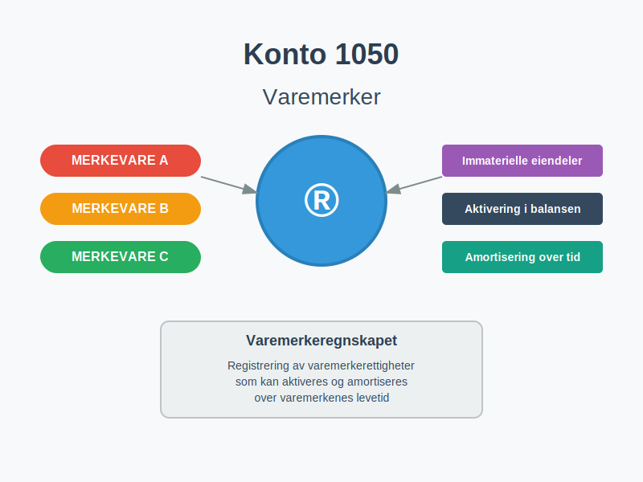
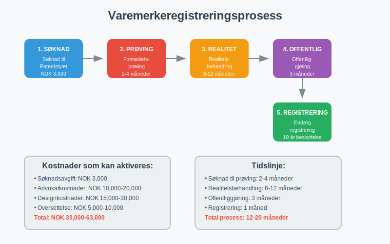
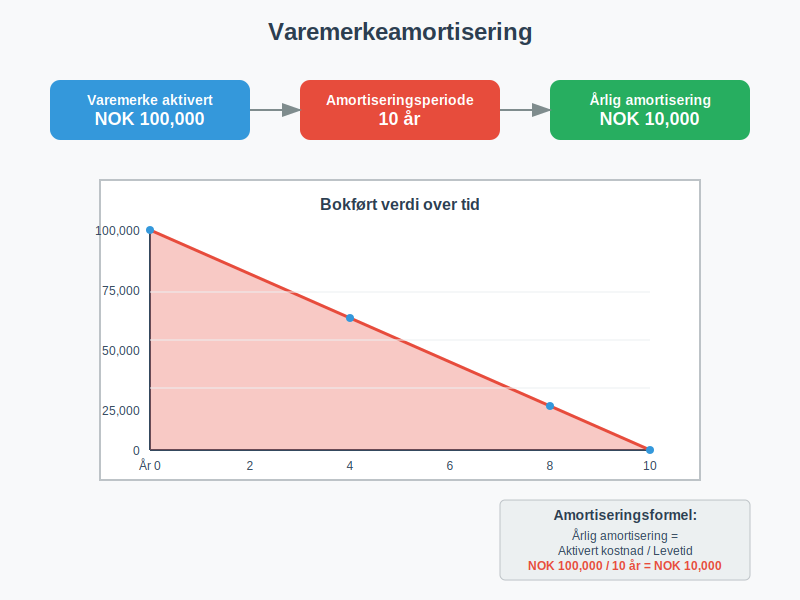
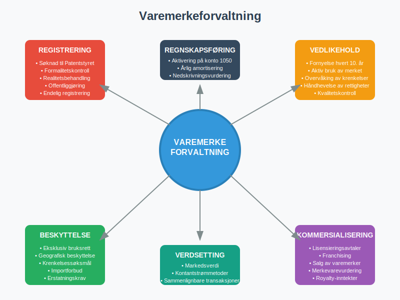

---
title: "Hva er Konto 1050 - Varemerker?"
seoTitle: "1050"
meta_description: '**Konto 1050 - Varemerker** er en sentral konto i norsk kontoplan som anvendes for å registrere [immaterielle eiendeler](/blogs/regnskap/hva-er-imaterielle-eie...'
slug: 1050
type: blog
layout: pages/single
---

**Konto 1050 - Varemerker** er en sentral konto i norsk kontoplan som anvendes for å registrere [immaterielle eiendeler](/blogs/regnskap/hva-er-imaterielle-eiendeler "Hva er Imaterielle Eiendeler?") knyttet til varemerkerettigheter. Denne kontoen brukes når virksomheter erverver eller utvikler varemerker som kan [aktiveres](/blogs/regnskap/hva-er-aktivering "Hva er Aktivering i Regnskap?") i [balansen](/blogs/regnskap/hva-er-balanse "Hva er Balanse?") og [amortiseres](/blogs/regnskap/hva-er-amortisering "Hva er Amortisering?") over varemerkenes levetid.



## Hva er varemerker?

Et **varemerke** er et beskyttet tegn som identifiserer og skiller en virksomhets varer eller tjenester fra andre aktører i markedet. Varemerker kan bestå av:

* **Ordmerker** - tekst, ord eller navn
* **Figurmerker** - logoer, symboler og grafiske elementer
* **Kombinerte merker** - kombinasjon av tekst og figurer
* **Formmerker** - spesielle former eller design
* **Fargmerker** - beskyttede fargekombinasjoner
* **Lydmerker** - karakteristiske lyder eller melodier

### Varemerketyper i norsk næringsliv

| Varemerketype | Beskyttelsesperiode | Fornyelsesmulighet |
|---------------|-------------------|-------------------|
| **Nasjonalt varemerke** | 10 år | Ubegrenset fornyelse |
| **EU-varemerke** | 10 år | Ubegrenset fornyelse |
| **Internasjonalt varemerke** | 10 år | Ubegrenset fornyelse |
| **Fellesvaremerker** | 10 år | Ubegrenset fornyelse |
| **Kollektivmerker** | 10 år | Ubegrenset fornyelse |



## Kriterier for aktivering av varemerker

For at varemerker kan aktiveres på konto 1050, må de oppfylle spesifikke kriterier:

### 1. Kontrollerbar ressurs
Virksomheten må ha **juridisk kontroll** over varemerkerettigheten gjennom:

* Registrert varemerke med eksklusiv bruksrett
* Overdragbar eller lisensierbar rettighet
* Juridisk håndhevbare rettigheter
* Klar eiendomsrett til varemerket

### 2. Fremtidige økonomiske fordeler
Varemerket må kunne generere **påviselige økonomiske fordeler** gjennom:

* Merkevarebeskyttelse og markedsposisjon
* Kundegjenkjenning og lojalitet
* Prispremium og markedsfordeler
* Lisensieringsmuligheter til tredjeparter

### 3. Pålitelig kostnadsmåling
**Anskaffelseskostnaden** må kunne måles pålitelig og inkludere:

* Registreringsgebyrer og søknadsavgifter
* Advokatkostnader og juridiske tjenester
* Designkostnader og merkeutvikling
* Oversettelses- og dokumentasjonskostnader

## Regnskapsføring av varemerker

### Anskaffelse av varemerker
Når varemerker anskaffes, registreres disse kostnadene:

| Kostnadskategori | Konto 1050 | Eksempel |
|------------------|------------|----------|
| **Registreringsgebyrer** | ✓ | NOK 3,000 |
| **Advokatkostnader** | ✓ | NOK 15,000 |
| **Designkostnader** | ✓ | NOK 25,000 |
| **Oversettelseskostnader** | ✓ | NOK 5,000 |
| **Søknadsavgifter** | ✓ | NOK 4,000 |
| **Vedlikeholdskostnader** | ✗ | Kostnadsføres |

### Internt utviklede varemerker
For **internt utviklede varemerker** kan disse kostnadene aktiveres:

* Designkostnader og merkeutvikling
* Markedsundersøkelser og konsepttesting
* Juridiske kostnader for registrering
* Dokumentasjon og søknadsprosess



## Amortisering av varemerker

### Amortiseringsperiode
Varemerker amortiseres over deres **økonomiske levetid**, som vanligvis er:

* **Maksimum 20 år** som hovedregel
* **Kortere periode** hvis økonomisk levetid er begrenset
* **Fleksibel vurdering** basert på markedsforhold

### Amortiseringsmetoder
**Lineær amortisering** er den vanligste metoden:

```
Årlig amortisering = Aktivert kostnad / Amortiseringsperiode
```

**Eksempel på amortisering:**
- Aktivert varemerkekostnad: NOK 100,000
- Amortiseringsperiode: 10 år
- Årlig amortisering: NOK 10,000

### Verdifall og nedskrivning
Varemerker må vurderes for **verdifall** årlig:

* **Nedskrivningstest** ved indikasjoner på verdifall
* **Markedsverdi** kontra bokført verdi
* **Fremtidige kontantstrømmer** fra varemerket
* **Konkurransesituasjon** og markedsutvikling

## Praktiske eksempler

### Eksempel 1: Registrering av nytt varemerke
Et selskap registrerer et nytt varemerke med følgende kostnader:

| Kostnad | Beløp |
|---------|-------|
| Registreringsgebyr | NOK 3,000 |
| Advokatkostnader | NOK 12,000 |
| Designkostnader | NOK 20,000 |
| **Total anskaffelseskost** | **NOK 35,000** |

**Regnskapsføring:**
- Debit: Konto 1050 Varemerker NOK 35,000
- Kredit: Konto 1900 Leverandørgjeld NOK 35,000

### Eksempel 2: Kjøp av etablert varemerke
En virksomhet kjøper et etablert varemerke for NOK 500,000:

**Regnskapsføring ved kjøp:**
- Debit: Konto 1050 Varemerker NOK 500,000
- Kredit: Konto 1900 Leverandørgjeld NOK 500,000

**Årlig amortisering (15 år):**
- Debit: Konto 6031 Amortisering NOK 33,333
- Kredit: Konto 1050 Varemerker NOK 33,333

## Forhold til andre kontoer

### Tilknyttede [anleggsmidler](/blogs/regnskap/hva-er-anleggsmidler "Hva er Anleggsmidler?"):
* **[Konto 1000](/blogs/kontoplan/1000-forskning-og-utvikling "Konto 1000 - Forskning og utvikling")** - Forskning og utvikling
* **[Konto 1020](/blogs/kontoplan/1020-konsesjoner "Konto 1020 - Konsesjoner")** - Konsesjoner
* **[Konto 1030](/blogs/kontoplan/1030-patenter "Konto 1030 - Patenter")** - Patenter
* **[Konto 1040](/blogs/kontoplan/1040-lisenser "Konto 1040 - Lisenser")** - Lisenser
* **[Konto 1060](/blogs/kontoplan/1060-andre-rettigheter "Konto 1060 - Andre rettigheter")** - Andre rettigheter

### Amortiseringskontoer:
* **[Konto 6020](/blogs/kontoplan/6020-avskrivning-pa-immatrielle-eiendeler "Konto 6020 - Avskrivning på immaterielle eiendeler")** - Avskrivning på immaterielle eiendeler
* **Konto 6032** - Nedskrivning av immaterielle eiendeler



## Juridiske aspekter

### Varemerkeregistrering
**Registreringsprosessen** i Norge omfatter:

1. **Søknad** til Patentstyret
2. **Formalitetsprøving** av søknaden
3. **Realitetsbehandling** og konfliktprøving
4. **Offentliggjøring** med innsigelsesperiode
5. **Registrering** ved godkjenning

### Beskyttelsesomfang
Varemerker gir **eksklusiv bruksrett** til:

* Identiske tegn for identiske varer/tjenester
* Liknende tegn for liknende varer/tjenester
* Kjente merker for ulike varer/tjenester
* Geografisk beskyttelse innenfor registreringsområdet

### Fornyelse og vedlikehold
**Varemerkevedlikehold** innebærer:

* **Fornyelse** hvert 10. år
* **Aktiv bruk** av varemerket
* **Overvåking** av krenkelser
* **Håndhevelse** av rettigheter

## Skattemessige forhold

### Skattemessig behandling
Varemerker behandles **skattemessig** som:

* **Avskrivbare driftsmidler** i gruppe d (20% saldoavskrivning)
* **Ervervet goodwill** hvis del av virksomhetsoverdragelse
* **Fradragsberettiget** amortisering over levetiden

### Gevinst og tap
Ved **salg eller avhending** av varemerker:

* **Gevinst** skattlegges som alminnelig inntekt
* **Tap** er **fradragsberettiget** i alminnelig inntekt
* **Balanseført verdi** reduseres med salgssum

## Internasjonale forhold

### Internasjonale varemerker
For **internasjonale varemerker** gjelder:

* **Madrid-protokollen** for internasjonal registrering
* **EU-varemerker** for europeisk beskyttelse
* **Nasjonale registreringer** i enkelte land
* **Valutaomregning** av utenlandske kostnader

### Konsernforhold
I **konsernforhold** kan varemerker:

* **Overføres** mellom selskaper
* **Lisensiere** til datterselskaper
* **Konsolideres** i konsernregnskapet
* **Elimineres** ved interne transaksjoner

## Kontroll og revisjon

### Interne kontroller
**Varemerkeforvaltning** krever:

* **Registrering** av alle varemerker
* **Oppfolging** av fornyelsesfrister
* **Verdivurdering** ved regnskapsavslutning
* **Dokumentasjon** av aktiverte kostnader

### Revisorens kontroll
**Revisor** må kontrollere:

* **Aktiveringsvilkår** for varemerker
* **Amortiseringsperioder** og -metoder
* **Nedskrivningsbehov** og verdivurderinger
* **Klassifisering** som immaterielle eiendeler

## Bransjespesifikke forhold

### Detaljhandel og merkevarer
I **detaljhandel** er varemerker viktige for:

* **Kundegjenkjenning** og lojalitet
* **Prispremium** og markedsposisjon
* **Franchising** og lisensieringsmodeller
* **Konkurransefordeler** i markedet

### Teknologibransjen
**Teknologiselskaper** bruker varemerker for:

* **Produktnavn** og tjenestemerker
* **Programvaremerker** og applikasjoner
* **Plattformmerker** og økosystemer
* **Bedriftsmerker** og omdømmehåndtering

### Servicebransjen
**Servicebedrifter** fokuserer på:

* **Tjenestemerker** og kvalitetssignaler
* **Bedriftsidentitet** og posisjonering
* **Konseptmerker** og forretningsmodeller
* **Lokalmerker** og markedsføring

## Utviklingstrender

### Digitale varemerker
**Digitalisering** påvirker varemerker gjennom:

* **Domenenavn** og internettmerker
* **Sosiale medier** og plattformmerker
* **Søkemotoroptimalisering** og synlighet
* **Digitale tjenester** og applikasjoner

### Bærekraft og CSR
**Bærekraftige varemerker** blir viktigere for:

* **Miljømerking** og grønne produkter
* **Samfunnsansvar** og etisk profilering
* **Forbrukertrender** og verdier
* **Regulatoriske krav** og rapportering

## Konklusjon

Konto 1050 Varemerker er en kritisk konto for virksomheter som investerer i merkevarebygging og markedsposisjonering. **Korrekt regnskapsføring** av varemerker krever forståelse av både regnskapsmessige, juridiske og skattemessige aspekter.

**Nøkkelpunkter** for varemerkeregnskapet:

* **Aktiver** kun varemerker som oppfyller aktiveringsvilkårene
* **Amortiser** over rimelig økonomisk levetid
* **Vurder** regelmessig for verdifall og nedskrivning
* **Dokumenter** alle kostnader og vurderinger
* **Følg opp** fornyelsesfrister og vedlikehold

Varemerker representerer ofte betydelige verdier for virksomheter og krever profesjonell forvaltning for å opprettholde både regnskapsmessig korrekthet og forretningsnytte.


