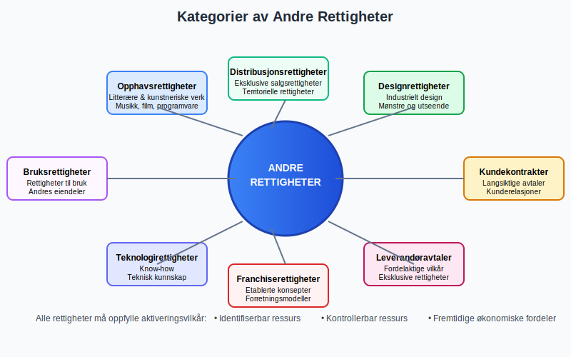
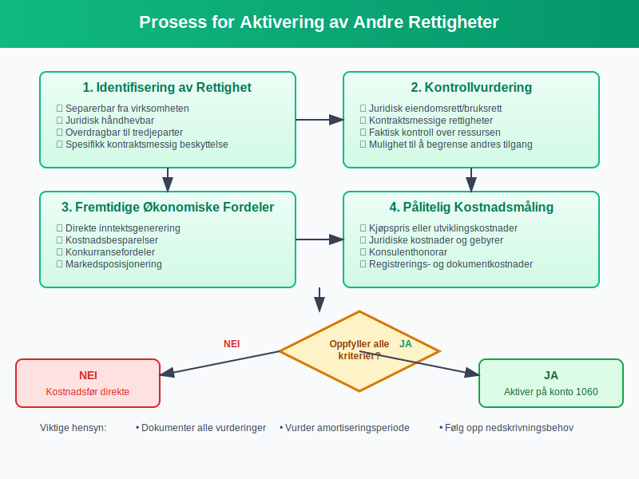
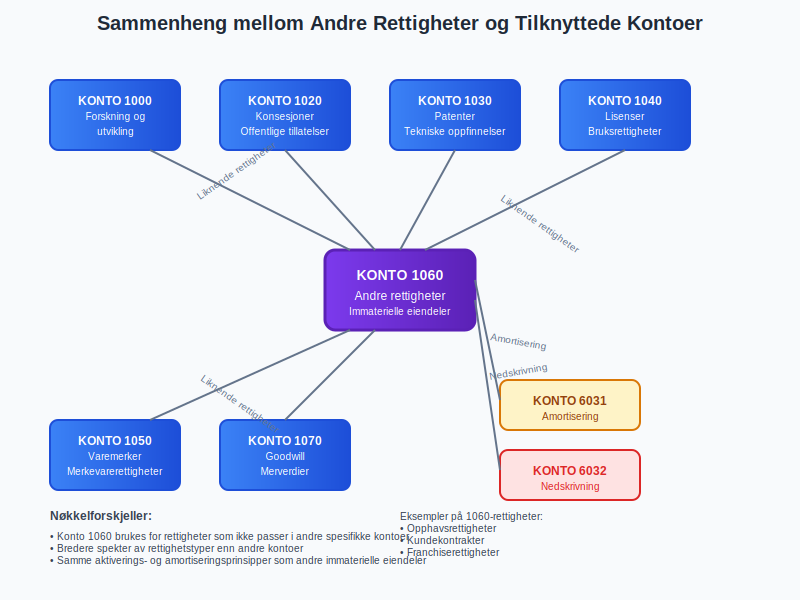

---
title: "Hva er Konto 1060 - Andre rettigheter?"
meta_title: "1060"
meta_description: '**Konto 1060 - Andre rettigheter** er en viktig konto i norsk kontoplan som anvendes for å registrere [immaterielle eiendeler](/blogs/regnskap/hva-er-imateriel...'
slug: 1060
type: blog
layout: pages/single
---

**Konto 1060 - Andre rettigheter** er en viktig konto i norsk kontoplan som anvendes for å registrere [immaterielle eiendeler](/blogs/regnskap/hva-er-imaterielle-eiendeler "Hva er Imaterielle Eiendeler?") knyttet til ulike typer rettigheter som ikke dekkes av andre spesifikke kontoer. Denne kontoen brukes når virksomheter erverver eller utvikler rettigheter som kan [aktiveres](/blogs/regnskap/hva-er-aktivering "Hva er Aktivering i Regnskap?") i [balansen](/blogs/regnskap/hva-er-balanse "Hva er Balanse?") og [amortiseres](/blogs/regnskap/hva-er-amortisering "Hva er Amortisering?") over rettighetenes levetid.


## Hva er andre rettigheter?

**Andre rettigheter** omfatter et bredt spekter av immaterielle eiendeler som gir virksomheten juridiske eller økonomiske fordeler. Disse rettighetene kan være av ulik karakter og varighet:

### Hovedtyper av andre rettigheter

* **Opphavsrettigheter** - litterære, kunstneriske og vitenskapelige verk
* **Designrettigheter** - beskyttelse av industrielt design og mønstre
* **Kundekontrakter** - langsiktige avtaler med kunder
* **Leverandøravtaler** - fordelaktige leverandørforhold
* **Teknologirettigheter** - know-how og teknisk kunnskap
* **Bruksrettigheter** - rettigheter til bruk av andres eiendeler
* **Distribusjonsrettigheter** - eksklusive salgs- og distribusjonsrettigheter
* **Franchiserettigheter** - rettigheter til å drive under etablerte konsepter



## Kriterier for aktivering av andre rettigheter

For at andre rettigheter kan aktiveres på konto 1060, må de oppfylle standardkriteriene for [immaterielle eiendeler](/blogs/regnskap/hva-er-imaterielle-eiendeler "Hva er Imaterielle Eiendeler?"):

### 1. Identifiserbar ressurs
Rettigheten må være **identifiserbar** gjennom:

* Separerbarhet fra virksomheten
* Juridisk håndheving av rettigheten
* Overdragbarhet til tredjeparter
* Spesifikk kontraktsmessig beskyttelse

### 2. Kontrollerbar ressurs
Virksomheten må ha **kontroll** over rettigheten gjennom:

* Juridisk eiendomsrett eller bruksrett
* Kontraktsmessige rettigheter
* Faktisk kontroll over ressursen
* Mulighet til å begrense andres tilgang

### 3. Fremtidige økonomiske fordeler
Rettigheten må kunne generere **økonomiske fordeler** gjennom:

* Direkte inntektsgenerering
* Kostnadsbesparelser
* Konkurransefordeler
* Markedsposisjonering

### 4. Pålitelig kostnadsmåling
**Anskaffelseskostnaden** må kunne måles pålitelig og inkludere:

* Kjøpspris eller utviklingskostnader
* Juridiske kostnader og gebyrer
* Konsulenthonorar
* Registrerings- og dokumentasjonskostnader

## Regnskapsføring av andre rettigheter

### Førstegangsinnregning
Ved **anskaffelse** av andre rettigheter registreres [anskaffelseskostnaden](/blogs/regnskap/hva-er-anskaffelseskost "Hva er Anskaffelseskost?"):

| Kostnadskategori | Inkluderes | Eksempel |
|------------------|------------|----------|
| **Kjøpspris** | ✓ | Faktisk betalt beløp |
| **Juridiske kostnader** | ✓ | Advokat- og notariuskostnader |
| **Konsulenthonorar** | ✓ | Profesjonelle tjenester |
| **Registreringsgebyrer** | ✓ | Offentlige avgifter |
| **Transaksjonskostnader** | ✓ | Meglerkostnader |
| **Vedlikeholdskostnader** | ✗ | Kostnadsføres løpende |

### Internt utviklede rettigheter
For **internt utviklede rettigheter** kan disse kostnadene aktiveres:

* Direkte personalkostnader
* Materialforbruk og tjenester
* Prosjektrelaterte kostnader
* Juridiske kostnader for registrering



## Amortisering av andre rettigheter

### Amortiseringsperiode
Andre rettigheter amortiseres over deres **økonomiske levetid**:

| Rettighetstype | Typisk amortiseringsperiode |
|----------------|---------------------------|
| **Opphavsrettigheter** | 5-20 år |
| **Designrettigheter** | 5-15 år |
| **Kundekontrakter** | Kontraktslengde |
| **Leverandøravtaler** | Avtalens varighet |
| **Teknologirettigheter** | 3-10 år |
| **Bruksrettigheter** | Bruksperiode |
| **Distribusjonsrettigheter** | 5-15 år |
| **Franchiserettigheter** | Franchiseperiode |

### Amortiseringsmetoder
**Lineær amortisering** er den vanligste metoden:

```
Årlig amortisering = Aktivert kostnad / Amortiseringsperiode
```

**Eksempel på amortisering:**
- Aktivert kostnad for kundekontrakt: NOK 200,000
- Kontraktslengde: 5 år
- Årlig amortisering: NOK 40,000

### Verdifall og nedskrivning
Andre rettigheter må vurderes for **verdifall** regelmessig:

* Endringer i markedsforhold
* Teknologisk utvikling
* Konkurransesituasjon
* Juridiske endringer

## Praktiske eksempler

### Eksempel 1: Opphavsrettigheter
Et forlag kjøper opphavsrettigheter til en bokutgivelse for NOK 150,000:

**Regnskapsføring ved kjøp:**
- Debit: Konto 1060 Andre rettigheter NOK 150,000
- Kredit: Konto 1900 Leverandørgjeld NOK 150,000

**Årlig amortisering (10 år):**
- Debit: Konto 6031 Amortisering NOK 15,000
- Kredit: Konto 1060 Andre rettigheter NOK 15,000

### Eksempel 2: Kundekontrakt
En IT-bedrift erverver en kunde med 3-årig kontrakt verdt NOK 300,000:

**Regnskapsføring:**
- Debit: Konto 1060 Andre rettigheter NOK 300,000
- Kredit: Konto 1900 Leverandørgjeld NOK 300,000

**Årlig amortisering (3 år):**
- Debit: Konto 6031 Amortisering NOK 100,000
- Kredit: Konto 1060 Andre rettigheter NOK 100,000

### Eksempel 3: Franchiserettigheter
En restaurantkjede kjøper franchiserettigheter for NOK 400,000 med 8 års varighet:

**Regnskapsføring:**
- Debit: Konto 1060 Andre rettigheter NOK 400,000
- Kredit: Konto 1900 Leverandørgjeld NOK 400,000

**Årlig amortisering (8 år):**
- Debit: Konto 6031 Amortisering NOK 50,000
- Kredit: Konto 1060 Andre rettigheter NOK 50,000

## Forhold til andre kontoer

### Tilknyttede [anleggsmidler](/blogs/regnskap/hva-er-anleggsmidler "Hva er Anleggsmidler?"):
* **[Konto 1000](/blogs/kontoplan/1000 "Konto 1000 - Forskning og utvikling")** - Forskning og utvikling
* **[Konto 1020](/blogs/kontoplan/1020 "Konto 1020 - Konsesjoner")** - Konsesjoner
* **[Konto 1030](/blogs/kontoplan/1030 "Konto 1030 - Patenter")** - Patenter
* **[Konto 1040](/blogs/kontoplan/1040 "Konto 1040 - Lisenser")** - Lisenser
* **[Konto 1050](/blogs/kontoplan/1050 "Konto 1050 - Varemerker")** - Varemerker
* **[Konto 1080](/blogs/kontoplan/1080-goodwill "Konto 1080 - Goodwill")** - Goodwill

### Kostnadskontoer:
* **[Konto 6020](/blogs/kontoplan/6020-avskrivning-pa-immatrielle-eiendeler "Konto 6020 - Avskrivning på immaterielle eiendeler")** - Avskrivning på immaterielle eiendeler
* **Konto 6032** - Nedskrivning av immaterielle eiendeler



## Juridiske aspekter

### Opphavsrettigheter
**Opphavsrett** beskytter originale verk og gir rettigheter til:

* **Eksemplarfremstilling** - reproduksjon av verket
* **Tilgjengeliggjøring** - offentlig fremføring
* **Bearbeiding** - endring og tilpasning
* **Distribusjon** - salg og utleie

### Designrettigheter
**Designrettigheter** beskytter industrielt design:

* **Registrert design** - 5 års beskyttelse (fornybar)
* **Uregistrert design** - 3 års beskyttelse
* **Fellesskapsdesign** - EU-omfattende beskyttelse
* **Internasjonalt design** - global beskyttelse

### Kontraktsrettigheter
**Kontraktsrettigheter** sikres gjennom:

* **Skriftlige avtaler** med klare vilkår
* **Eksklusivitetsklausuler** for konkurransefordel
* **Varighet og fornyelse** av avtaler
* **Overføringsrettigheter** til tredjeparter

## Skattemessige forhold

### Skattemessig behandling
Andre rettigheter behandles **skattemessig** som:

* **Avskrivbare driftsmidler** med saldoavskrivning
* **Tidsbegrenset avskrivning** for rettigheter med kjent levetid
* **Fradragsberettiget** amortisering over levetiden

### Avskrivningsgrupper
**Skattemessige avskrivningsgrupper** for andre rettigheter:

| Rettighetstype | Avskrivningsgruppe | Avskrivningssats |
|----------------|-------------------|------------------|
| **Opphavsrettigheter** | Gruppe d | 20% |
| **Designrettigheter** | Gruppe d | 20% |
| **Kundekontrakter** | Gruppe d | 20% |
| **Tidsbegrensede rettigheter** | Tidsbegrenset | Over levetid |

### Gevinst og tap
Ved **salg eller avhending** av andre rettigheter:

* **Gevinst** inntektsføres som alminnelig inntekt
* **Tap** er **fradragsberettiget** i alminnelig inntekt
* **Gjenvinning** ved salg over skattemessig verdi

## Bransjespesifikke forhold

### Mediebransjen
I **mediebransjen** er andre rettigheter kritiske for:

* **Filmrettigheter** og produksjonsrettigheter
* **Musikkrettigheter** og komponistrettigheter
* **Fotografirettigheter** og bilderettigheter
* **Publiseringsrettigheter** og distribusjon

### IT-bransjen
**IT-selskaper** fokuserer på:

* **Kildekoderettigheter** og proprietær programvare
* **Algoritmer** og datastrukturer
* **Brukergrensesnitt** og designrettigheter
* **Teknisk dokumentasjon** og manualer

### Franchisebransjen
**Franchisevirksomheter** investerer i:

* **Konseptrettigheter** og forretningsmodeller
* **Operasjonsmanualer** og prosedyrer
* **Merkevarerettigheter** og identitet
* **Territorierettigheter** og eksklusivitet

## Internasjonale forhold

### Internasjonale rettigheter
For **internasjonale rettigheter** gjelder:

* **Bern-konvensjonen** for opphavsrettigheter
* **Pariskonvensjonen** for industriell eiendomsrett
* **TRIPS-avtalen** for immaterielle rettigheter
* **Nasjonale varianter** i lovgivning

### Valutahensyn
Ved **utenlandske rettigheter** må man vurdere:

* **Valutaomregning** ved anskaffelse
* **Kurssikring** for langsiktige kontrakter
* **Valutaeffekter** på amortisering
* **Regnskapsmessig behandling** av kursgevinster/-tap

## Kontroll og revisjon

### Interne kontroller
**Rettighetsforvaltning** krever:

* **Registrering** av alle rettigheter
* **Oppfolging** av utløpsdatoer
* **Verdivurdering** ved regnskapsavslutning
* **Dokumentasjon** av aktiverte kostnader

### Revisorens kontroll
**Revisor** må kontrollere:

* **Aktiveringsvilkår** for andre rettigheter
* **Amortiseringsperioder** og -metoder
* **Nedskrivningsbehov** og verdivurderinger
* **Juridisk validitet** av rettigheter

### Dokumentasjonskrav
**Dokumentasjon** må omfatte:

* **Kontraktsdokumenter** og avtaler
* **Registreringsbevis** og sertifikater
* **Kostnadsdokumentasjon** og fakturaer
* **Juridiske vurderinger** av rettigheter

## Utfordringer og fallgruver

### Verdsettelsesutfordringer
**Verdsettelse** av andre rettigheter kan være vanskelig:

* **Manglende sammenlignbare transaksjoner**
* **Usikkerhet** rundt fremtidige kontantstrømmer
* **Teknologisk utvikling** som reduserer verdi
* **Markedsendringer** som påvirker verdien

### Juridiske risiker
**Juridiske risikofaktorer** inkluderer:

* **Krenkelser** av andres rettigheter
* **Ugyldige** registreringer eller avtaler
* **Kontraktbrudd** og tvistesaker
* **Endringer** i lovgivning

### Regnskapsutfordringer
**Regnskapsmessige utfordringer**:

* **Aktiveringsvilkår** kan være vanskelige å vurdere
* **Amortiseringsperioder** er ofte skjønnsmessige
* **Nedskrivningsvurderinger** krever ekspertise
* **Klassifisering** mellom ulike rettighetstyper

## Fremtidige utviklingstrender

### Digitalisering
**Digitaliseringen** påvirker andre rettigheter:

* **Digitale rettigheter** og online-innhold
* **Blockchain-baserte** rettigheter
* **NFT-er** og digitale samleobjekter
* **Metaverse-rettigheter** og virtuelle verdener

### Bærekraft
**Bærekraftsfokus** skaper nye rettighetstyper:

* **Karbonkreditter** og utslippsrettigheter
* **Miljøsertifiseringer** og kvalitetsmerkinger
* **Sosialt ansvar** og etiske sertifiseringer
* **Sirkulær økonomi** og resirkuleringsrettigheter

### Regulatoriske endringer
**Regulatoriske utviklinger** påvirker:

* **Databeskyttelse** og personvernrettigheter
* **Kunstig intelligens** og algoritmerettigheter
* **Åpen kildekode** og delingsrettigheter
* **Internasjonal harmonisering** av regler

## Konklusjon

Konto 1060 Andre rettigheter er en fleksibel konto som dekker et bredt spekter av [immaterielle eiendeler](/blogs/regnskap/hva-er-imaterielle-eiendeler "Hva er Imaterielle Eiendeler?") som ikke passer inn i andre spesifikke kontoer. **Korrekt regnskapsføring** av andre rettigheter krever grundig forståelse av både regnskapsmessige prinsipper og juridiske aspekter.

**Nøkkelpunkter** for regnskapsføring av andre rettigheter:

* **Vurder aktiveringsvilkår** nøye for hver rettighet
* **Dokumenter** alle kostnader og juridiske forhold
* **Amortiser** over rimelig økonomisk levetid
* **Følg opp** nedskrivningsbehov regelmessig
* **Oppretthold** god kontroll og dokumentasjon

Andre rettigheter representerer ofte betydelige verdier for virksomheter og krever profesjonell forvaltning for å sikre både regnskapsmessig korrekthet og optimal forretningsnytte. Med økende fokus på digitalisering og immaterielle verdier blir denne kontoen stadig mer relevant for moderne virksomheter.


