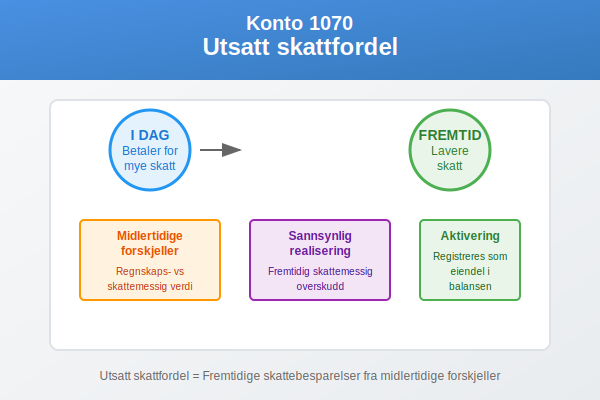
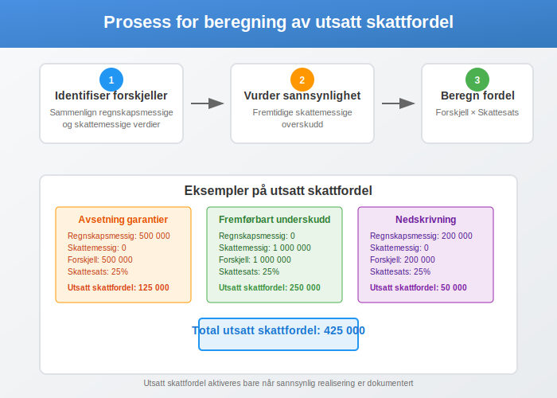
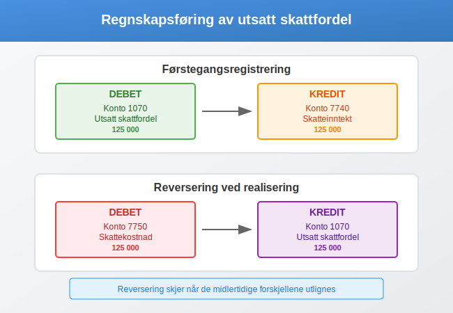
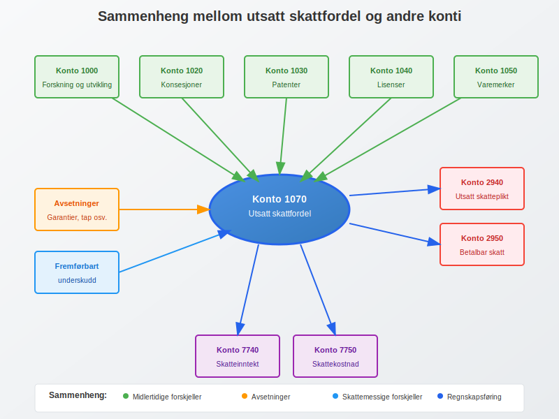

---
title: "1070"
meta_title: "1070"
meta_description: "**Konto 1070 - Utsatt skattfordel** er en spesialisert konto som brukes for å registrere **utsatt skattfordel** - en [immateriell eiendel](/blogs/regnskap/hva-..."
slug: 1070
type: blog
layout: pages/single
---

**Konto 1070 - Utsatt skattfordel** er en spesialisert konto som brukes for å registrere **utsatt skattfordel** - en [immateriell eiendel](/blogs/regnskap/hva-er-imaterielle-eiendeler "Hva er Imaterielle Eiendeler?") som oppstår når det er midlertidige forskjeller mellom regnskapsmessige og skattemessige verdier som vil resultere i lavere fremtidig skatt. Denne kontoen er sentral for å sikre korrekt periodisering og sammenstilling av skattekostnader i [balansen](/blogs/regnskap/hva-er-balanse "Hva er Balanse?").



## Hva er utsatt skattfordel?

**Utsatt skattfordel** er en regnskapsmessig eiendel som representerer fremtidige skattebesparelser som vil oppstå på grunn av midlertidige forskjeller mellom regnskapsmessige og skattemessige verdier. Denne eiendelen gjenspeiler at virksomheten har betalt for mye skatt i inneværende periode eller har skattekreditter som kan benyttes i fremtiden.

### Hovedprinsipper for utsatt skattfordel

* **Midlertidige forskjeller**: Forskjeller mellom regnskapsmessig og skattemessig verdi som reverserer over tid
* **Fremtidige skattebesparelser**: Fordelen realiseres når de midlertidige forskjellene reverserer
* **Aktivering**: Skal bare aktiveres når det er **sannsynlig** at fordelen kan realiseres

## Når oppstår utsatt skattfordel?

Utsatt skattfordel oppstår i følgende situasjoner:

### 1. Midlertidige forskjeller som gir fremtidig fradrag

* **Regnskapsmessige avsetninger** som ikke er skattemessig fradragsberettigede før de blir betalt
* **Nedskrivninger** av eiendeler som ikke er skattemessig fradragsberettigede
* **Pensjonskostnader** som er regnskapsmessig kostnadsført, men ikke skattemessig fradragsberettigede

### 2. Fremførbare skattemessige underskudd

* **Skattemessige underskudd** som kan fremføres til fremtidige år
* **Ubenyttede skattefradrag** som kan benyttes i fremtiden



## Kriterier for aktivering

For at utsatt skattfordel kan [aktiveres](/blogs/regnskap/hva-er-aktivering "Hva er Aktivering i Regnskap?") på konto 1070, må følgende kriterier være oppfylt:

### Sannsynlighetskravet

| Kriterium | Beskrivelse |
|-----------|-------------|
| **Sannsynlig realisering** | Det må være sannsynlig at virksomheten vil ha tilstrekkelig fremtidig skattemessig overskudd til å utnytte fordelen |
| **Tidsmessig sammenheng** | Fordelen må kunne realiseres innenfor en rimelig tidshorisont |
| **Juridisk grunnlag** | Fordelen må ha lovhjemmel i gjeldende skattelovgivning |

### Dokumentasjonskrav

* **Beregningsgrunnlag**: Detaljert beregning av midlertidige forskjeller
* **Prognoser**: Fremtidige inntjening og skatteposisjon
* **Revidering**: Regelmessig vurdering av realiserbarhet

## Regnskapsføring av utsatt skattfordel

### Førstegangsregistrering

```
Debet: Konto 1070 - Utsatt skattfordel
Kredit: Konto 7740 - Skatteinntekt
```

### Reversering av utsatt skattfordel

```
Debet: Konto 7750 - Skattekostnad
Kredit: Konto 1070 - Utsatt skattfordel
```



## Beregning av utsatt skattfordel

### Grunnleggende beregning

**Utsatt skattfordel = Midlertidig forskjell × Skattesats**

### Eksempel på beregning

| Post | Regnskapsmessig verdi | Skattemessig verdi | Midlertidig forskjell | Skattesats | Utsatt skattfordel |
|------|----------------------|-------------------|----------------------|------------|-------------------|
| Avsetning garantier | 500 000 | 0 | 500 000 | 25% | 125 000 |
| Fremførbart underskudd | 0 | 1 000 000 | 1 000 000 | 25% | 250 000 |
| **Total** | | | | | **375 000** |

## Presentasjon i regnskapet

### Balanseoppstilling

Utsatt skattfordel presenteres som:

* **Anleggsmiddel**: Når realiseringen forventes utover 12 måneder
* **Omløpsmiddel**: Når realiseringen forventes innen 12 måneder
* **Nettoføring**: Kan nettoføres mot [utsatt skatteplikt](/blogs/kontoplan/2120-utsatt-skatt "Konto 2120 - Utsatt skatt") for samme skattesubjekt

### Noteopplysninger

Følgende opplysninger skal gis i noter:

* **Sammensetning**: Spesifikasjon av hovedkomponenter
* **Bevegelser**: Endringer i løpet av regnskapsåret
* **Sannsynlighetsvurdering**: Grunnlag for aktiveringen
* **Skattesats**: Anvendt skattesats for beregningen

## Sammenhengen med andre konti

Konto 1070 henger nært sammen med andre konti i kontoplanen:

### Relaterte aktivakonti

* **[Konto 1000 - Forskning og utvikling](/blogs/kontoplan/1000-forskning-og-utvikling "Konto 1000 - Forskning og utvikling")**: Kan ha utsatt skattfordel knyttet til FoU-fradrag
* **[Konto 1020 - Konsesjoner](/blogs/kontoplan/1020-konsesjoner "Konto 1020 - Konsesjoner")**: Midlertidige forskjeller i [amortisering](/blogs/regnskap/hva-er-amortisering "Hva er Amortisering?")
* **[Konto 1030 - Patenter](/blogs/kontoplan/1030-patenter "Konto 1030 - Patenter")**: Forskjeller i avskrivningstakt
* **[Konto 1300 - Investeringer i datterselskaper](/blogs/kontoplan/1300-investeringer-i-datterselskaper "Konto 1300 - Investeringer i datterselskaper")**: Midlertidige forskjeller knyttet til investeringer i datterselskaper

### Tilhørende gjeldskonti

* **Konto 2120 - Utsatt skatt**: Periodisering av fremtidig skattekostnad
* **Konto 2940 - Utsatt skatteplikt**: Motsatt effekt av midlertidige forskjeller
* **Konto 2950 - Betalbar skatt**: Ã…rets skattekostnad

### Resultatkonti

* **Konto 7740 - Skatteinntekt**: Inntektsføring av utsatt skattfordel
* **Konto 7750 - Skattekostnad**: Kostnadsføring ved reversering
* **Konto 8320 - Utsatt skatt**: Skattekostnad ved endring i midlertidige forskjeller

## Særlige vurderinger

### Endring i skattesats

Når skattesatsen endres, må utsatt skattfordel rekalkuleres:

* **Økning i skattesats**: Øker verdien av utsatt skattfordel
* **Reduksjon i skattesats**: Reduserer verdien av utsatt skattfordel

### Konsernforhold

I konsernregnskap må følgende vurderes:

* **Elimineringer**: Utsatt skattfordel knyttet til eliminerte poster
* **Konsolidering**: Nettopresentasjon på konsernnivå
* **Utlandske datterselskap**: Valutaomregning og lokale skatteregler



## Revisjon og kontroll

### Revisjonshandlinger

Revisorer vil typisk gjennomføre følgende kontroller:

* **Beregningsgrunnlag**: Verifisering av midlertidige forskjeller
* **Sannsynlighetsvurdering**: Evaluering av realiserbarhet
* **Dokumentasjon**: Gjennomgang av underliggende dokumentasjon
* **Skattesats**: Kontroll av anvendt skattesats

### Vanlige feilkilder

* **Overoptimistiske prognoser**: For positive forventninger til fremtidig inntjening
* **Feil skattesats**: Bruk av feil skattesats for beregningene
* **Manglende reversering**: Ikke reversering når kriteriene ikke lenger er oppfylt

## Internasjonale regnskapsstandarder

### Forskjeller IFRS vs. NGAAP

| Område | IFRS | NGAAP |
|--------|------|--------|
| **Sannsynlighetskriterium** | Mer sannsynlig enn ikke (>50%) | Sannsynlig realisering |
| **Tidsbegrensning** | Ingen spesifikk tidsbegrensning | Rimelig tidshorisont |
| **Underskudd** | Strenge krav til fremtidig lønnsomhet | Fleksibel vurdering |

### Overgangsregler

Ved overgang mellom regnskapsstandarder:

* **Ny vurdering**: Alle utsatte skattfordeler må revurderes
* **Justeringer**: Eventuelle justeringer føres mot egenkapitalen
* **Dokumentasjon**: Utvidet noteopplysninger kreves

## Praktiske tips

### Best practice

* **Regelmessig vurdering**: Vurder realiserbarhet minimum hvert kvartal
* **Dokumentasjon**: Oppretthold god dokumentasjon av alle vurderinger
* **Prognoser**: Bruk konservative, realistiske prognoser
* **Samordning**: Samordne med skatteplanlegging

### Vanlige fallgruver

* **Automatisk aktivering**: Ikke aktiver uten grundig vurdering
* **Glemte reverseringer**: Husk å reversere når kriteriene ikke lenger er oppfylt
* **Feil klassifisering**: Sikre korrekt klassifisering som anleggs- eller omløpsmiddel

## Sammendrag

Konto 1070 - Utsatt skattfordel er en kompleks, men viktig del av regnskapsføringen som krever:

* **Grundig analyse** av midlertidige forskjeller
* **Realistisk vurdering** av realiserbarhet
* **Korrekt beregning** og presentasjon
* **Kontinuerlig oppfølging** og revidering

Korrekt håndtering av utsatt skattfordel sikrer at regnskapet gir et rettvisende bilde av virksomhetens finansielle stilling og fremtidige skattesituasjon.
