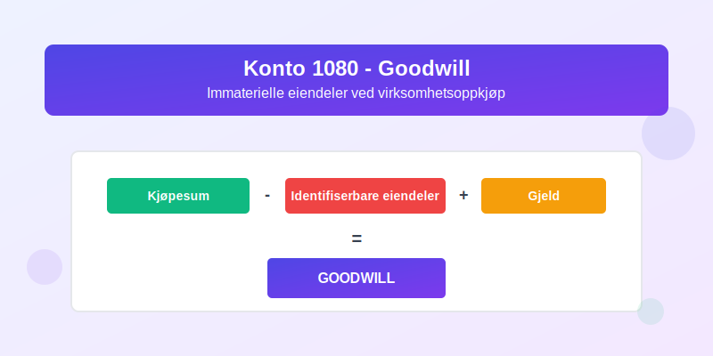
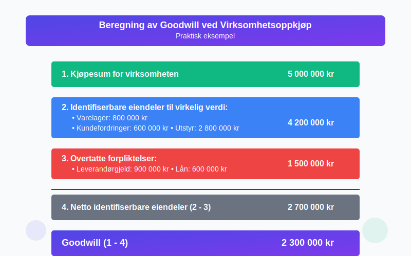
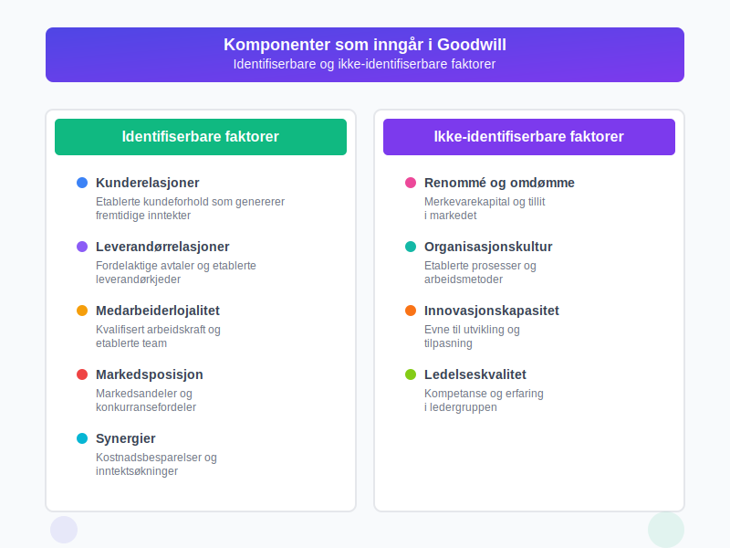
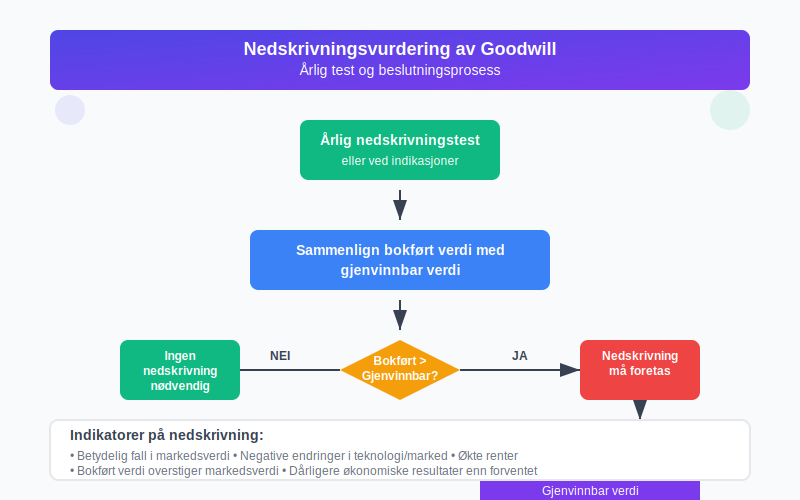
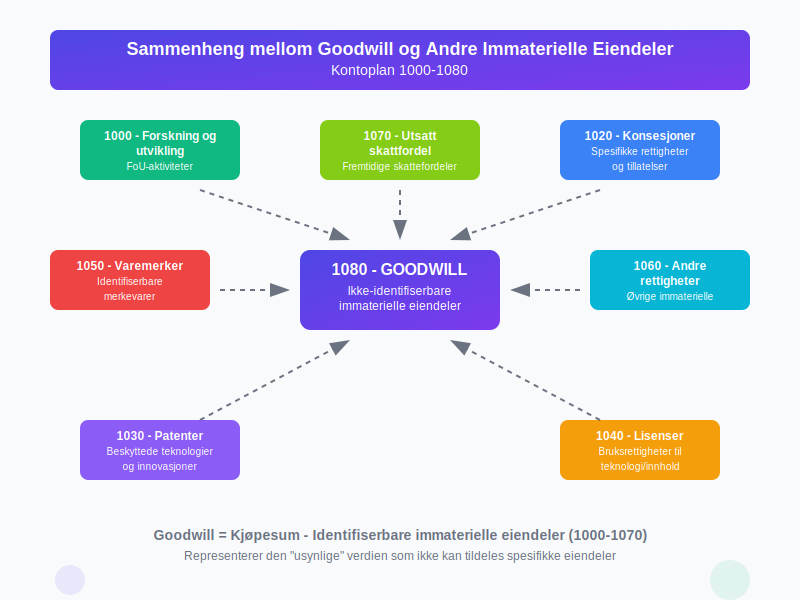

---
title: "1080"
meta_title: "1080"
meta_description: '**Konto 1080 - Goodwill** er en av de mest komplekse kontiene i norsk kontoplan og representerer den delen av [anskaffelseskostnaden](/blogs/regnskap/hva-er-ans...'
slug: 1080
type: blog
layout: pages/single
---

**Konto 1080 - Goodwill** er en av de mest komplekse kontiene i norsk kontoplan og representerer den delen av [anskaffelseskostnaden](/blogs/regnskap/hva-er-anskaffelseskost "Hva er Anskaffelseskost?") for en virksomhet som overstiger virkelig verdi av de identifiserbare [anleggsmidlene](/blogs/regnskap/hva-er-anleggsmidler "Hva er Anleggsmidler?"). Denne kontoen brukes for å registrere **goodwill** som oppstår ved virksomhetsoppkjøp og representerer [immaterielle eiendeler](/blogs/regnskap/hva-er-imaterielle-eiendeler "Hva er Imaterielle Eiendeler?") som ikke kan identifiseres separat.



## Hva er Goodwill?

**Goodwill** er en immateriell eiendel som representerer den ekstra verdien en virksomhet har utover summen av dens identifiserbare eiendeler og gjeld. I regnskapsmessig sammenheng skilles det mellom:

* **Kjøpt goodwill**: Oppstår ved oppkjøp av virksomheter og [aktiveres](/blogs/regnskap/hva-er-aktivering "Hva er Aktivering i Regnskap?") på konto 1080
* **Egenutviklet goodwill**: Kan ikke aktiveres og må kostnadsføres løpende

## Hvordan oppstår Goodwill?

Goodwill oppstår når en virksomhet kjøper en annen virksomhet til en pris som overstiger den **netto bokførte verdien** av de identifiserbare eiendelene. Beregningen gjøres slik:

| Komponent | Beskrivel se |
|-----------|-------------|
| **Kjøpesum** | Total betalt for virksomheten |
| **Minus: Identifiserbare eiendeler** | Varelager, [kundefordringer](/blogs/kontoplan/1500-kundefordringer "Konto 1500 - Kundefordringer"), anleggsmidler etc. |
| **Pluss: Overtatte forpliktelser** | Leverandørgjeld, lån, avsetninger etc. |
| **Resultat = Goodwill** | Differansen aktiveres på konto 1080 |



## Elementer som inngår i Goodwill

### Identifiserbare faktorer
* **Kunderelasjoner og kundebase**: Etablerte kundeforhold som genererer fremtidige inntekter
* **Leverandørrelasjoner**: Fordelaktige avtaler og etablerte leverandørkjeder
* **Medarbeiderlojalitet**: Kvalifisert arbeidskraft og etablerte team
* **Markedsposisjon**: Markedsandeler og konkurransefordeler
* **Synergier**: Kostnadsbesparelser og inntektsøkninger ved sammenlåing

### Ikke-identifiserbare faktorer
* **Renommé og omdømme**: Merkevarekapital og tillit i markedet
* **Organisasjonskultur**: Etablerte prosesser og arbeidsmetoder
* **Innovasjonskapasitet**: Evne til utvikling og tilpasning
* **Ledelseskvalitet**: Kompetanse og erfaring i ledergruppen



## Regnskapsføring av Goodwill

### Ved oppkjøp
Når goodwill oppstår ved virksomhetsoppkjøp, bokføres det på følgende måte:

```
Debet:  Konto 1080 - Goodwill         XXX kroner
Kredit: Konto 1900 - Bankinnskudd     XXX kroner
```

### Nedskrivningsvurdering
Goodwill skal **ikke** amortiseres, men må vurderes for [nedskrivning](/blogs/regnskap/hva-er-nedskrivning "Hva er Nedskrivning?") årlig. Nedskrivning bokføres slik:

```
Debet:  Konto 6890 - Nedskrivning av goodwill    XXX kroner
Kredit: Konto 1080 - Goodwill                    XXX kroner
```

## Vurdering og nedskrivning

### Ã…rlig nedskrivningstest
Goodwill skal testes for nedskrivning minst en gang årlig eller når det foreligger indikasjoner på verdifall. Testen sammenligner:

* **Bokført verdi**: Goodwill pluss andre eiendeler i kontantgenererende enhet
* **Gjenvinnbar verdi**: Høyeste av bruksverdi og virkelig verdi minus salgsutgifter

### Indikatorer på nedskrivning
* Betydelig fall i markedsverdi
* Negative endringer i teknologi eller marked
* Økte renter som påvirker diskonteringsraten
* Bokført verdi av netto eiendeler overstiger markedsverdi



## Praktiske eksempler

### Eksempel 1: Oppkjøp av mindre virksomhet
En virksomhet kjøper en konkurrent for 5 millioner kroner. Regnskapsanalysen viser:

* **Kjøpesum**: 5 000 000 kroner
* **Identifiserbare eiendeler**: 4 200 000 kroner
* **Overtatte forpliktelser**: 1 500 000 kroner
* **Netto identifiserbare eiendeler**: 2 700 000 kroner
* **Goodwill**: 2 300 000 kroner

### Eksempel 2: Nedskrivning av goodwill
Etter tre år viser analysen at den kontantgenererende enheten har en gjenvinnbar verdi på 1 800 000 kroner, mens bokført verdi er 2 300 000 kroner. Nedskrivning på 500 000 kroner må bokføres.

## Forskjeller mellom regnskapsregler

### Norske regnskapsstandarder (NGRS)
* Goodwill skal amortiseres over økonomisk levetid (maks 20 år)
* Lineær amortisering er hovedregel
* Nedskrivning når bokført verdi overstiger gjenvinnbar verdi

### Internasjonale regnskapsstandarder (IFRS)
* Goodwill skal **ikke** amortiseres
* Ã…rlig nedskrivningstest er obligatorisk
* Mer detaljerte krav til dokumentasjon

## Utfordringer og fallgruver

### Vanlige feil ved goodwill-regnskapsføring
* **Feil beregning**: Ikke identifisering av alle immaterielle eiendeler
* **Manglende nedskrivningstest**: Utsettelse av nødvendige nedskrivninger
* **Feil allokering**: Fordeling av goodwill på feil kontantgenererende enheter
* **Utilstrekkelig dokumentasjon**: Manglende begrunnelse for verdivurderinger

### Best practice anbefalinger
* Gjennomfør grundig due diligence før oppkjøp
* Dokumenter alle verdivurderinger og antagelser
* Etabler rutiner for årlig nedskrivningstest
* Konsulter regnskapsfaglig ekspertise ved komplekse transaksjoner

## Sammenheng med andre kontoer

Goodwill har nær sammenheng med andre kontoer i [balansen](/blogs/regnskap/hva-er-balanse "Hva er Balanse?"):

* **[Konto 1000 - Forskning og utvikling](/blogs/kontoplan/1000-forskning-og-utvikling "Konto 1000 - Forskning og utvikling")**: Identifiserbare immaterielle eiendeler
* **[Konto 1020 - Konsesjoner](/blogs/kontoplan/1020-konsesjoner "Konto 1020 - Konsesjoner")**: Spesifikke rettigheter som kan skilles ut
* **[Konto 1030 - Patenter](/blogs/kontoplan/1030-patenter "Konto 1030 - Patenter")**: Beskyttede teknologier og innovasjoner
* **[Konto 1040 - Lisenser](/blogs/kontoplan/1040-lisenser "Konto 1040 - Lisenser")**: Bruksrettigheter til teknologi eller innhold
* **[Konto 1050 - Varemerker](/blogs/kontoplan/1050-varemerker "Konto 1050 - Varemerker")**: Identifiserbare merkevarer
* **[Konto 1060 - Andre rettigheter](/blogs/kontoplan/1060-andre-rettigheter "Konto 1060 - Andre rettigheter")**: Øvrige identifiserbare immaterielle eiendeler



## Regulatoriske krav

### Revisjonspliktige virksomheter
* **Ã…rlig nedskrivningstest**: Obligatorisk for alle virksomheter med goodwill
* **Noteopplysninger**: Detaljert informasjon om endringer i goodwill
* **Sensitivitetsanalyse**: Vurdering av følsomhet for endringer i forutsetninger

### Rapportering i årsregnskap
Følgende opplysninger skal gis i noter til årsregnskapet:

* Brutto bokført verdi ved årets begynnelse og slutt
* Akkumulerte nedskrivninger
* Tilgang ved oppkjøp i regnskapsåret
* Nedskrivninger foretatt i året
* Valuta- og andre justeringer

## Konklusjon

Konto 1080 - Goodwill er en kompleks, men viktig del av norsk regnskapsføring. Korrekt håndtering krever:

* **Nøyaktig beregning** ved oppkjøp
* **Regelmessig nedskrivningstest** for å sikre korrekt verdsetting
* **Grundig dokumentasjon** av alle vurderinger og beslutninger
* **Kontinuerlig oppfølging** av verdifendringer

Ved å følge gjeldende regnskapsstandarder og beste praksis kan virksomheter sikre at goodwill reflekterer den faktiske verdien av immaterielle eiendeler og gir interessenter et korrekt bilde av virksomhetens finansielle stilling.
