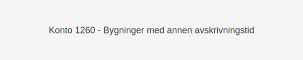

---
title: "Hva er Konto 1260 - Bygninger med annen avskrivningstid?"
seoTitle: "1260"
meta_description: '**Konto 1260 - Bygninger med annen avskrivningstid** er en konto i norsk kontoplan som benyttes for **bygninger** som krever **spesielle avskrivningsperioder** ...'
slug: 1260
type: blog
layout: pages/single
---

**Konto 1260 - Bygninger med annen avskrivningstid** er en konto i norsk kontoplan som benyttes for **bygninger** som krever **spesielle avskrivningsperioder** utover standard levetid.



## Når brukes Konto 1260?

Konto 1260 skal brukes når en bygning har **annen økonomisk levetid** enn den som er angitt for standard bygninger på konto 1100.

Eksempler på situasjoner hvor konto 1260 benyttes:

* **Vernede bygg** med kortere avskrivningsperiode pga. særskilte forpliktelser eller støtteordninger
* **Spesialbygg** (for eksempel laboratorier eller rensesystemer) som har tekniske komponenter med ulik slitasje
* Bygninger med **forhåndsbestemt utleiekontrakt** som gir avskrivningshorisont i tråd med kontraktens varighet

## Anskaffelseskost og aktivering

[Anskaffelseskostnad](/blogs/regnskap/hva-er-anskaffelseskost "Hva er Anskaffelseskost?") for konto 1260 følger samme prinsipper som for [Konto 1100 - Bygninger](/blogs/kontoplan/1100-bygninger "Konto 1100 - Bygninger"), men tar høyde for de spesifikke kostnadselementene og avskrivningsperioden som er avtalt eller forskriftsfestet.

## Tabell over avvikende levetider

| Bygningstype                         | Standard levetid | Avvikende levetid | Kommentar                                   |
|--------------------------------------|------------------|-------------------|----------------------------------------------|
| Vernet bygg                          | 25–50 år         | 10 år             | Kortere levetid pga. bevaringsforpliktelser  |
| Laboratorier og rensesystemer        | 30–50 år         | 15 år             | Teknisk slitasje på utstyr                   |
| Utleiebygg med fast kontrakt         | 25–50 år         | Kontraktens varighet | Avskrivning tilpasset leieperiode         |

## Avskrivning og regnskapsføring

Avskrivning skjer lineært over den avtalte **avvikende perioden**. Eksempel postering ved årlig avskrivning:

```
Debet: Konto 6040 - Avskrivning bygninger med annen avskrivningstid   XXX kroner
Kredit: Konto 2800 - Kumulert avskrivning bygninger med annen avskrivningstid XXX kroner
```

Ved salg eller utrangering følger bokføringen samme prinsipper som for [Konto 1100 - Bygninger](/blogs/kontoplan/1100-bygninger "Konto 1100 - Bygninger"), med justerte beløp basert på avvikende avskrivningsgrunnlag.

## Relaterte artikler

* [Konto 1100 - Bygninger](/blogs/kontoplan/1100-bygninger "Konto 1100 - Bygninger")
* [Konto 1120 - Bygningsmessige anlegg](/blogs/kontoplan/1120-bygningsmessige-anlegg "Konto 1120 - Bygningsmessige anlegg")
* [Konto 1270 - Verktøy mv.](/blogs/kontoplan/1270-verktoy-mv "Konto 1270 - Verktøy mv.")
* [Konto 6000 - Avskrivning på bygninger og annen fast eiendom](/blogs/kontoplan/6000-avskrivning-pa-bygninger-og-annen-fast-eiendom "Konto 6000 - Avskrivning på bygninger og annen fast eiendom")
* [Hva er Avskrivning?](/blogs/regnskap/hva-er-avskrivning "Hva er Avskrivning i Regnskap?")
* [Hva er Anskaffelseskost?](/blogs/regnskap/hva-er-anskaffelseskost "Hva er Anskaffelseskost?")


