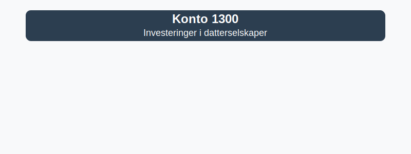

---
title: "1300"
meta_title: "1300"
meta_description: "**Konto 1300 - Investeringer i datterselskaper** er en konto i Norsk Standard Kontoplan som brukes til å registrere **langsiktige investeringer** i datterselsk..."
slug: 1300
type: blog
layout: pages/single
---

**Konto 1300 - Investeringer i datterselskaper** er en konto i Norsk Standard Kontoplan som brukes til å registrere **langsiktige investeringer** i datterselskaper som inngår i konsernregnskapet.



## Hva er investeringer i datterselskaper?

*Konto 1300 - Investeringer i datterselskaper* omfatter eierandeler i selskaper hvor morselskapet har bestemmende innflytelse (over 50 % eierandel). Investeringene presenteres i balansen som anleggsmidler og konsolideres ved utarbeidelse av konsernregnskap.

## Regnskapsføring ved anskaffelse

Anskaffelseskost for investeringer i datterselskaper inkluderer:

* **Kjøpesum** for aksjer eller andeler
* **Direkte transaksjonskostnader**, som meglerhonorarer og avgifter
* **Valutagevinster eller -tap** ved kjøp i fremmed valuta

```plaintext
Debet: Konto 1300 - Investeringer i datterselskaper   XXX kroner
Kredit: Konto 1920 - Bankinnskudd                    XXX kroner
```

## Vurdering og nedskrivning

Investeringer i datterselskaper skal vurderes for verdifall ([nedskrivning](/blogs/regnskap/hva-er-nedskrivning "Hva er Nedskrivning?")) dersom det er indikasjoner på at investeringens bokførte verdi overstiger virkelig verdi. Indikasjoner kan være:

* Redusert resultat i datterselskapet
* Negativ egenkapital eller konsumert egenkapital
* Betydelig kursfall i børsnotert selskap
* Planlagt avhendelse eller restrukturering

| Indikasjon            | Eksempel                             |
|-----------------------|--------------------------------------|
| Redusert resultat     | Datterselskapets resultat faller     |
| Negativ egenkapital   | Egenkapitalen er oppbrukt            |
| Markedsverdiredusjon  | Kursfall i børsnotert selskap        |
| Endringer i strategi  | Planlagt avhendelse                  |

## Konsernforhold

Ved utarbeidelse av [konsernregnskap](/blogs/regnskap/hva-er-konsern "Hva er Konsern?") elimineres investeringer i datterselskaper mot egenkapitalen i datterselskapet. Konserninterne transaksjoner må også hensyntas.

## Eksempel på bokføring

Virksomhet A kjøper 80 % av aksjene i B AS for 5 000 000 NOK.

```plaintext
Debet: Konto 1300 - Investeringer i datterselskaper   5 000 000
Kredit: Konto 1920 - Bankinnskudd                    5 000 000
```

## Relaterte artikler

* [Konto 1070 - Utsatt skattfordel](/blogs/kontoplan/1070-utsatt-skattfordel "Konto 1070 - Utsatt skattfordel")
* [Hva er Anleggsmidler?](/blogs/regnskap/hva-er-anleggsmidler "Hva er Anleggsmidler?")
* [Hva er Konsern?](/blogs/regnskap/hva-er-konsern "Hva er Konsern?")
* [Hva er Konsernbidrag?](/blogs/regnskap/hva-er-konsernbidrag "Hva er Konsernbidrag?")
* [Hva er Nedskrivning?](/blogs/regnskap/hva-er-nedskrivning "Hva er Nedskrivning?")
* [Konto 1310 - Investeringer annet foretak i samme konsern](/blogs/kontoplan/1310-investeringer-annet-foretak-i-samme-konsern "Konto 1310 - Investeringer annet foretak i samme konsern")
* [Konto 1320 - LÃ¥n til foretak samme konsern](/blogs/kontoplan/1320-lan-til-foretak-samme-konsern "Konto 1320 - LÃ¥n til foretak samme konsern")
* [Konto 1330 - Investeringer i tilknyttede selskap](/blogs/kontoplan/1330-investeringer-i-tilknyttede-selskap "Konto 1330 - Investeringer i tilknyttede selskap")
* [Konto 1340 - LÃ¥n til tilknyttede selskap](/blogs/kontoplan/1340-lan-til-tilknyttede-selskap "Konto 1340 - LÃ¥n til tilknyttede selskap")
* [Konto 1350 - Investeringer i aksjer og eiendeler](/blogs/kontoplan/1350-investeringer-i-aksjer-og-eiendeler "Konto 1350 - Investeringer i aksjer og eiendeler")
* [Konto 1360 - Obligasjoner](/blogs/kontoplan/1360-obligasjoner "Konto 1360 - Obligasjoner")
* [Konto 1370 - Fordringer på eiere og styremedlemmer](/blogs/kontoplan/1370-fordringer-pa-eiere-og-styremedlemmer "Konto 1370 - Fordringer på eiere og styremedlemmer")
* [Konto 1380 - Fordringer på ansatte](/blogs/kontoplan/1380-fordringer-pa-ansatte "Konto 1380 - Fordringer på ansatte")
* [Konto 8000 - Inntekt på investering i datterselskap](/blogs/kontoplan/8000-inntekt-pa-investering-i-datterselskap "Konto 8000 - Inntekt på investering i datterselskap")
