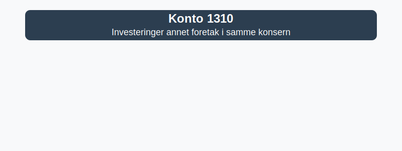

---
title: "Hva er Konto 1310 - Investeringer annet foretak i samme konsern?"
seoTitle: "1310"
description: '**Konto 1310 - Investeringer annet foretak i samme konsern** er en konto i Norsk Standard Kontoplan som brukes til å registrere **langsiktige investeringer** i...'
---

**Konto 1310 - Investeringer annet foretak i samme konsern** er en konto i Norsk Standard Kontoplan som brukes til å registrere **langsiktige investeringer** i andre foretak innen samme konsernstruktur.



## Hva er investeringer annet foretak i samme konsern?

*Konto 1310 - Investeringer annet foretak i samme konsern* omfatter **eierandeler** og andre investeringer i selskaper hvor morselskapet har betydelig innflytelse, men ikke full kontroll, innen samme konsern. Disse investeringene presenteres som **anleggsmidler** i balansen.

## Regnskapsføring ved anskaffelse

Anskaffelseskost for konto 1310 inkluderer:

* **Kjøpesum** for aksjer eller andeler
* **Direkte transaksjonskostnader**, som rådgivningshonorarer og avgifter
* **Valutagevinster eller -tap** ved kjøp i fremmed valuta

```plaintext
Debet: Konto 1310 - Investeringer annet foretak i samme konsern   XXX kroner
Kredit: Konto 1920 - Bankinnskudd                                  XXX kroner
```

## Vurdering og nedskrivning

Investeringer på konto 1310 skal testes for verdifall ([nedskrivning](/blogs/regnskap/hva-er-nedskrivning "Hva er Nedskrivning?")) hvis det er indikasjoner på at bokført verdi overstiger virkelig verdi. Vanlige indikasjoner:

| Indikasjon            | Eksempel                                |
|-----------------------|-----------------------------------------|
| Redusert resultat     | Morselskapets andel av resultatet synker |
| Negativ egenkapital   | Oppbrukt eller negativ egenkapital      |
| Markedsverdiredusjon  | Betydelig kursfall                      |
| Endringer i strategi  | Planlagt omstrukturering eller salg     |

## Konsernforhold

Ved utarbeidelse av [konsernregnskap](/blogs/regnskap/hva-er-konsern "Hva er Konsern?") elimineres interninvesteringer mot egenkapitalpost i datterselskap eller tilknyttet selskap. Det er viktig å skille mellom [konto 1300 - investeringer i datterselskaper](/blogs/kontoplan/1300-investeringer-i-datterselskaper "Konto 1300 - Investeringer i datterselskaper") og konto 1310.

## Eksempel på bokføring

Selskap A overfører en investering på 1–¯200–¯000–¯NOK til annet konsernselskap B:

```plaintext
Debet: Konto 1310 - Investeringer annet foretak i samme konsern   1–¯200–¯000
Kredit: Konto 1920 - Bankinnskudd                                  1–¯200–¯000
```

## Relaterte artikler

* [Konto 1300 - Investeringer i datterselskaper](/blogs/kontoplan/1300-investeringer-i-datterselskaper "Konto 1300 - Investeringer i datterselskaper")
* [Hva er Anleggsmidler?](/blogs/regnskap/hva-er-anleggsmidler "Hva er Anleggsmidler?")
* [Hva er Konsern?](/blogs/regnskap/hva-er-konsern "Hva er Konsern?")
* [Konto 1800 - Aksjer og andeler i foretak samme konsern](/blogs/kontoplan/1800-aksjer-og-andeler-i-foretak-samme-konsern "Konto 1800 - Aksjer og andeler i foretak samme konsern")
* [Hva er Nedskrivning?](/blogs/regnskap/hva-er-nedskrivning "Hva er Nedskrivning?")
* [Konto 1320 - Lån til foretak samme konsern](/blogs/kontoplan/1320-lan-til-foretak-samme-konsern "Konto 1320 - Lån til foretak samme konsern")
* [Konto 1330 - Investeringer i tilknyttede selskap](/blogs/kontoplan/1330-investeringer-i-tilknyttede-selskap "Konto 1330 - Investeringer i tilknyttede selskap")
* [Konto 1340 - Lån til tilknyttede selskap](/blogs/kontoplan/1340-lan-til-tilknyttede-selskap "Konto 1340 - Lån til tilknyttede selskap")
* [Konto 1350 - Investeringer i aksjer og eiendeler](/blogs/kontoplan/1350-investeringer-i-aksjer-og-eiendeler "Konto 1350 - Investeringer i aksjer og eiendeler")
* [Konto 1360 - Obligasjoner](/blogs/kontoplan/1360-obligasjoner "Konto 1360 - Obligasjoner")
* [Konto 1370 - Fordringer på eiere og styremedlemmer](/blogs/kontoplan/1370-fordringer-pa-eiere-og-styremedlemmer "Konto 1370 - Fordringer på eiere og styremedlemmer")
* [Konto 1380 - Fordringer på ansatte](/blogs/kontoplan/1380-fordringer-pa-ansatte "Konto 1380 - Fordringer på ansatte")


