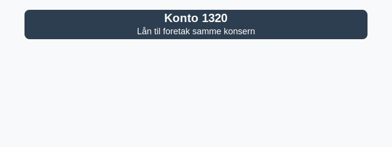

---
title: "Konto 1320 - Lån til foretak samme konsern"
seoTitle: "Konto 1320 | Lån til foretak samme konsern | Kontoplan"
description: '**Konto 1320 - Lån til foretak samme konsern** er en konto i Norsk Standard Kontoplan som brukes til å registrere **konserninterne lån** til andre selskaper innen samme konsern. Lær om regnskapsføring, renteberegning, tilbakebetaling og konsolidert behandling.'
summary: "Konto 1320 brukes for konserninterne lån. Guiden oppsummerer regnskapsføring, renteberegning, tilbakebetaling og konsolidering med eksempler."
---

**Konto 1320 - Lån til foretak samme konsern** er en konto i Norsk Standard Kontoplan som brukes til å registrere **konserninterne lån** til andre selskaper innen samme konsern.



## Hva er lån til foretak samme konsern?

*Konto 1320 - Lån til foretak samme konsern* omfatter **rentebærende fordringer** utstedt av morselskapet til et annet foretak i samme konsern, hvor hovedformålet er å finansiere konserninterne operasjoner eller investeringer. Disse midlene presenteres som **anleggsmidler** i balansen under langsiktig gjeld for utstedende selskap og som anleggsmiddel hos mottaker.

## Regnskapsføring ved utstedelse

Ved utstedelse av konserninternt lån føres transaksjonen med anskaffelseskost som inkluderer:

* **Lånebeløp** avtalt mellom selskapene
* **Transaksjonskostnader**, som gebyrer og administrasjonskostnader
* **Valutagevinster eller -tap** ved lån i fremmed valuta

```plaintext
Debet: Konto 1320 - Lån til foretak samme konsern       XXX kroner
Kredit: Konto 1920 - Bankinnskudd                        XXX kroner
```

## Renteberegning og avskrivning

Renten på konserninterne lån fastsettes vanligvis etter en internrente basert på markedsrente eller selskapsinterne retningslinjer. Rentekostnader periodiseres:

| Periode                | Kontering                                      |
|------------------------|-------------------------------------------------|
| Rentekostnad           | Debet: Konto 8140 - Renteinntekter konserninterne |
| Betaling av renter     | Kredit: Konto 1920 - Bankinnskudd                |
| Påløpte, ikke betalte  | Kredit: Konto 2970 - Påløpte renter              |

## Tilbakebetaling av lån

Ved tilbakebetaling reduseres lånefordringen:

```plaintext
Debet: Konto 1920 - Bankinnskudd                     XXX kroner
Kredit: Konto 1320 - Lån til foretak samme konsern  XXX kroner
```

## Konsernforhold

I [konsernregnskap](/blogs/regnskap/hva-er-konsern "Hva er Konsern?") elimineres konserninterne lån ved konsolidering mot tilsvarende rentepost eller fordrings- og gjeldskonto. Det er viktig å skille mellom:

* [Konto 1300 - Investeringer i datterselskaper](/blogs/kontoplan/1300-investeringer-i-datterselskaper "Konto 1300 - Investeringer i datterselskaper")
* [Konto 1310 - Investeringer annet foretak i samme konsern](/blogs/kontoplan/1310-investeringer-annet-foretak-i-samme-konsern "Konto 1310 - Investeringer annet foretak i samme konsern")

## Eksempel

Selskap A gir et konserninternt lån på 2–¯000–¯000 NOK til Selskap B med 5 % rente:

```plaintext
Debet: Konto 1320 - Lån til foretak samme konsern   2–¯000–¯000
Kredit: Konto 1920 - Bankinnskudd                    2–¯000–¯000
```

Ved betaling av renter for en periode:

```plaintext
Debet: Konto 8140 - Renteinntekter konserninterne    100–¯000
Kredit: Konto 1920 - Bankinnskudd                     100–¯000
```

## Relaterte artikler

* [Konto 1300 - Investeringer i datterselskaper](/blogs/kontoplan/1300-investeringer-i-datterselskaper "Konto 1300 - Investeringer i datterselskaper")
* [Konto 1310 - Investeringer annet foretak i samme konsern](/blogs/kontoplan/1310-investeringer-annet-foretak-i-samme-konsern "Konto 1310 - Investeringer annet foretak i samme konsern")
* [Hva er langsiktig gjeld?](/blogs/regnskap/langsiktig-gjeld "Langsiktig gjeld")
* [Hva er Konsern?](/blogs/regnskap/hva-er-konsern "Hva er Konsern?")
* [Konto 1800 - Aksjer og andeler i foretak samme konsern](/blogs/kontoplan/1800-aksjer-og-andeler-i-foretak-samme-konsern "Konto 1800 - Aksjer og andeler i foretak samme konsern")
* [Konto 1330 - Investeringer i tilknyttede selskap](/blogs/kontoplan/1330-investeringer-i-tilknyttede-selskap "Konto 1330 - Investeringer i tilknyttede selskap")
* [Konto 1340 - Lån til tilknyttede selskap](/blogs/kontoplan/1340-lan-til-tilknyttede-selskap "Konto 1340 - Lån til tilknyttede selskap")
* [Konto 1350 - Investeringer i aksjer og eiendeler](/blogs/kontoplan/1350-investeringer-i-aksjer-og-eiendeler "Konto 1350 - Investeringer i aksjer og eiendeler")
* [Konto 1360 - Obligasjoner](/blogs/kontoplan/1360-obligasjoner "Konto 1360 - Obligasjoner")
* [Konto 1370 - Fordringer på eiere og styremedlemmer](/blogs/kontoplan/1370-fordringer-pa-eiere-og-styremedlemmer "Konto 1370 - Fordringer på eiere og styremedlemmer")
* [Konto 1380 - Fordringer på ansatte](/blogs/kontoplan/1380-fordringer-pa-ansatte "Konto 1380 - Fordringer på ansatte")
* [Konto 1500 - Kundefordringer](/blogs/kontoplan/1500-kundefordringer "Konto 1500 - Kundefordringer")
* [Konto 1550 - Kundefordringer på selskap samme konsern](/blogs/kontoplan/1550-kundefordringer-pa-selskap-samme-konsern "Konto 1550 - Kundefordringer på selskap samme konsern")
* [Konto 2260 - Gjeld til selskap i samme konsern](/blogs/kontoplan/2260-gjeld-til-selskap-i-samme-konsern "Konto 2260 - Gjeld til selskap i samme konsern")
* [Konto 8030 - Renteinntekt på foretak i samme konsern](/blogs/kontoplan/8030-renteinntekt-pa-foretak-i-samme-konsern "Konto 8030 - Renteinntekt på foretak i samme konsern: Regnskapsføring av konserninterne renteinntekter")


