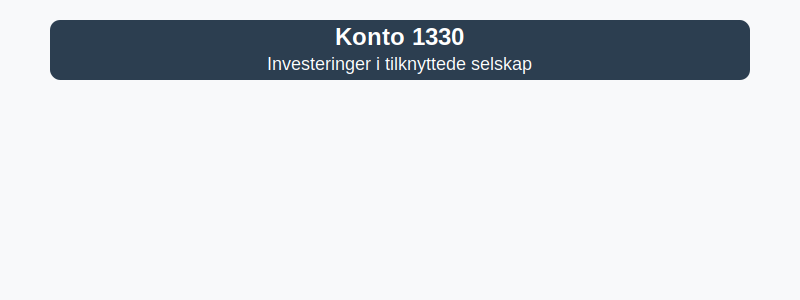

**Konto 1330 - Investeringer i tilknyttede selskap** er en konto i Norsk Standard Kontoplan som brukes til å registrere **langsiktige investeringer** i selskaper hvor investoren har betydelig innflytelse uten å eie majoriteten.



## Hva er et tilknyttet selskap?

*Konto 1330 - Investeringer i tilknyttede selskap* omfatter eierandeler i selskaper hvor investor har **betydelig innflytelse**, men verken kontroll (datterselskap) eller felles kontroll. Betydelig innflytelse oppnås vanligvis ved å inneha **20–50–¯%** av stemmene i det investerte selskapet.

## Regnskapsføring etter egenkapitalmetoden

I henhold til **regnskapsstandarder** behandles investeringer i tilknyttede selskap ofte etter *egenkapitalmetoden*, hvor investorens andel av resultatet justerer investeringskontoen.

| Steg | Beskrivelse                                                                 |
|------|------------------------------------------------------------------------------|
| 1    | Innregning av investeringen til anskaffelseskost                            |
| 2    | Justering for andel av tilknyttet selskaps resultat                           |
| 3    | Reduksjon for utbytte mottatt fra det tilknyttede selskapet                   |
| 4    | Vurdering for nedskrivning dersom verdifall anses som varig                  |

## Klassifisering i kontoplanen

| Kontotype               | Kontonummer | Beskrivelse                                                      |
|-------------------------|-------------|------------------------------------------------------------------|
| Datterselskap           | 1300        | Investeringer i datterselskaper (kontroll, >50–¯%)                |
| Investering annen egenkapitalinteresse | 1310  | Investeringer annet foretak i samme konsern (<20–¯%)               |
| Tilknyttet selskap      | 1330        | Investeringer i selskaper med betydelig innflytelse (20–50–¯%)     |

## Eksempel på bokføring

Ved anskaffelse av en tilknyttet investering kan bilagsføring se slik ut:

```plaintext
Debet: Konto 1330 - Investeringer i tilknyttede selskap   1–¯000–¯000 kr
Kredit: Konto 1920 - Bankinnskudd                           1–¯000–¯000 kr
```

## Relaterte artikler

* [Konto 1300 - Investeringer i datterselskaper](/blogs/kontoplan/1300-investeringer-i-datterselskaper "Konto 1300 - Investeringer i datterselskaper")
* [Konto 1310 - Investeringer annet foretak i samme konsern](/blogs/kontoplan/1310-investeringer-annet-foretak-i-samme-konsern "Konto 1310 - Investeringer annet foretak i samme konsern")
* [Konto 1320 - Lån til foretak samme konsern](/blogs/kontoplan/1320-lan-til-foretak-samme-konsern "Konto 1320 - Lån til foretak samme konsern")
* [Konto 1340 - Lån til tilknyttede selskap](/blogs/kontoplan/1340-lan-til-tilknyttede-selskap "Konto 1340 - Lån til tilknyttede selskap")
* [Konto 1350 - Investeringer i aksjer og eiendeler](/blogs/kontoplan/1350-investeringer-i-aksjer-og-eiendeler "Konto 1350 - Investeringer i aksjer og eiendeler")
* [Konto 1360 - Obligasjoner](/blogs/kontoplan/1360-obligasjoner "Konto 1360 - Obligasjoner")
* [Konto 1370 - Fordringer på eiere og styremedlemmer](/blogs/kontoplan/1370-fordringer-pa-eiere-og-styremedlemmer "Konto 1370 - Fordringer på eiere og styremedlemmer")
* [Konto 1380 - Fordringer på ansatte](/blogs/kontoplan/1380-fordringer-pa-ansatte "Konto 1380 - Fordringer på ansatte")
* [Konto 1390 - Andre fordringer](/blogs/kontoplan/1390-andre-fordringer "Konto 1390 - Andre fordringer")
* [Konto 8000 - Inntekt på investering i datterselskap](/blogs/kontoplan/8000-inntekt-pa-investering-i-datterselskap "Konto 8000 - Inntekt på investering i datterselskap")
* [Hva er å investere?](/blogs/regnskap/hva-er-investere "Hva er å investere? Komplett Guide til Investeringer i Regnskap")


