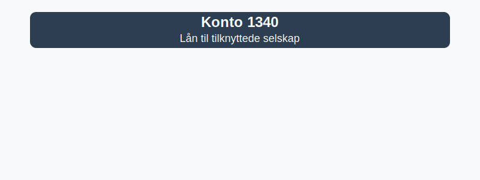

**Konto 1340 - Lån til tilknyttede selskap** er en konto i Norsk Standard Kontoplan som brukes til å registrere **konserninterne lån til tilknyttede selskaper** hvor investoren har betydelig innflytelse uten full kontroll.



## Hva er lån til tilknyttede selskap?

*Konto 1340 - Lån til tilknyttede selskap* omfatter **rentebærende fordringer** til selskaper der investoren har betydelig innflytelse (20–50 % eierandel), men ikke majoritetskontroll.

## Regnskapsføring ved utstedelse

Ved utstedelse av lån til tilknyttede selskap bokføres anskaffelseskost som inkluderer:

* **Lånebeløp** avtalt mellom partene
* **Transaksjonskostnader**, som gebyrer og administrasjonskostnader
* **Valutagevinster eller -tap** ved lån i fremmed valuta

```plaintext
Debet: Konto 1340 - LÃ¥n til tilknyttede selskap    XXX kroner
Kredit: Konto 1920 - Bankinnskudd                  XXX kroner
```

## Renteberegning og periodisering

Rentekostnader periodiseres basert på effektiv rente eller avtalt rente:

| Periode               | Kontering                                   |
|-----------------------|----------------------------------------------|
| Påløpte renter        | Kredit: Konto 2970 - Påløpte renter           |
| Rentekostnad          | Debet: Konto 8140 - Renteinntekter konserninterne |
| Betaling av renter    | Kredit: Konto 1920 - Bankinnskudd             |

## Tilbakebetaling av lån

Ved tilbakebetaling reduseres fordringen:

```plaintext
Debet: Konto 1920 - Bankinnskudd                  XXX kroner
Kredit: Konto 1340 - LÃ¥n til tilknyttede selskap  XXX kroner
```

## Konsernforhold

I [konsernregnskap](/blogs/regnskap/hva-er-konsern "Hva er Konsern?") elimineres konserninterne lån ved konsolidering mot tilsvarende fordrings- eller gjeldskonto.

## Eksempel

Selskap A gir et lån på 500 000 NOK til tilknyttet selskap B med 4 % rente:

```plaintext
Debet: Konto 1340 - Lån til tilknyttede selskap   500 000
Kredit: Konto 1920 - Bankinnskudd                  500 000
```

Ved periodisering av renter for perioden:

```plaintext
Debet: Konto 2970 - Påløpte renter                20 000
Kredit: Konto 8140 - Renteinntekter konserninterne 20 000
```

## Relaterte artikler

* [Konto 1300 - Investeringer i datterselskaper](/blogs/kontoplan/1300-investeringer-i-datterselskaper "Konto 1300 - Investeringer i datterselskaper")
* [Konto 1310 - Investeringer annet foretak i samme konsern](/blogs/kontoplan/1310-investeringer-annet-foretak-i-samme-konsern "Konto 1310 - Investeringer annet foretak i samme konsern")
* [Konto 1320 - LÃ¥n til foretak samme konsern](/blogs/kontoplan/1320-lan-til-foretak-samme-konsern "Konto 1320 - LÃ¥n til foretak samme konsern")
* [Konto 1330 - Investeringer i tilknyttede selskap](/blogs/kontoplan/1330-investeringer-i-tilknyttede-selskap "Konto 1330 - Investeringer i tilknyttede selskap")
* [Konto 1350 - Investeringer i aksjer og eiendeler](/blogs/kontoplan/1350-investeringer-i-aksjer-og-eiendeler "Konto 1350 - Investeringer i aksjer og eiendeler")
* [Konto 1360 - Obligasjoner](/blogs/kontoplan/1360-obligasjoner "Konto 1360 - Obligasjoner")
* [Konto 1370 - Fordringer på eiere og styremedlemmer](/blogs/kontoplan/1370-fordringer-pa-eiere-og-styremedlemmer "Konto 1370 - Fordringer på eiere og styremedlemmer")
* [Konto 1380 - Fordringer på ansatte](/blogs/kontoplan/1380-fordringer-pa-ansatte "Konto 1380 - Fordringer på ansatte")
* [Konto 1390 - Andre fordringer](/blogs/kontoplan/1390-andre-fordringer "Konto 1390 - Andre fordringer")
* [Konto 8030 - Renteinntekt på foretak i samme konsern](/blogs/kontoplan/8030-renteinntekt-pa-foretak-i-samme-konsern "Konto 8030 - Renteinntekt på foretak i samme konsern: Regnskapsføring av konserninterne renteinntekter")

