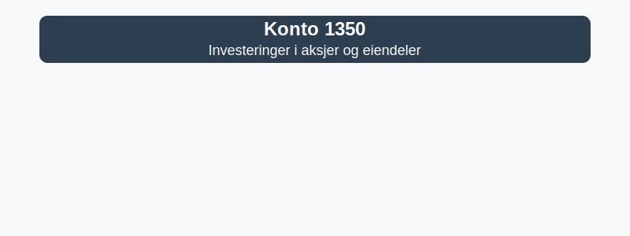

---
title: "1350-investeringer-i-aksjer-og-eiendeler"
meta_title: "1350-investeringer-i-aksjer-og-eiendeler"
meta_description: "**Konto 1350 - Investeringer i aksjer og eiendeler** er en konto i Norsk Standard Kontoplan som brukes til å registrere **langsiktige investeringer** i aksjer,..."
slug: 1350-investeringer-i-aksjer-og-eiendeler
type: blog
layout: pages/single
---

**Konto 1350 - Investeringer i aksjer og eiendeler** er en konto i Norsk Standard Kontoplan som brukes til å registrere **langsiktige investeringer** i aksjer, verdipapirer og andre finansielle eiendeler som ikke er konserninvesteringer.



## Hva er investeringer i aksjer og eiendeler?

*Konto 1350 - Investeringer i aksjer og eiendeler* omfatter eierandeler i andre selskaper samt [investeringer i obligasjoner](/blogs/kontoplan/1360-obligasjoner "Konto 1360 - Obligasjoner"), aksjefond og andre finansielle instrumenter som holdes som **anleggsmidler** for å sikre langsiktig avkastning og diversifisering. For **markedsbaserte aksjer**, se [Konto 1810 - Markedsbaserte aksjer](/blogs/kontoplan/1810-markedsbaserte-aksjer "Konto 1810 - Markedsbaserte aksjer"). For **andre aksjer**, se [Konto 1820 - Andre aksjer](/blogs/kontoplan/1820-andre-aksjer "Konto 1820 - Andre aksjer").

## Regnskapsføring av investeringer

Ved anskaffelse innregnes investeringen til anskaffelseskost, som kan inkludere transaksjonskostnader. Eventuell verdiendring må vurderes for nedskrivning hvis verdifallet er varig.

| Steg | Beskrivelse |
|------|-------------|
| 1    | Innregning til anskaffelseskost |
| 2    | Løpende vurdering for nedskrivning |
| 3    | Bokføring av mottatt utbytte eller renteinntekter |

## Klassifisering i kontoplanen

| Kontotype                           | Kontonummer | Beskrivelse                                                         |
|-------------------------------------|-------------|---------------------------------------------------------------------|
| Datterselskap                       | 1300        | Investeringer i datterselskaper (kontroll, >50 %)                   |
| Investering tilknyttet selskap      | 1330        | Investeringer i selskaper med betydelig innflytelse (20–50 %)       |
| Lån til tilknyttede selskap         | 1340        | Rentebærende fordringer til tilknyttede selskap                     |
| Aksjer og andre eiendeler           | 1350        | Investeringer i aksjer, obligasjoner og andre finansielle eiendeler |
| Obligasjoner                        | 1360        | Langsiktige obligasjonsinvesteringer og rentebærende verdipapirer    |

## Eksempel på bokføring

```plaintext
Debet: Konto 1350 - Investeringer i aksjer og eiendeler   1 500 000 kr
Kredit: Konto 1920 - Bankinnskudd                         1 500 000 kr
```

## Relaterte artikler

* [Konto 1330 - Investeringer i tilknyttede selskap](/blogs/kontoplan/1330-investeringer-i-tilknyttede-selskap "Konto 1330 - Investeringer i tilknyttede selskap")
* [Konto 1340 - LÃ¥n til tilknyttede selskap](/blogs/kontoplan/1340-lan-til-tilknyttede-selskap "Konto 1340 - LÃ¥n til tilknyttede selskap")
* [Konto 1360 - Obligasjoner](/blogs/kontoplan/1360-obligasjoner "Konto 1360 - Obligasjoner")
* [Konto 1820 - Andre aksjer](/blogs/kontoplan/1820-andre-aksjer "Konto 1820 - Andre aksjer")
* [Konto 1810 - Markedsbaserte aksjer](/blogs/kontoplan/1810-markedsbaserte-aksjer "Konto 1810 - Markedsbaserte aksjer")
* [Konto 1370 - Fordringer på eiere og styremedlemmer](/blogs/kontoplan/1370-fordringer-pa-eiere-og-styremedlemmer "Konto 1370 - Fordringer på eiere og styremedlemmer")
* [Konto 1380 - Fordringer på ansatte](/blogs/kontoplan/1380-fordringer-pa-ansatte "Konto 1380 - Fordringer på ansatte")
* [Konto 1390 - Andre fordringer](/blogs/kontoplan/1390-andre-fordringer "Konto 1390 - Andre fordringer")
* [Hva er langsiktig gjeld?](/blogs/regnskap/langsiktig-gjeld "Langsiktig gjeld")
