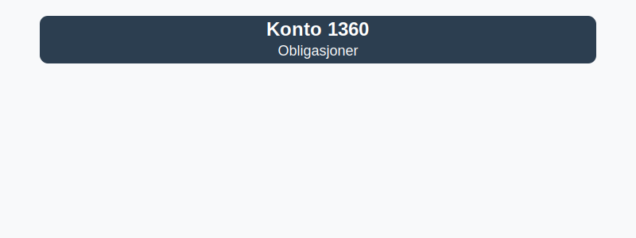

---
title: "Konto 1360 - Obligasjoner"
seoTitle: "Konto 1360 | Obligasjoner | Kontoplan | Regnskap"
description: "Konto 1360 brukes til å registrere langsiktige obligasjoner og rentebærende verdipapirer som anleggsmidler. Les om typer obligasjoner, innregning, rentemetoder og bokføring."
summary: "Konto 1360 dekker obligasjoner som langsiktige investeringer. Oppsummerer typer obligasjoner, innregning, effektiv rente og bokføring."
---

**Konto 1360 - Obligasjoner** er en konto i Norsk Standard Kontoplan som brukes til å registrere **langsiktige obligasjoner** og **rentebærende verdipapirer** som holdes som anleggsmidler for å oppnå avkastning og diversifisering.



## Hva er obligasjoner?

*Konto 1360 - Obligasjoner* omfatter langsiktige lånedokumenter utstedt av stater, kommuner eller selskaper, hvor investor mottar renteinntekter over obligasjonens løpetid og tilbakebetaling av nominell verdi ved forfall.

## Typer obligasjoner

Vanlige obligasjonstyper inkluderer:

* **Statsobligasjoner:** Utstedt av nasjonale myndigheter med lav kredittrisiko.
* **Kommunalobligasjoner:** Utstedt av kommuner eller fylkeskommuner.
* **Selskapsobligasjoner:** Utstedt av private selskaper med varierende kredittrating.
* **Inflasjonsobligasjoner:** Obligasjoner med rentejustering knyttet til inflasjonsindekser.
* **Konvertible obligasjoner:** Kan konverteres til aksjer på visse vilkår.
* **Grønne obligasjoner:** Øremerket finansiering av miljøvennlige prosjekter.

## Regnskapsføring av obligasjoner

Ved anskaffelse innregnes obligasjonen til anskaffelseskost, inkludert transaksjonskostnader. Rentekuponger periodiseres under renteinntekter ved bruk av effektiv rente-metode. Verdsettelsen kan være til amortisert kost eller virkelig verdi, basert på regnskapsstandard og intensjon.

| Steg | Beskrivelse |
|------|-------------|
| 1    | Innregning til anskaffelseskost inkludert påløpte renter |
| 2    | Løpende vurdering for nedskrivning ved varig verdifall |
| 3    | Periodisering av renteinntekter (effektiv rente-metode) |
| 4    | Verdivurdering ved virkelig verdi for omsettelige obligasjoner |

## Klassifisering i kontoplanen

| Kontotype                           | Kontonummer | Beskrivelse                                                        |
|-------------------------------------|-------------|--------------------------------------------------------------------|
| Datterselskap                       | 1300        | Investeringer i datterselskaper (kontroll, >50–¯%)                  |
| Investering tilknyttet selskap      | 1330        | Investeringer i selskaper med betydelig innflytelse (20–50–¯%)      |
| Lån til tilknyttede selskap         | 1340        | Rentebærende fordringer til tilknyttede selskap                    |
| Aksjer og andre eiendeler           | 1350        | Investeringer i aksjer, obligasjoner og andre finansielle eiendeler|
| **Obligasjoner**                    | **1360**    | **Langsiktige obligasjonsinvesteringer og rentebærende verdipapirer** |
| Fordringer på eiere og styremedlemmer | 1370    | Lån og forskudd til eiere og styremedlemmer                        |

## Eksempel på bokføring

```plaintext
Debet: Konto 1360 - Obligasjoner                        2–¯000–¯000 kr
Kredit: Konto 1920 - Bankinnskudd                       2–¯000–¯000 kr
```

## Relaterte artikler

* [Konto 1330 - Investeringer i tilknyttede selskap](/blogs/kontoplan/1330-investeringer-i-tilknyttede-selskap "Konto 1330 - Investeringer i tilknyttede selskap")
* [Konto 1340 - Lån til tilknyttede selskap](/blogs/kontoplan/1340-lan-til-tilknyttede-selskap "Konto 1340 - Lån til tilknyttede selskap")
* [Konto 1350 - Investeringer i aksjer og eiendeler](/blogs/kontoplan/1350-investeringer-i-aksjer-og-eiendeler "Konto 1350 - Investeringer i aksjer og eiendeler")
* [Konto 1370 - Fordringer på eiere og styremedlemmer](/blogs/kontoplan/1370-fordringer-pa-eiere-og-styremedlemmer "Konto 1370 - Fordringer på eiere og styremedlemmer")
* [Konto 1380 - Fordringer på ansatte](/blogs/kontoplan/1380-fordringer-pa-ansatte "Konto 1380 - Fordringer på ansatte")
* [Konto 1390 - Andre fordringer](/blogs/kontoplan/1390-andre-fordringer "Konto 1390 - Andre fordringer")
* [Konto 1850 - Markedsbaserte obligasjoner](/blogs/kontoplan/1850-markedsbaserte-obligasjoner "Konto 1850 - Markedsbaserte obligasjoner: Guide til markedsbaserte obligasjoner i norsk kontoplan")
* [Konto 2210 - Obligasjonslån](/blogs/kontoplan/2210-obligasjonslan "Konto 2210 - Obligasjonslån i Norsk Standard Kontoplan")
* [Hva er langsiktig gjeld?](/blogs/regnskap/langsiktig-gjeld "Langsiktig gjeld")


