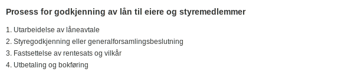

---
title: "Konto 1370 - Fordringer på eiere og styremedlemmer"
seoTitle: "1370-fordringer-pa-eiere-og-styremedlemmer"
description: '**Konto 1370 - Fordringer på eiere og styremedlemmer** er en konto i Norsk Standard Kontoplan som brukes til å registrere **lån og forskudd til eiere og styr...'
---

**Konto 1370 - Fordringer på eiere og styremedlemmer** er en konto i Norsk Standard Kontoplan som brukes til å registrere **lån og forskudd til eiere og styremedlemmer** som finansielle anleggsmidler. Kontoen omfatter både rente- og rentefrie fordringer som er innvilget av selskapet til sine eiere eller tillitsvalgte, under forutsetning av at transaksjonene er godkjent i henhold til gjeldende lover og selskapets vedtekter.


## Hva er fordringer på eiere og styremedlemmer?

Fordringer på eiere og styremedlemmer oppstår når selskapet yter lån, forskuddsutbetalinger eller forskuddsbetalinger til sine eiere eller styremedlemmer. Slike transaksjoner må være **styregodkjent** og ha klare avtalevilkår, herunder:

* Låneavtale formelt inngått
* Godkjennelse i styret eller generalforsamling
* Rentesats og betalingsplan fastsatt
* Eventuell sikkerhet og pant dokumentert

## Prosess for godkjenning av lån



1. Utarbeidelse av låneavtale
2. Styregodkjenning eller generalforsamlingsbeslutning
3. Fastsettelse av rentesats og vilkår
4. Utbetaling og bokføring

## Regnskapsføring

Ved utbetaling av lån til eiere eller styremedlemmer bokføres transaksjonen slik:

```plaintext
Debet: Konto 1370 - Fordringer på eiere og styremedlemmer   XXX
Kredit: Konto 1920 - Bankinnskudd                          XXX
```

Renteinntekter periodiseres basert på avtalt rente:

```plaintext
Debet: Konto 2970 - Påløpte renter                        YYY
Kredit: Konto 8140 - Renteinntekter annen finans           YYY
```

## Vurdering og nedskrivning

Fordringer på eiere og styremedlemmer skal vurderes løpende for **pålitelig måling** og eventuelt nedskrives ved indikasjoner på redusert inndrivbarhet. Se også behandlingen av [tapsavsetninger](/blogs/regnskap/tap-pa-fordring "Hva er Tapsavsetning? Behandling av fordringer").

## Klassifisering i kontoplanen

| Kontotype                             | Kontonummer | Beskrivelse                                            |
|---------------------------------------|-------------|--------------------------------------------------------|
| Datterselskap                         | 1300        | Investeringer i datterselskaper                        |
| Investering tilknyttet selskap        | 1330        | Investeringer i selskaper med betydelig innflytelse    |
| Lån til foretak samme konsern         | 1320        | Rentebærende fordringer til foretak i samme konsern    |
| Lån til tilknyttede selskap           | 1340        | Rentebærende fordringer til tilknyttede selskap        |
| Investeringer i aksjer og eiendeler   | 1350        | Investeringer i aksjer og andre finansielle eiendeler  |
| Obligasjoner                          | 1360        | Langsiktige obligasjonsinvesteringer og rentebærende   |
| **Fordringer på eiere og styremedlemmer** | **1370** | **Lån og forskudd til eiere og styremedlemmer**        |

## Eksempel på bokføring

```plaintext
Debet: Konto 1370 - Fordringer på eiere og styremedlemmer   500–¯000
Kredit: Konto 1920 - Bankinnskudd                            500–¯000
```

## Relaterte artikler

* [Konto 1300 - Investeringer i datterselskaper](/blogs/kontoplan/1300-investeringer-i-datterselskaper "Konto 1300 - Investeringer i datterselskaper")
* [Konto 1310 - Investeringer annet foretak i samme konsern](/blogs/kontoplan/1310-investeringer-annet-foretak-i-samme-konsern "Konto 1310 - Investeringer annet foretak i samme konsern")
* [Konto 1320 - Lån til foretak samme konsern](/blogs/kontoplan/1320-lan-til-foretak-samme-konsern "Konto 1320 - Lån til foretak samme konsern")
* [Konto 1330 - Investeringer i tilknyttede selskap](/blogs/kontoplan/1330-investeringer-i-tilknyttede-selskap "Konto 1330 - Investeringer i tilknyttede selskap")
* [Konto 1340 - Lån til tilknyttede selskap](/blogs/kontoplan/1340-lan-til-tilknyttede-selskap "Konto 1340 - Lån til tilknyttede selskap")
* [Konto 1350 - Investeringer i aksjer og eiendeler](/blogs/kontoplan/1350-investeringer-i-aksjer-og-eiendeler "Konto 1350 - Investeringer i aksjer og eiendeler")
* [Konto 1360 - Obligasjoner](/blogs/kontoplan/1360-obligasjoner "Konto 1360 - Obligasjoner")
* [Konto 1380 - Fordringer på ansatte](/blogs/kontoplan/1380-fordringer-pa-ansatte "Konto 1380 - Fordringer på ansatte")
* [Konto 1390 - Andre fordringer](/blogs/kontoplan/1390-andre-fordringer "Konto 1390 - Andre fordringer")
* [Konto 1580 - Avsetning tap på fordringer](/blogs/kontoplan/1580-avsetning-tap-pa-fordringer "Konto 1580 - Avsetning tap på fordringer")
* [Konto 2910 - Gjeld til ansatte og eiere](/blogs/kontoplan/2910-gjeld-til-ansatte-og-eiere "Konto 2910 - Gjeld til ansatte og eiere")
* [Hva er Kundefordring?](/blogs/regnskap/hva-er-kundefordring "Hva er Kundefordring? Komplett Guide til Kundefordring")
* [Hva er Tapsavsetning?](/blogs/regnskap/tap-pa-fordring "Hva er Tapsavsetning? Behandling av fordringer")
* [Hva er Langsiktig gjeld?](/blogs/regnskap/langsiktig-gjeld "Langsiktig gjeld")


