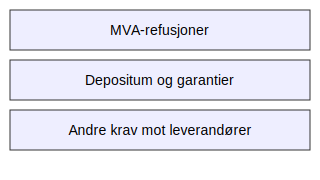

---
title: "Konto 1390 - Andre fordringer"
seoTitle: "Konto 1390 | Andre fordringer | Kontoplan"
description: "Konto 1390 brukes til å registrere andre kortsiktige fordringer uten sikkerhet som ikke dekkes av andre spesifikke kontoer. Les om typiske eksempler, vurdering, nedskrivning og bokføring."
summary: "Konto 1390 dekker andre kortsiktige fordringer. Oppsummerer eksempler, vurdering, nedskrivning og bokføring."
---

**Konto 1390 - Andre fordringer** er en konto i Norsk Standard Kontoplan som brukes til å registrere **andre kortsiktige fordringer uten sikkerhet** som ikke dekkes av spesifikke fordringskontoer som kundefordringer, fordringer på eiere eller ansatte.


## Hva er andre fordringer?

Andre fordringer oppstår når selskapet har krav på betaling som ikke faller inn under standardkontoer. Typiske eksempler inkluderer:

* **MVA-refusjoner** fra skattemyndighetene
* **Depositum og garantier** som skal tilbakebetales ved kontraktsopphør
* **Skatterestanser** og over- eller underreguleringer
* **Andre krav mot leverandører** og tredjepart
* **Intercompany fordringer** på selskap i samme konsern, se [Konto 1560 - Andre fordringer på selskap samme konsern](/blogs/kontoplan/1560-andre-fordringer-pa-selskap-samme-konsern "Konto 1560 - Andre fordringer på selskap samme konsern")



## Regnskapsføring

Ved bokføring av andre fordringer brukes normalt:

```plaintext
Debet: Konto 1390 - Andre fordringer       XXX
Kredit: Konto 1920 - Bankinnskudd         XXX
```

## Vurdering og nedskrivning

Andre fordringer skal vurderes for **pålitelig måling** og nedskrives hvis det er vesentlige usikkerheter knyttet til inndrivbarheten. Se også prinsippene for [tapsavsetninger](/blogs/regnskap/tap-pa-fordring "Hva er Tapsavsetning? Behandling av fordringer").

## Klassifisering i kontoplanen

| Kontotype                             | Kontonummer | Beskrivelse                                      |
|---------------------------------------|-------------|--------------------------------------------------|
| Datterselskap                         | 1300        | Investeringer i datterselskaper                  |
| Investering tilknyttet selskap        | 1330        | Investeringer i selskaper med betydelig innflytelse |
| Lån til foretak samme konsern         | 1320        | Rentebærende fordringer til foretak i samme konsern |
| Lån til tilknyttede selskap           | 1340        | Rentebærende fordringer til tilknyttede selskap  |
| Investeringer i aksjer og eiendeler   | 1350        | Investeringer i aksjer og andre finansielle eiendeler |
| Obligasjoner                          | 1360        | Langsiktige obligasjonsinvesteringer og rentebærende |
| Fordringer på eiere og styremedlemmer | 1370        | Lån og forskudd til eiere og styremedlemmer      |
| Fordringer på ansatte                 | 1380        | Lån og forskudd til ansatte                      |
| **Andre fordringer**                  | **1390**    | **Andre kortsiktige fordringer uten sikkerhet** |

## Eksempel på bokføring

```plaintext
Debet: Konto 1390 - Andre fordringer       25–¯000
Kredit: Konto 1920 - Bankinnskudd          25–¯000
```

## Relaterte artikler

* [Konto 1380 - Fordringer på ansatte](/blogs/kontoplan/1380-fordringer-pa-ansatte "Konto 1380 - Fordringer på ansatte")
* [Konto 1580 - Avsetning tap på fordringer](/blogs/kontoplan/1580-avsetning-tap-pa-fordringer "Konto 1580 - Avsetning tap på fordringer")
* [Hva er Kundefordring?](/blogs/regnskap/hva-er-kundefordring "Hva er Kundefordring? Komplett Guide til Kundefordring")
* [Hva er Tapsavsetning?](/blogs/regnskap/tap-pa-fordring "Hva er Tapsavsetning? Behandling av fordringer")
* [Hva er Langsiktig gjeld?](/blogs/regnskap/langsiktig-gjeld "Langsiktig gjeld")
* [Konto 1560 - Andre fordringer på selskap samme konsern](/blogs/kontoplan/1560-andre-fordringer-pa-selskap-samme-konsern "Konto 1560 - Andre fordringer på selskap samme konsern")


