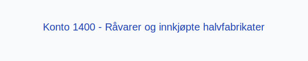

---
title: "Konto 1400 - Råvarer og innkjøpte halvfabrikater"
seoTitle: "Konto 1400 | Råvarer og innkjøpte halvfabrikater | Kontoplan"
description: '**Konto 1400 - Råvarer og innkjøpte halvfabrikater** brukes til å registrere **råvarer** og **innkjøpte halvfabrikater** i varelager. Les om lagerføring, verdsettelse, regnskapsføringsposter og relaterte kontoer.'
summary: "Konto 1400 dekker råvarer og innkjøpte halvfabrikater. Oppsummerer lagerføring, verdsettelse og typiske bokføringsposter."
---

**Konto 1400 - Råvarer og innkjøpte halvfabrikater** er en konto i Norsk Standard Kontoplan som brukes til å registrere **råvarer** og **innkjøpte halvfabrikater** som inngår i selskapets varelager.

## Hva er råvarer og innkjøpte halvfabrikater?

> *Råvarer* er materialer som omdannes i produksjonsprosessen, mens *innkjøpte halvfabrikater* er produkter som allerede er bearbeidet og som brukes videre i produksjonen.

Nøkkelkarakteristikker:

| Egenskap                     | Råvarer                      | Innkjøpte halvfabrikater          |
| ----------------------------- | ---------------------------- | --------------------------------- |
| Omfang                        | Naturmaterialer              | Delvis bearbeidede produkter      |
| Lagerføring                   | Krav til periodisk telling   | Krav til periodisk telling        |
| Verdsettelsesmetode           | FIFO, LIFO, vektet gj.snitt  | FIFO, vektet gj.snitt             |
| Eksempel                      | Stål, plastpellets, trevirke | Delvis ferdige komponenter        |

## Regnskapsføring

> Bokføring skjer ved anskaffelse, ved periodisk lageroppgjør og ved uttak til produksjon.

| Transaksjon                       | Debet                                                   | Kredit                        |
| --------------------------------- | ------------------------------------------------------- | ----------------------------- |
| Kjøp av råvarer                   | Konto 1400 - Råvarer og innkjøpte halvfabrikater         | Konto 1920 - Bankinnskudd     |
| Uttak til produksjon              | Konto 4300 - Vareforbruk (kostnad)                       | Konto 1400                     |
| Lagerjustering ved periodisering  | Konto 1400                                              | Konto 4160 - Endring i lager   |

## Vurdering og verdsettelse

Ved årsslutt må selskapet vurdere lageret til laveste av anskaffelseskost og virkelig verdi:

* **Anskaffelseskost** inkluderer kjøpspris, toll, frakt og andre direkte kostnader.
* **Virkelig verdi** er markedspris fratrukket forventede salgskostnader.

For en komplett oversikt over vurderingsmetoder for varelager, se [Hva er Varelager?](/blogs/regnskap/hva-er-varelager "Hva er Varelager? Komplett Guide til Lagerføring og Verdivurdering").

## Intern lenking og relaterte kontoer

Andre kontoer i NS 4102 som ofte benyttes sammen med konto 1400:

* [Konto 1420 - Varer under utvikling](/blogs/kontoplan/1420-varer-under-utvikling "Konto 1420 - Varer under utvikling")
* [Konto 1440 - Ferdige egentilvirkede varer](/blogs/kontoplan/1440-ferdige-egentilvirkede-varer "Konto 1440 - Ferdige egentilvirkede varer")
* [Konto 1460 - Innkjøpte varer for videresalg](/blogs/kontoplan/1460-innkjopte-varer-for-videresalg "Konto 1460 - Innkjøpte varer for videresalg")
* [Konto 1500 - Ferdige varer og varer under tilvirkning](/blogs/kontoplan/1500-ferdige-varer-og-varer-under-tilvirkning "Konto 1500 - Ferdige varer og varer under tilvirkning")
* [Konto 4000 - Innkjøp av råvarer og halvfabrikata høy sats](/blogs/kontoplan/4000-innkjop-av-raavarer-og-halvfabrikata-hoy-sats "Konto 4000 - Innkjøp av råvarer og halvfabrikata høy sats")
* [Konto 4100 - Innkjøp varer under tilvirkning høy sats](/blogs/kontoplan/4100-innkjop-varer-under-tilvirkning-hoy-sats "Konto 4100 - Innkjøp varer under tilvirkning høy sats")
* [Hva er en Kontoplan?](/blogs/regnskap/hva-er-kontoplan "Hva er en Kontoplan? Komplett Guide til Kontoplaner i Norsk Regnskap")
* [Hva er Arbeidskapital?](/blogs/regnskap/hva-er-arbeidskapital "Hva er Arbeidskapital? En Komplett Guide til Working Capital")
* [Konto 3060 - Uttak av varer avgiftspliktig høy sats](/blogs/kontoplan/3060-uttak-av-varer-avgiftspliktig-hoy-sats "Konto 3060 - Uttak av varer avgiftspliktig høy sats")
* [Konto 4090 - Beholdningsendring](/blogs/kontoplan/4090-beholdningsendring "Konto 4090 - Beholdningsendring")

* [Konto 4190 - Beholdningsendring](/blogs/kontoplan/4190-beholdningsendring "Konto 4190 - Beholdningsendring")

**God lagerstyring** av råvarer og halvfabrikater bidrar til bedre kostnadskontroll og økt effektivitet i produksjonen.

