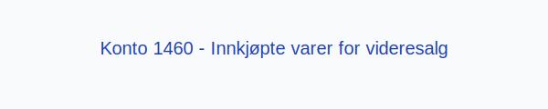

---
title: "Konto 1460 - Innkjøpte varer for videresalg"
meta_title: "1460-innkjopte-varer-for-videresalg"
meta_description: '**Konto 1460 - Innkjøpte varer for videresalg** er en konto i Norsk Standard Kontoplan som brukes til å registrere **handelsvarer** og **varekjøp** som skal ...'
slug: 1460-innkjopte-varer-for-videresalg
type: blog
layout: pages/single
---

**Konto 1460 - Innkjøpte varer for videresalg** er en konto i Norsk Standard Kontoplan som brukes til å registrere **handelsvarer** og **varekjøp** som skal videreselges uten ytterligere bearbeiding.

## Hva er innkjøpte varer for videresalg?

*Innkjøpte varer for videresalg* (også kalt handelsvarer) er produkter kjøpt fra leverandører for videre salg, uten intern produksjonsprosess.

Vanlige kjennetegn:

| Type vare   | Beskrivelse                                                            |
|-------------|------------------------------------------------------------------------|
| Engrosvarer | Varer kjøpt i store kvanta for videresalg til detaljhandel               |
| Detaljvarer | Produkter som selges direkte til sluttkunde                              |
| Komponenter | Innkjøpte deler som videreselges uten bearbeiding                        |

## Regnskapsføring

| Transaksjon                          | Debet                                            | Kredit                                    |
|--------------------------------------|--------------------------------------------------|-------------------------------------------|
| Kjøp av varer for videresalg         | Konto 1460 - Innkjøpte varer for videresalg       | Konto 1920 - Bankinnskudd                 |
| Kjøp av varer på kreditt             | Konto 1460 - Innkjøpte varer for videresalg       | Konto 2400 - Leverandørgjeld               |
| Uttak til salg (vareforbruk)         | Konto 4300 - Vareforbruk (kostnad)                | Konto 1460 - Innkjøpte varer for videresalg |
| Lagerjustering ved periodisering     | Konto 1460 - Innkjøpte varer for videresalg       | Konto 4160 - Endring i lager               |

## Vurdering og verdsettelse

Ved årsavslutning må varer for videresalg vurderes til laveste av anskaffelseskost og virkelig verdi:

* **Anskaffelseskost** omfatter kjøpspris, frakt, toll og andre direkte kostnader.
* **Virkelig verdi** er forventet salgspris fratrukket anslåtte salgskostnader.

Se [Hva er Varelager?](/blogs/regnskap/hva-er-varelager "Hva er Varelager? Komplett Guide til Lagerføring og Verdivurdering") for mer om varelager og verdivurdering.

## Intern lenking og relaterte kontoer

Andre kontoer i NS 4102 som ofte benyttes sammen med konto 1460:

* [Konto 1400 - Råvarer og innkjøpte halvfabrikater](/blogs/kontoplan/1400-raavarer-og-innkjopte-halvfabrikater "Konto 1400 - Råvarer og innkjøpte halvfabrikater")
* [Konto 1420 - Varer under utvikling](/blogs/kontoplan/1420-varer-under-utvikling "Konto 1420 - Varer under utvikling")
* [Konto 1440 - Ferdige egentilvirkede varer](/blogs/kontoplan/1440-ferdige-egentilvirkede-varer "Konto 1440 - Ferdige egentilvirkede varer")
* [Konto 1460 - Innkjøpte varer for videresalg](/blogs/kontoplan/1460-innkjopte-varer-for-videresalg "Konto 1460 - Innkjøpte varer for videresalg")
* [Konto 4300 - Innkjøp varer for videresalg høy sats](/blogs/kontoplan/4300-innkjop-varer-for-videresalg-hoy-sats "Konto 4300 - Innkjøp varer for videresalg høy sats")
* [Konto 4330 - Innkjøp varer for videresalg middels sats](/blogs/kontoplan/4330-innkjop-varer-for-videresalg-middels-sats "Konto 4330 - Innkjøp varer for videresalg middels sats")
* [Konto 1500 - Ferdige varer og varer under tilvirkning](/blogs/kontoplan/1500-ferdige-varer-og-varer-under-tilvirkning "Konto 1500 - Ferdige varer og varer under tilvirkning")
* [Konto 4000 - Innkjøp av råvarer og halvfabrikata høy sats](/blogs/kontoplan/4000-innkjop-av-raavarer-og-halvfabrikata-hoy-sats "Konto 4000 - Innkjøp av råvarer og halvfabrikata høy sats")
* [Hva er en Kontoplan?](/blogs/regnskap/hva-er-kontoplan "Hva er en Kontoplan? Komplett Guide til Kontoplaner i Norsk Regnskap")
* [Hva er Varelager?](/blogs/regnskap/hva-er-varelager "Hva er Varelager? Komplett Guide til Lagerføring og Verdivurdering")
* [Konto 3060 - Uttak av varer avgiftspliktig høy sats](/blogs/kontoplan/3060-uttak-av-varer-avgiftspliktig-hoy-sats "Konto 3060 - Uttak av varer avgiftspliktig høy sats")
* [Konto 4090 - Beholdningsendring](/blogs/kontoplan/4090-beholdningsendring "Konto 4090 - Beholdningsendring")

* [Konto 4190 - Beholdningsendring](/blogs/kontoplan/4190-beholdningsendring "Konto 4190 - Beholdningsendring")
* [Konto 7910 - Ukurante varer](/blogs/kontoplan/7910-ukurante-varer "Konto 7910 - Ukurante varer")

**Korrekt bokføring** av handelsvarer sikrer god kontroll over varelager og kostnader.

