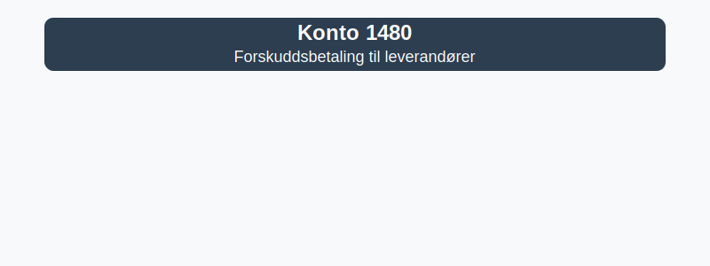

---
title: "1480-forskuddsbetaling-til-leverandorer"
meta_title: "1480-forskuddsbetaling-til-leverandorer"
meta_description: "**Konto 1480 - Forskuddsbetaling til leverandører** er en konto i Norsk Standard Kontoplan som brukes til å registrere **forskuddsbetalinger** til leverandør..."
slug: 1480-forskuddsbetaling-til-leverandorer
type: blog
layout: pages/single
---

**Konto 1480 - Forskuddsbetaling til leverandører** er en konto i Norsk Standard Kontoplan som brukes til å registrere **forskuddsbetalinger** til leverandører som betales før levering av varer eller tjenester.

## Hva er forskuddsbetaling til leverandører?

*Forskuddsbetaling til leverandører* er en betaling gjort på forhånd for varer eller tjenester som skal leveres ved et senere tidspunkt. Konto 1480 fungerer som en **midlertidig eiendelskonto** for disse forskuddene inntil levering.

Vanlige situasjoner for bruk av konto 1480:

* Deler av totalbeløp betales ved kontraktsinngåelse for **tilpassede produkter**
* Forskudd ved **store materialkostnader** i byggeprosjekter
* Førbestilling eller reservasjon i **sesongbaserte bransjer**

## Regnskapsføring

| Transaksjon                             | Debet                                    | Kredit                                     |
|-----------------------------------------|------------------------------------------|--------------------------------------------|
| Betaling av forskudd til leverandør     | Konto 1480 - Forskuddsbetaling til leverandører | Konto 1920 - Bankinnskudd                   |
| Forskuddsbetaling på kreditt            | Konto 1480 - Forskuddsbetaling til leverandører | [Konto 2400 - Leverandørgjeld](/blogs/kontoplan/2400-leverandorgjeld "Konto 2400 - Leverandørgjeld") |
| Mottak av varer/tjenester               | Konto 1460 / relevant kostnadskonto      | Konto 1480 - Forskuddsbetaling til leverandører |
| Periodisering ved årsavslutning         | Konto 1480 - Forskuddsbetaling til leverandører | Konto 4160 - Endring i forskuddsbetalinger     |

## Vurdering og balansepresentasjon

Ved årsavslutning skal saldo på konto 1480 presenteres som **omløpsmidler**, vurdert til anskaffelseskost. Forskuddsbetalinger som ikke fører til levering etter balansedagen, skal vurderes for eventuelle nedskrivninger.

Se også [Hva er forskuddsbetaling?](/blogs/regnskap/hva-er-forskuddsbetaling "Hva er forskuddsbetaling? Komplett Guide til Forskuddsbetalinger i Regnskap") for mer om regnskapsmessig behandling.

## Intern lenking og relaterte kontoer

Andre kontoer i NS 4102 som ofte benyttes sammen med konto 1480:

* [Konto 1460 - Innkjøpte varer for videresalg](/blogs/kontoplan/1460-innkjopte-varer-for-videresalg "Konto 1460 - Innkjøpte varer for videresalg")
* [Konto 1500 - Ferdige varer og varer under tilvirkning](/blogs/kontoplan/1500-ferdige-varer-og-varer-under-tilvirkning "Konto 1500 - Ferdige varer og varer under tilvirkning")
* [Hva er en Kontoplan?](/blogs/regnskap/hva-er-kontoplan "Hva er en Kontoplan? Komplett Guide til Kontoplaner i Norsk Regnskap")
* [Hva er forskuddsbetaling?](/blogs/regnskap/hva-er-forskuddsbetaling "Hva er forskuddsbetaling? Komplett Guide til Forskuddsbetalinger i Regnskap")
* [Konto 1700 - Forskuddsbetalte leier](/blogs/kontoplan/1700-forskuddsbetalte-leier "Konto 1700 - Forskuddsbetalte leier: Regnskapsføring av forhåndsbetalte leiekostnader")
* [Konto 2900 - Forskudd fra kunder](/blogs/kontoplan/2900-forskudd-fra-kunder "Konto 2900 - Forskudd fra kunder: Regnskapsføring av forskudd fra kunder")

**Korrekt bruk** av konto 1480 sikrer god periodisering av kostnader og kontroll over forskuddsbetalinger til leverandører.
