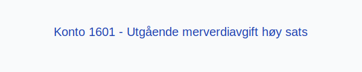

**Konto 1601 - Utgående merverdiavgift høy sats** er en konto i Norsk Standard Kontoplan som brukes til å registrere **utgående merverdiavgift med høy sats** (25 %) som en gjeld til skattemyndighetene fram til innbetaling.

## Hva er utgående merverdiavgift med høy sats?

*Utgående merverdiavgift med høy sats* på 25 % legges til ved salg av varer og tjenester som omfattes av standard merverdiavgift. Konto 1601 skiller denne posten fra andre satser for å gi bedre oversikt i regnskapet.

## Når skal konto 1601 benyttes?

* Ved fakturering av varer og tjenester med **25 % MVA**
* I periodisk MVA-rapportering for standard sats
* Ved avregning mot konto [1600 - Utgående merverdiavgift](/blogs/kontoplan/1600-utgaende-merverdiavgift "Konto 1600 - Utgående merverdiavgift")

## Regnskapsføring av høy sats MVA

| Transaksjon                                | Debet                                            | Kredit                                      |
|--------------------------------------------|--------------------------------------------------|----------------------------------------------|
| Salg med 25 % MVA                          | Konto 3000 - Salgsinntekt                         | Konto 1601 - Utgående merverdiavgift høy sats |
| Innbetaling til skattemyndighetene (MVA)   | Konto 1601 - Utgående merverdiavgift høy sats     | Konto 1920 - Bankinnskudd                    |

For en grundig introduksjon til MVA, se også [Hva er MVA?](/blogs/regnskap/hva-er-moms-mva "Hva er MVA? MVA-regnskapsføring og merverdiavgift").

## Eksempler og beregning

Tabellen under viser beregning av høy sats MVA for ulike verdier:

| Salgsbeløp uten MVA | MVA (25 %) | Salgsbeløp inkl. MVA |
|---------------------|------------|----------------------|
| 8 000 NOK           | 2 000 NOK  | 10 000 NOK           |
| 20 000 NOK          | 5 000 NOK  | 25 000 NOK           |

## Fordeler med separat høy sats-konto

* **Klarere balanseoversikt** ved å skille standard og høy sats
* **Forenklet rapportering** til skattemyndighetene
* Bedre kontroll av **likviditet** og betalingsplaner

## Relaterte artikler

* [Konto 1600 - Utgående merverdiavgift](/blogs/kontoplan/1600-utgaende-merverdiavgift "Konto 1600 - Utgående merverdiavgift")
* [Konto 1602 - Utgående merverdiavgift kjøp tjenester fra utlandet](/blogs/kontoplan/1602-utgaende-merverdiavgift-kjop-tjen-fra-utlandet "Konto 1602 - Utgående merverdiavgift kjøp tjenester fra utlandet")
* [Konto 1603 - Utgående merverdiavgift middels sats](/blogs/kontoplan/1603-utgaende-merverdiavgift-middels-sats "Konto 1603 - Utgående merverdiavgift middels sats")
* [Konto 1604 - Utgående merverdiavgift lav sats](/blogs/kontoplan/1604-utgaende-merverdiavgift-lav-sats "Konto 1604 - Utgående merverdiavgift lav sats")
* [Konto 1610 - Inngående merverdiavgift](/blogs/kontoplan/1610-inngaaende-merverdiavgift "Konto 1610 - Inngående merverdiavgift")
* [Konto 1611 - Inngående merverdiavgift høy sats](/blogs/kontoplan/1611-inngaaende-merverdiavgift-hoy-sats "Konto 1611 - Inngående merverdiavgift høy sats")
* [Konto 1612 - Inngående merverdiavgift kjøp tjenester fra utlandet](/blogs/kontoplan/1612-inngaaende-merverdiavgift-kjop-tjen-fra-utlandet "Konto 1612 - Inngående merverdiavgift kjøp tjenester fra utlandet")
* [Konto 2700 - Utgående merverdiavgift](/blogs/kontoplan/2700-utgaende-merverdiavgift "Konto 2700 - Utgående merverdiavgift")
* [Konto 2701 - Utgående merverdiavgift høy sats](/blogs/kontoplan/2701-utgaende-merverdiavgift-hoy-sats "Konto 2701 - Utgående merverdiavgift høy sats")
* [Hva er MVA?](/blogs/regnskap/hva-er-moms-mva "Hva er MVA? MVA-regnskapsføring og merverdiavgift")
