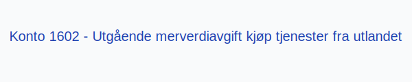

---
title: "Konto 1602 - Utgående merverdiavgift kjøp tjenester fra utlandet"
seoTitle: "1602-utgaende-merverdiavgift-kjop-tjen-fra-utlandet"
meta_description: '**Konto 1602 - Utgående merverdiavgift kjøp tjenester fra utlandet** er en konto i Norsk Standard Kontoplan som brukes til å registrere **utgående merverdia...'
slug: 1602-utgaende-merverdiavgift-kjop-tjen-fra-utlandet
type: blog
layout: pages/single
---

**Konto 1602 - Utgående merverdiavgift kjøp tjenester fra utlandet** er en konto i Norsk Standard Kontoplan som brukes til å registrere **utgående merverdiavgift** ved kjøp av tjenester fra utlandet (omvendt avgiftsplikt) som en gjeld til skattemyndighetene frem til betaling.

## Hva er omvendt avgiftsplikt for kjøp av tjenester fra utlandet?

Ved kjøp av tjenester fra utlandet gjelder omvendt avgiftsplikt, som innebærer at kjøperen (virksomheten) skal beregne og bokføre merverdiavgift på tjenesten selv. Dette sikrer like konkurransevilkår mellom norske og utenlandske tilbydere.

## Når skal konto 1602 benyttes?

* Når virksomheten kjøper tjenester fra utlandet som omfattes av omvendt avgiftsplikt.
* Ved periodisk MVA-rapportering for importerte tjenester.
* Når inngående MVA på utenlandske tjenester skal føres mot utgående MVA.

## Regnskapsføring

| Transaksjon                                                        | Debet                                                        | Kredit                                                     |
|--------------------------------------------------------------------|--------------------------------------------------------------|------------------------------------------------------------|
| Registrering av omvendt avgiftsplikt for kjøp av tjenester fra utlandet | Konto 2640 - Inngående merverdiavgift                       | Konto 1602 - Utgående merverdiavgift kjøp tjenester fra utlandet |
| Betaling av MVA ved omvendt avgiftsplikt                            | Konto 1602 - Utgående merverdiavgift kjøp tjenester fra utlandet | Konto 1920 - Bankinnskudd                                   |

For en grundig innføring i merverdiavgift, se [Hva er MVA?](/blogs/regnskap/hva-er-moms-mva "Hva er MVA? MVA-regnskapsføring og merverdiavgift").

## Eksempel

| Beløp uten MVA  | MVA (25 %) | MVA å føre som omvendt avgiftsplikt |
|-----------------|------------|-------------------------------------|
| 5–¯000 NOK       | 1–¯250 NOK  | 1–¯250 NOK                           |

## Fordeler ved korrekt omvendt avgiftsbehandling

* **Redusert risiko** for feilrapportering ved import av tjenester
* **Bedre likviditetsstyring** gjennom planlagt innrapportering
* Overholdelse av **regelverkskrav** for merverdiavgift på utenlandske tjenester

## Relaterte artikler

* [Konto 1600 - Utgående merverdiavgift](/blogs/kontoplan/1600-utgaende-merverdiavgift "Konto 1600 - Utgående merverdiavgift")
* [Konto 1601 - Utgående merverdiavgift høy sats](/blogs/kontoplan/1601-utgaende-merverdiavgift-hoy-sats "Konto 1601 - Utgående merverdiavgift høy sats")
* [Konto 1603 - Utgående merverdiavgift middels sats](/blogs/kontoplan/1603-utgaende-merverdiavgift-middels-sats "Konto 1603 - Utgående merverdiavgift middels sats")
* [Konto 1604 - Utgående merverdiavgift lav sats](/blogs/kontoplan/1604-utgaende-merverdiavgift-lav-sats "Konto 1604 - Utgående merverdiavgift lav sats")
* [Konto 1610 - Inngående merverdiavgift](/blogs/kontoplan/1610-inngaaende-merverdiavgift "Konto 1610 - Inngående merverdiavgift")
* [Konto 1611 - Inngående merverdiavgift høy sats](/blogs/kontoplan/1611-inngaaende-merverdiavgift-hoy-sats "Konto 1611 - Inngående merverdiavgift høy sats")
* [Konto 1612 - Inngående merverdiavgift kjøp tjenester fra utlandet](/blogs/kontoplan/1612-inngaaende-merverdiavgift-kjop-tjen-fra-utlandet "Konto 1612 - Inngående merverdiavgift kjøp tjenester fra utlandet")
* [Konto 2712 - Inngående merverdiavgift kjøp tjenester fra utlandet](/blogs/kontoplan/2712-inngaaende-merverdiavgift-kjop-tjen-fra-utlandet "Konto 2712 - Inngående merverdiavgift kjøp tjenester fra utlandet")
* [Konto 2700 - Utgående merverdiavgift](/blogs/kontoplan/2700-utgaende-merverdiavgift "Konto 2700 - Utgående merverdiavgift")
* [Konto 2702 - Utgående merverdiavgift kjøp tjenester fra utlandet](/blogs/kontoplan/2702-utgaende-merverdiavgift-kjop-tjen-fra-utlandet "Konto 2702 - Utgående merverdiavgift kjøp tjenester fra utlandet")
* [Hva er MVA?](/blogs/regnskap/hva-er-moms-mva "Hva er MVA? MVA-regnskapsføring og merverdiavgift")
* [Hva er en Kontoplan?](/blogs/regnskap/hva-er-kontoplan "Hva er en Kontoplan? Komplett Guide til Kontoplaner i Norsk Regnskap")

