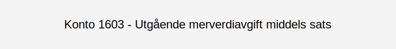

---
title: "Konto 1603 - Utgående merverdiavgift middels sats"
seoTitle: "1603-utgaende-merverdiavgift-middels-sats"
meta_description: '**Konto 1603 - Utgående merverdiavgift middels sats** er en konto i Norsk Standard Kontoplan som brukes til å registrere **utgående merverdiavgift med middel...'
slug: 1603-utgaende-merverdiavgift-middels-sats
type: blog
layout: pages/single
---

**Konto 1603 - Utgående merverdiavgift middels sats** er en konto i Norsk Standard Kontoplan som brukes til å registrere **utgående merverdiavgift med middels sats** (15–¯%) som en gjeld til skattemyndighetene frem til innbetaling.

## Hva er utgående merverdiavgift middels sats?

*Utgående merverdiavgift middels sats* er den delen av **merverdiavgiften** som påløper ved salg av varer og tjenester som omfattes av den reduserte satsen på **15–¯%**. Denne satsen gjelder blant annet for:

* **Matvarer** (unntatt alkohol og tobakk)
* **Hotell- og overnattingstjenester**
* **Passasjertransport**
* **Visse kulturelle og sportslige arrangementer**

For en oversikt over andre satser, se [Hva er MVA?](/blogs/regnskap/hva-er-moms-mva "Hva er MVA? MVA-regnskapsføring og merverdiavgift").

## Når skal konto 1603 benyttes?

Konto 1603 skal brukes når virksomheten fakturerer kunder med middels sats MVA. Eksempler på registreringer:

* Ved salg av mat og drikke på restaurant eller kafé
* Ved fakturering av hotell- og overnattingsgjester
* Når bedriften selger billetter til kultur- og idrettsarrangementer

## Regnskapsføring

| Transaksjon                                    | Debet                                   | Kredit                                           |
|------------------------------------------------|-----------------------------------------|--------------------------------------------------|
| Salg med 15–¯% MVA                              | Konto 3000 - Salgsinntekt               | Konto 1603 - Utgående merverdiavgift middels sats |
| Innbetaling av MVA til skattemyndighetene      | Konto 1603 - Utgående merverdiavgift middels sats | Konto 1920 - Bankinnskudd                        |

## Eksempel

| Salgsbeløp uten MVA | MVA (15–¯%)  | Salgsbeløp inkl. MVA |
|---------------------|-------------|----------------------|
| 8–¯000 NOK           | 1–¯200 NOK   | 9–¯200 NOK            |
| 20–¯000 NOK          | 3–¯000 NOK   | 23–¯000 NOK           |

## Fordeler ved korrekt bokføring av middels sats

* **Forbedret oversikt** over ulike MVA-satser i regnskapet
* **Redusert risiko** for feilrapportering ved reduserte satser
* Effektiv **likviditetsstyring** gjennom presis avregning

## Relaterte artikler

* [Konto 1600 - Utgående merverdiavgift](/blogs/kontoplan/1600-utgaende-merverdiavgift "Konto 1600 - Utgående merverdiavgift")
* [Konto 1601 - Utgående merverdiavgift høy sats](/blogs/kontoplan/1601-utgaende-merverdiavgift-hoy-sats "Konto 1601 - Utgående merverdiavgift høy sats")
* [Konto 1602 - Utgående merverdiavgift kjøp tjenester fra utlandet](/blogs/kontoplan/1602-utgaende-merverdiavgift-kjop-tjen-fra-utlandet "Konto 1602 - Utgående merverdiavgift kjøp tjenester fra utlandet")
* [Konto 1604 - Utgående merverdiavgift lav sats](/blogs/kontoplan/1604-utgaende-merverdiavgift-lav-sats "Konto 1604 - Utgående merverdiavgift lav sats")
* [Konto 1610 - Inngående merverdiavgift](/blogs/kontoplan/1610-inngaaende-merverdiavgift "Konto 1610 - Inngående merverdiavgift")
* [Konto 1611 - Inngående merverdiavgift høy sats](/blogs/kontoplan/1611-inngaaende-merverdiavgift-hoy-sats "Konto 1611 - Inngående merverdiavgift høy sats")
* [Konto 1612 - Inngående merverdiavgift kjøp tjenester fra utlandet](/blogs/kontoplan/1612-inngaaende-merverdiavgift-kjop-tjen-fra-utlandet "Konto 1612 - Inngående merverdiavgift kjøp tjenester fra utlandet")
* [Konto 2700 - Utgående merverdiavgift](/blogs/kontoplan/2700-utgaende-merverdiavgift "Konto 2700 - Utgående merverdiavgift")
* [Konto 1613 - Inngående merverdiavgift middels sats](/blogs/kontoplan/1613-inngaaende-merverdiavgift-middels-sats "Konto 1613 - Inngående merverdiavgift middels sats")
* [Hva er MVA?](/blogs/regnskap/hva-er-moms-mva "Hva er MVA? MVA-regnskapsføring og merverdiavgift")
* [Hva er en Kontoplan?](/blogs/regnskap/hva-er-kontoplan "Hva er en Kontoplan? Komplett Guide til Kontoplaner i Norsk Regnskap")

