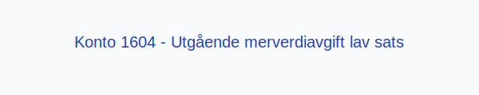

---
title: "1604-utgaende-merverdiavgift-lav-sats"
meta_title: "1604-utgaende-merverdiavgift-lav-sats"
meta_description: "**Konto 1604 - Utgående merverdiavgift lav sats** er en konto i Norsk Standard Kontoplan som brukes til å registrere **utgående merverdiavgift med lav sats**..."
slug: 1604-utgaende-merverdiavgift-lav-sats
type: blog
layout: pages/single
---

**Konto 1604 - Utgående merverdiavgift lav sats** er en konto i Norsk Standard Kontoplan som brukes til å registrere **utgående merverdiavgift med lav sats** (12 %) som en gjeld til skattemyndighetene frem til innbetaling.

## Hva er utgående merverdiavgift lav sats?

*Utgående merverdiavgift lav sats* er den delen av **merverdiavgiften** som påløper ved salg av varer og tjenester som omfattes av den **lave merverdiavgiftssatsen** på **12 %**. Denne satsen gjelder blant annet for:

* **Aviser og tidsskrifter**
* **Elektrisitet til husholdninger**
* **Passasjertransport** (buss, tog, ferge)
* **Hotell- og losjivirksomhet**

For en oversikt over andre satser, se [Hva er MVA?](/blogs/regnskap/hva-er-moms-mva "Hva er MVA? MVA-regnskapsføring og merverdiavgift").

## NÃ¥r skal konto 1604 benyttes?

Konto 1604 skal brukes når virksomheten fakturerer kunder med lav sats MVA. Typiske eksempler:

* Ved salg av **avisabonnement** og løssalg av aviser
* Når strømleverandører fakturerer husholdninger
* Ved fakturering av passasjertransport innenlands

## Regnskapsføring

| Transaksjon                                    | Debet                                   | Kredit                                           |
|------------------------------------------------|-----------------------------------------|--------------------------------------------------|
| Salg med 12 % MVA                              | Konto 3000 - Salgsinntekt               | Konto 1604 - Utgående merverdiavgift lav sats     |
| Innbetaling av MVA til skattemyndighetene      | Konto 1604 - Utgående merverdiavgift lav sats | Konto 1920 - Bankinnskudd                        |

## Eksempler

| Salgsbeløp uten MVA | MVA (12 %)  | Salgsbeløp inkl. MVA |
|---------------------|-------------|----------------------|
| 10 000 NOK          | 1 200 NOK   | 11 200 NOK           |
| 25 000 NOK          | 3 000 NOK   | 28 000 NOK           |

## Fordeler ved korrekt bokføring av lav sats

* **Detaljert oversikt** over ulike MVA-satser i regnskapet
* **Nøyaktig rapportering** for spesialsatser
* Bedre **kontroll av likviditet** ved å skille lav sats fra andre satser

## Relaterte artikler

* [Konto 1600 - Utgående merverdiavgift](/blogs/kontoplan/1600-utgaende-merverdiavgift "Konto 1600 - Utgående merverdiavgift")
* [Konto 1601 - Utgående merverdiavgift høy sats](/blogs/kontoplan/1601-utgaende-merverdiavgift-hoy-sats "Konto 1601 - Utgående merverdiavgift høy sats")
* [Konto 1602 - Utgående merverdiavgift kjøp tjenester fra utlandet](/blogs/kontoplan/1602-utgaende-merverdiavgift-kjop-tjen-fra-utlandet "Konto 1602 - Utgående merverdiavgift kjøp tjenester fra utlandet")
* [Konto 1603 - Utgående merverdiavgift middels sats](/blogs/kontoplan/1603-utgaende-merverdiavgift-middels-sats "Konto 1603 - Utgående merverdiavgift middels sats")
* [Konto 1610 - Inngående merverdiavgift](/blogs/kontoplan/1610-inngaaende-merverdiavgift "Konto 1610 - Inngående merverdiavgift")
* [Konto 1611 - Inngående merverdiavgift høy sats](/blogs/kontoplan/1611-inngaaende-merverdiavgift-hoy-sats "Konto 1611 - Inngående merverdiavgift høy sats")
* [Konto 1612 - Inngående merverdiavgift kjøp tjenester fra utlandet](/blogs/kontoplan/1612-inngaaende-merverdiavgift-kjop-tjen-fra-utlandet "Konto 1612 - Inngående merverdiavgift kjøp tjenester fra utlandet")
* [Konto 2700 - Utgående merverdiavgift](/blogs/kontoplan/2700-utgaende-merverdiavgift "Konto 2700 - Utgående merverdiavgift")
* [Hva er MVA?](/blogs/regnskap/hva-er-moms-mva "Hva er MVA? MVA-regnskapsføring og merverdiavgift")
* [Hva er en Kontoplan?](/blogs/regnskap/hva-er-kontoplan "Hva er en Kontoplan? Komplett Guide til Kontoplaner i Norsk Regnskap")
