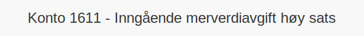

---
title: "Konto 1611 - Inngående merverdiavgift høy sats"
seoTitle: "1611-inngaaende-merverdiavgift-hoy-sats"
meta_description: '**Konto 1611 - Inngående merverdiavgift høy sats** er en konto i Norsk Standard Kontoplan som brukes til å registrere **inngående merverdiavgift med høy sa...'
slug: 1611-inngaaende-merverdiavgift-hoy-sats
type: blog
layout: pages/single
---

**Konto 1611 - Inngående merverdiavgift høy sats** er en konto i Norsk Standard Kontoplan som brukes til å registrere **inngående merverdiavgift med høy sats (25 %)** som et fradrag i regnskapet for kjøp av varer og tjenester med standard MVA-sats.

## Hva er inngående merverdiavgift høy sats?

*Høy sats inngående merverdiavgift* gjelder **25 %** merverdiavgift som virksomheter betaler ved kjøp av varer og tjenester som omfattes av standard MVA-sats og som kan fradras.

## Når skal konto 1611 benyttes?

* Ved kjøp med **25 % MVA** der inngående merverdiavgift skal føres som fradrag
* I periodisk MVA-rapportering for standard sats
* Ved avregning mot konto [1610 - Inngående merverdiavgift](/blogs/kontoplan/1610-inngaaende-merverdiavgift "Konto 1610 - Inngående merverdiavgift")

## Regnskapsføring av høy sats inngående MVA

| Transaksjon                              | Debet                                           | Kredit                                        |
|------------------------------------------|-------------------------------------------------|-----------------------------------------------|
| Kjøp med 25 % MVA                        | Konto 1611 - Inngående merverdiavgift høy sats   | Konto 2400 - Leverandørgjeld                  |
| Periodisk MVA-oppgjør (fradrag høy sats) | Konto 2740 - Inngående merverdiavgift fradrag   | Konto 1611 - Inngående merverdiavgift høy sats |

For en komplett gjennomgang av merverdiavgift, se [Hva er MVA?](/blogs/regnskap/hva-er-moms-mva "Hva er MVA? MVA-regnskapsføring og merverdiavgift").

## Eksempler på beregning

| Beløp uten MVA | MVA (25 %) | Totalt inkl. MVA |
|---------------|------------|------------------|
| 8–¯000 NOK     | 2–¯000 NOK  | 10–¯000 NOK       |
| 20–¯000 NOK    | 5–¯000 NOK  | 25–¯000 NOK       |

## Fordeler ved egen høy sats-konto

* **Klarere oversikt** over fradragsberettiget MVA med høy sats
* **Forenklet rapportering** ved periodisk MVA-oppgjør
* Bedre **likviditetsstyring** og kontroll

## Relaterte artikler

* [Konto 1610 - Inngående merverdiavgift](/blogs/kontoplan/1610-inngaaende-merverdiavgift "Konto 1610 - Inngående merverdiavgift")
* [Konto 1601 - Utgående merverdiavgift høy sats](/blogs/kontoplan/1601-utgaende-merverdiavgift-hoy-sats "Konto 1601 - Utgående merverdiavgift høy sats")
* [Konto 1612 - Inngående merverdiavgift kjøp tjenester fra utlandet](/blogs/kontoplan/1612-inngaaende-merverdiavgift-kjop-tjen-fra-utlandet "Konto 1612 - Inngående merverdiavgift kjøp tjenester fra utlandet")
* [Konto 1613 - Inngående merverdiavgift middels sats](/blogs/kontoplan/1613-inngaaende-merverdiavgift-middels-sats "Konto 1613 - Inngående merverdiavgift middels sats")
* [Hva er MVA?](/blogs/regnskap/hva-er-moms-mva "Hva er MVA? MVA-regnskapsføring og merverdiavgift")
* [Hva er en Kontoplan?](/blogs/regnskap/hva-er-kontoplan "Hva er en Kontoplan? Komplett Guide til Kontoplaner i Norsk Regnskap")

