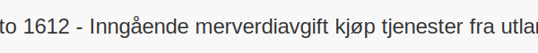

---
title: "Konto 1612 - Inngående merverdiavgift kjøp tjenester fra utlandet"
seoTitle: "1612-inngaaende-merverdiavgift-kjop-tjen-fra-utlandet"
description: '**Konto 1612 - Inngående merverdiavgift kjøp tjenester fra utlandet** er en konto i Norsk Standard Kontoplan som brukes til å registrere **inngående merverd...'
---

**Konto 1612 - Inngående merverdiavgift kjøp tjenester fra utlandet** er en konto i Norsk Standard Kontoplan som brukes til å registrere **inngående merverdiavgift** ved kjøp av tjenester fra utlandet som et **fradragsberettiget** beløp i regnskapet.

## Hva er inngående merverdiavgift kjøp tjenester fra utlandet?

*Inngående merverdiavgift ved kjøp av tjenester fra utlandet* oppstår når virksomheter kjøper tjenester fra utenlandske leverandører og omvendt avgiftsplikt gjelder. Kjøperen må beregne og føre merverdiavgift selv som et inngående fradrag.

## Når skal konto 1612 benyttes?

* Når virksomheten kjøper tjenester fra utlandet under omvendt avgiftsplikt.
* Ved periodisk MVA-rapportering for importerte tjenester.
* Når inngående merverdiavgift på utenlandske tjenester skal fradragsføres.

## Regnskapsføring

| Transaksjon                                                          | Debet                                                | Kredit                                                 |
|----------------------------------------------------------------------|------------------------------------------------------|--------------------------------------------------------|
| Registrering av omvendt avgiftsplikt ved kjøp av tjenester fra utlandet | Konto 1612 - Inngående merverdiavgift kjøp tjenester fra utlandet | Konto 2400 - Leverandørgjeld                           |
| Periodisk MVA-oppgjør (fradrag)                                       | Konto 2740 - Inngående merverdiavgift fradrag        | Konto 1612 - Inngående merverdiavgift kjøp tjenester fra utlandet |

For en grundig innføring i merverdiavgift, se [Hva er MVA?](/blogs/regnskap/hva-er-moms-mva "Hva er MVA? MVA-regnskapsføring og merverdiavgift").

## Eksempel på beregning

| Beløp uten MVA   | MVA (25 %) | MVA å føre som inngående MVA |
|------------------|------------|-------------------------------|
| 10–¯000 NOK       | 2–¯500 NOK  | 2–¯500 NOK                     |
| 5–¯000 NOK        | 1–¯250 NOK  | 1–¯250 NOK                     |

## Regler og begrensninger

* **Fradragsrett** gjelder kun for kjøp relatert til avgiftspliktig virksomhet.
* Enkelte tjenester (f.eks. representasjon, persontransport) kan ha **begrenset eller ingen fradragsrett**.
* Ved **andel fradrag** må inngående merverdiavgift beregnes etter forholdet mellom avgiftspliktig og avgiftsfri omsetning.

## Fordeler ved korrekt behandling av konto 1612

* **Bedre likviditetsstyring** ved å sikre riktig fradrag og unngå overbetaling.
* **Redusert risiko** for feil i MVA-rapporteringen ved import av tjenester.
* Overholdelse av **skatte- og avgiftslovgivning** for utenlandstjenester.

## Relaterte artikler

* [Konto 1602 - Utgående merverdiavgift kjøp tjenester fra utlandet](/blogs/kontoplan/1602-utgaende-merverdiavgift-kjop-tjen-fra-utlandet "Konto 1602 - Utgående merverdiavgift kjøp tjenester fra utlandet")
* [Konto 1610 - Inngående merverdiavgift](/blogs/kontoplan/1610-inngaaende-merverdiavgift "Konto 1610 - Inngående merverdiavgift")
* [Konto 1611 - Inngående merverdiavgift høy sats](/blogs/kontoplan/1611-inngaaende-merverdiavgift-hoy-sats "Konto 1611 - Inngående merverdiavgift høy sats")
* [Konto 1613 - Inngående merverdiavgift middels sats](/blogs/kontoplan/1613-inngaaende-merverdiavgift-middels-sats "Konto 1613 - Inngående merverdiavgift middels sats")
* [Konto 2712 - Inngående merverdiavgift kjøp tjenester fra utlandet](/blogs/kontoplan/2712-inngaaende-merverdiavgift-kjop-tjen-fra-utlandet "Konto 2712 - Inngående merverdiavgift kjøp tjenester fra utlandet")
* [Konto 2713 - Inngående merverdiavgift middels sats](/blogs/kontoplan/2713-inngaaende-merverdiavgift-middels-sats "Konto 2713 - Inngående merverdiavgift middels sats")
* [Konto 7350 - Representasjon, fradragsberettiget](/blogs/kontoplan/7350-representasjon-fradragsberettiget "Konto 7350 - Representasjon, fradragsberettiget")
* [Konto 7360 - Representasjon, ikke fradragsberettiget](/blogs/kontoplan/7360-representasjon-ikke-fradragsberettiget "Konto 7360 - Representasjon, ikke fradragsberettiget")
* [Hva er MVA?](/blogs/regnskap/hva-er-moms-mva "Hva er MVA? MVA-regnskapsføring og merverdiavgift")
* [Hva er en Kontoplan?](/blogs/regnskap/hva-er-kontoplan "Hva er en Kontoplan? Komplett Guide til Kontoplaner i Norsk Regnskap")

