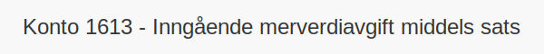

---
title: "Konto 1613 - Inngående merverdiavgift middels sats"
seoTitle: "1613-inngaaende-merverdiavgift-middels-sats"
meta_description: '**Konto 1613 - Inngående merverdiavgift middels sats** er en konto i Norsk Standard Kontoplan som brukes til å registrere **inngående merverdiavgift med midd...'
slug: 1613-inngaaende-merverdiavgift-middels-sats
type: blog
layout: pages/single
---

**Konto 1613 - Inngående merverdiavgift middels sats** er en konto i Norsk Standard Kontoplan som brukes til å registrere **inngående merverdiavgift med middels sats (15 %)** som et fradragsberettiget beløp i regnskapet for kjøp av varer og tjenester med redusert MVA-sats.

## Hva er inngående merverdiavgift middels sats?

*Inngående merverdiavgift middels sats* gjelder MVA på varer og tjenester som omfattes av den reduserte satsen på **15–¯%**, for eksempel:

* **Matvarer** (unntatt alkohol og tobakk)
* **Hotell- og overnattingstjenester**
* **Passasjertransport**
* **Visse kulturelle og sportslige arrangementer**

For en oversikt over andre satser, se [Hva er MVA?](/blogs/regnskap/hva-er-moms-mva "Hva er MVA? MVA-regnskapsføring og merverdiavgift").

## Når skal konto 1613 benyttes?

* Når virksomheten kjøper varer eller tjenester med **15–¯% MVA**.
* Ved periodisk MVA-rapportering for middels sats.
* Når inngående MVA med middels sats skal fradragsføres.

## Regnskapsføring

| Transaksjon                                                       | Debet                                                  | Kredit                                                |
|-------------------------------------------------------------------|--------------------------------------------------------|-------------------------------------------------------|
| Registrering av inngående merverdiavgift med middels sats         | Konto 1613 - Inngående merverdiavgift middels sats      | Konto 2400 - Leverandørgjeld                          |
| Periodisk MVA-oppgjør (fradrag middels sats)                      | Konto 2740 - Inngående merverdiavgift fradrag          | Konto 1613 - Inngående merverdiavgift middels sats     |

## Eksempel på beregning

| Beløp uten MVA   | MVA (15–¯%)  | MVA å føre som inngående MVA |
|------------------|-------------|-------------------------------|
| 8–¯000 NOK        | 1–¯200 NOK   | 1–¯200 NOK                    |
| 20–¯000 NOK       | 3–¯000 NOK   | 3–¯000 NOK                    |

## Regler og begrensninger

* **Fradragsrett** gjelder kun for kjøp relatert til avgiftspliktig virksomhet.
* Enkelte varer og tjenester kan ha **begrenset eller ingen fradragsrett**.
* Ved **andel fradrag** må inngående merverdiavgift beregnes etter forholdet mellom avgiftspliktig og avgiftsfri omsetning.

## Fordeler ved korrekt behandling av konto 1613

* **Forbedret oversikt** over kjøp med middels MVA-sats.
* **Redusert risiko** for feil i MVA-rapporteringen ved reduserte satser.
* Effektiv **likviditetsstyring** gjennom presis fradragsføring.

## Relaterte artikler

* [Konto 1603 - Utgående merverdiavgift middels sats](/blogs/kontoplan/1603-utgaende-merverdiavgift-middels-sats "Konto 1603 - Utgående merverdiavgift middels sats")
* [Konto 1610 - Inngående merverdiavgift](/blogs/kontoplan/1610-inngaaende-merverdiavgift "Konto 1610 - Inngående merverdiavgift")
* [Konto 1611 - Inngående merverdiavgift høy sats](/blogs/kontoplan/1611-inngaaende-merverdiavgift-hoy-sats "Konto 1611 - Inngående merverdiavgift høy sats")
* [Konto 1612 - Inngående merverdiavgift kjøp tjenester fra utlandet](/blogs/kontoplan/1612-inngaaende-merverdiavgift-kjop-tjen-fra-utlandet "Konto 1612 - Inngående merverdiavgift kjøp tjenester fra utlandet")
* [Konto 2713 - Inngående merverdiavgift middels sats](/blogs/kontoplan/2713-inngaaende-merverdiavgift-middels-sats "Konto 2713 - Inngående merverdiavgift middels sats")
* [Hva er MVA?](/blogs/regnskap/hva-er-moms-mva "Hva er MVA? MVA-regnskapsføring og merverdiavgift")
* [Hva er en Kontoplan?](/blogs/regnskap/hva-er-kontoplan "Hva er en Kontoplan? Komplett Guide til Kontoplaner i Norsk Regnskap")

