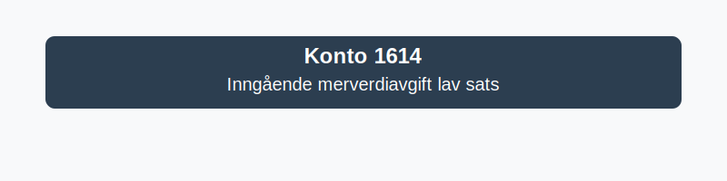

---
title: "1614-inngaaende-merverdiavgift-lav-sats"
meta_title: "1614-inngaaende-merverdiavgift-lav-sats"
meta_description: '**Konto 1614 - Inngående merverdiavgift lav sats** brukes for å bokføre *inngående merverdiavgift* på varer og tjenester som har den **reduserte MVA-satsen...'
slug: 1614-inngaaende-merverdiavgift-lav-sats
type: blog
layout: pages/single
---

**Konto 1614 - Inngående merverdiavgift lav sats** brukes for å bokføre *inngående merverdiavgift* på varer og tjenester som har den **reduserte MVA-satsen (12%)**. Denne kontoen er en del av [Norsk Standard Kontoplan](/blogs/regnskap/hva-er-kontoplan "Hva er Kontoplan?").

## Hva er inngående merverdiavgift lav sats?

*Inngående merverdiavgift lav sats* gjelder for *varer og tjenester* som har MVA med **12%**, som vanlige eksempler inkluderer:

* Persontransport (buss, tog, fly)
* Overnatting (hoteller, camping)
* Kinobilletter og andre kulturarrangementer

## Hvordan bruke konto 1614?

* Bokfør inngående MVA med lav sats på konto **1614**.
* Sørg for å spesifisere MVA-satsen (12%) i bilaget.
* Kontoen er en **balansekonto** (eiendel) som viser innbetalt MVA.

## Kontoplan-eksempler

| MVA-sats | Konto | Beskrivelse |
|----------|-------|-------------|
| **12%** | 1614  | Inngående merverdiavgift lav sats |

## Eksempel på bokføring

| Dato       | Konto Debet | Debet    | Konto Kredit | Kredit  | Beskrivelse                                   |
|------------|-------------|----------|--------------|---------|-----------------------------------------------|
| 13.02.2023 | 1460        | 5 000,–  | 1614         | 600,–   | Kjøp av overnatting inkl. 12% MVA             |

## Relaterte artikler

For mer informasjon om MVA og avgiftsplikt se:
* [Hva er avgiftsplikt (MVA)?](/blogs/regnskap/hva-er-avgiftsplikt-mva "Hva er Avgiftsplikt (MVA)?")
* [Hva er kontoplan?](/blogs/regnskap/hva-er-kontoplan "Hva er Kontoplan?")
* [Konto 2714 - Inngående merverdiavgift lav sats](/blogs/kontoplan/2714-inngaaende-merverdiavgift-lav-sats "Konto 2714 - Inngående merverdiavgift lav sats")
