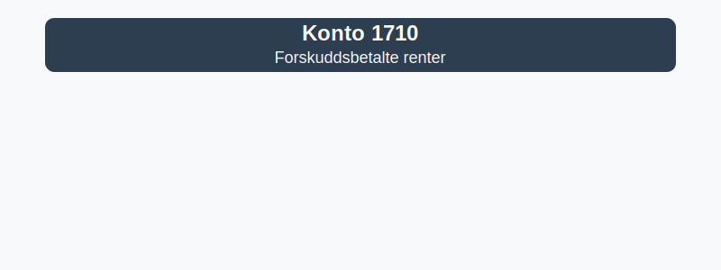

---
title: "Konto 1710 - Forskuddsbetalte renter"
seoTitle: "Konto 1710 | Forskuddsbetalte renter | Kontoplan"
description: "Konto 1710 brukes til å registrere forskuddsbetalte renteutgifter på lån og kreditter. Les om bruk, periodisering, bokføring og balansepresentasjon."
summary: "Konto 1710: forskuddsbetalte renter. Bruk, bokføring og periodisering."
---

**Konto 1710 - Forskuddsbetalte renter** er en konto i Norsk Standard Kontoplan som brukes til å registrere **forskuddsbetalte renteutgifter**.

## Hva er forskuddsbetalte renter?

*Forskuddsbetalte renter* er betaling av renter på lån eller kreditter som skjer på forhånd for en fremtidig periode. Ved å betale renter før perioden de gjelder for, utsettes kostnadsføringen til den aktuelle perioden, og beløpet plasseres midlertidig som et omløpsmiddel.

Vanlige situasjoner for bruk av konto 1710:

* **Terminutbetalinger av lån** hvor renten betales kvartalsvis eller årlig på forskudd
* **Rammekreditter** med avtale om forskuddsbetaling av renter
* **Spesialavtaler** som krever forskuddsbetaling av rentekostnader ved låneopptak

## Regnskapsføring

| Transaksjon                           | Debet                                    | Kredit                                     |
|---------------------------------------|------------------------------------------|--------------------------------------------|
| Betaling av forskuddsbetalte renter   | Konto 1710 - Forskuddsbetalte renter     | Konto 1920 - Bankinnskudd                  |
| Forskuddsbetaling på kreditt          | Konto 1710 - Forskuddsbetalte renter     | Konto 2400 - Leverandørgjeld               |
| Kostnadsføring av renteperiode        | Relevante rentekostnadskonto (f.eks. Konto 8240 - Rentekostnader) | Konto 1710 - Forskuddsbetalte renter |
| Periodisering ved årsavslutning       | Konto 1710 - Forskuddsbetalte renter     | Konto 4160 - Endring i forskuddsbetalinger |

## Vurdering og balansepresentasjon

Ved årsavslutning presenteres saldo på konto 1710 som **omløpsmidler**, vurdert til anskaffelseskost. Forhåndsbetalte renter som ikke gjelder perioder etter balansedagen, må periodiseres og vurderes for eventuelle ned- eller oppskrivninger.

## Intern lenking og relaterte kontoer

Andre kontoer i NS 4102 som ofte benyttes sammen med konto 1710:

* [Konto 1480 - Forskuddsbetaling til leverandører](/blogs/kontoplan/1480-forskuddsbetaling-til-leverandorer "Konto 1480 - Forskuddsbetaling til leverandører: Regnskapsføring av forskuddsbetalinger til leverandører")
* [Konto 1670 - Krav på offentlige tilskudd](/blogs/kontoplan/1670-krav-pa-offentlige-tilskudd "Konto 1670 - Krav på offentlige tilskudd: Behandling av tilskuddskrav")
* [Konto 1700 - Forskuddsbetalte leier](/blogs/kontoplan/1700-forskuddsbetalte-leier "Konto 1700 - Forskuddsbetalte leier: Regnskapsføring av forhåndsbetalte leiekostnader")
* [Konto 1750 - Påløpte leier](/blogs/kontoplan/1750-palopte-leier "Konto 1750 - Påløpte leier: Regnskapsføring av påløpte leiekostnader")
* [Konto 1760 - Påløpte renter](/blogs/kontoplan/1760-palopte-renter "Konto 1760 - Påløpte renter: Regnskapsføring av påløpte renteutgifter")
* [Konto 2950 - Påløpte renter](/blogs/kontoplan/2950-palopte-renter "Konto 2950 - Påløpte renter: Regnskapsføring av påløpte renteutgifter")
* [Hva er en Kontoplan?](/blogs/regnskap/hva-er-kontoplan "Hva er en Kontoplan? Komplett Guide til Kontoplaner i Norsk Regnskap")

**Korrekt bruk** av konto 1710 sikrer god periodisering av rentekostnader og oversikt over forskuddsbetalte renter.

