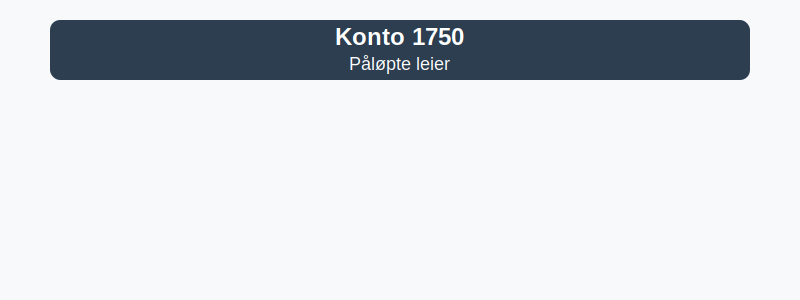

---
title: "Konto 1750 - Påløpte leier"
seoTitle: "Konto 1750 | Påløpte leier | Kontoplan"
description: "Konto 1750 brukes til å registrere påløpte leiekostnader som ennå ikke er betalt ved periodens slutt. Lær regler, bokføring, periodisering og balanseføring."
summary: "Konto 1750: påløpte leier. Bruk, bokføring og periodisering."
---

**Konto 1750 - Påløpte leier** er en konto i Norsk Standard Kontoplan som brukes til å registrere **påløpte leiekostnader** for leie av lokaler, utstyr og eiendeler.

## Hva er påløpte leier?

*Påløpte leier* er kostnader for leie av lokaler, maskiner, kjøretøy eller annet utstyr som er påløpt, men som ennå ikke er betalt ved periodens slutt. Konto 1750 fungerer som en **kortsiktig gjeldskonto** for disse påløpte kostnadene inntil faktura eller betaling skjer.

Vanlige situasjoner for bruk av konto 1750:

* **Leiekostnader for kontor- og næringslokaler** som er påløpt ved regnskapsavslutning
* **Maskin- og utstyrsleie** ved prosjekter som påløper over månedsskifte
* **Kjøretøyleie** for firmabiler der faktura mottas etter måneden
* **Lager- og logistikkfasiliteter** med periodisering av leiekostnader
* **Spesialutstyr** leid på sesongavtaler med forskjøvet betalingsdato

## Regnskapsføring

| Transaksjon                             | Debet                                    | Kredit                                     |
|-----------------------------------------|------------------------------------------|--------------------------------------------|
| Kostnadsføring av påløpt leieperiode    | Konto 6000 / relevant kostnadskonto      | Konto 1750 - Påløpte leier                 |
| Påløpt leie uten mottatt faktura        | Konto 1750 - Påløpte leier               | Konto 2400 - Leverandørgjeld               |
| Betaling av påløpt leie                 | Konto 2400 - Leverandørgjeld             | Konto 1920 - Bankinnskudd                  |
| Periodisering ved årsavslutning         | Konto 1750 - Påløpte leier               | Konto 4160 - Endring i påløpte kostnader   |

## Vurdering og balansepresentasjon

Ved årsavslutning presenteres saldo på konto 1750 som **kortsiktig gjeld**, vurdert til påløpt kostnad. Påløpte leiekostnader som gjelder perioder etter balansedagen, må periodiseres og vurderes for eventuelle ned- eller oppskrivninger.

## Intern lenking og relaterte kontoer

Andre kontoer i NS 4102 som ofte benyttes sammen med konto 1750:

* [Konto 1700 - Forskuddsbetalte leier](/blogs/kontoplan/1700-forskuddsbetalte-leier "Konto 1700 - Forskuddsbetalte leier: Regnskapsføring av forhåndsbetalte leiekostnader")
* [Konto 1710 - Forskuddsbetalte renter](/blogs/kontoplan/1710-forskuddsbetalte-renter "Konto 1710 - Forskuddsbetalte renter: Regnskapsføring av forskuddsbetalte renteutgifter")
* [Hva er en Kontoplan?](/blogs/regnskap/hva-er-kontoplan "Hva er en Kontoplan? Komplett Guide til Kontoplaner i Norsk Regnskap")
* [Hva er Periodisering i Regnskap?](/blogs/regnskap/hva-er-periodisering "Hva er Periodisering i Regnskap? Guide til periodisering av kostnader og inntekter")
* [Konto 2960 - Påløpt kostnad og forskuddsbetalt inntekt](/blogs/kontoplan/2960-palopte-kostnad-og-forskuddsbetalt-inntekt "Konto 2960 - Påløpt kostnad og forskuddsbetalt inntekt: Regnskapsføring av påløpt kostnad og forskuddsbetalt inntekt")

**Korrekt bruk** av konto 1750 sikrer god periodisering og oversikt over påløpte leiekostnader.

