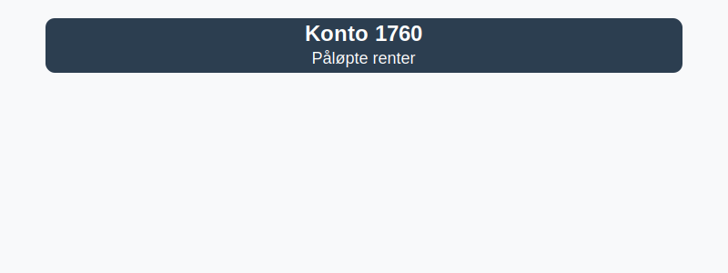

---
title: "1760-palopte-renter"
meta_title: "1760-palopte-renter"
meta_description: "**Konto 1760 - Påløpte renter** er en konto i Norsk Standard Kontoplan som brukes til å registrere **påløpte renteutgifter**."
slug: 1760-palopte-renter
type: blog
layout: pages/single
---

**Konto 1760 - Påløpte renter** er en konto i Norsk Standard Kontoplan som brukes til å registrere **påløpte renteutgifter**.

## Hva er påløpte renter?

*Påløpte renter* er rentekostnader som er påløpt i løpet av en periode, men som ennå ikke er betalt ved regnskapsavslutning. Konto 1760 fungerer som en **kortsiktig gjeldskonto** for disse påløpte kostnadene inntil faktura eller betaling skjer.

Typiske situasjoner for bruk av konto 1760:

* **Renteutgifter på lån og kreditter** som er påløpt ved periodens slutt
* **Overgangsperioder** i lån med avdrag og renteberegning over månedsskifte
* **Avtaler med rentebetaling i etterkant** hvor faktura mottas etter at renten er påløpt
* **Serier av rentebetalinger** som krever periodisering for korrekt regnskapsføring

## Regnskapsføring

| Transaksjon                           | Debet                                    | Kredit                                     |
|---------------------------------------|------------------------------------------|--------------------------------------------|
| Kostnadsføring av påløpt renteperiode | Relevante rentekostnadskonto (f.eks. Konto 8240 - Rentekostnader) | Konto 1760 - Påløpte renter |
| Påløpte renter uten mottatt faktura   | Konto 1760 - Påløpte renter              | Konto 2400 - Leverandørgjeld               |
| Betaling av påløpt rente              | Konto 2400 - Leverandørgjeld             | Konto 1920 - Bankinnskudd                  |
| Periodisering ved årsavslutning       | Konto 1760 - Påløpte renter              | Konto 4160 - Endring i påløpte kostnader   |

## Vurdering og balansepresentasjon

Ved årsavslutning presenteres saldo på konto 1760 som **kortsiktig gjeld**, vurdert til påløpt kostnad. Påløpte renter som gjelder perioder etter balansedagen må vurderes for eventuelle av- eller nedskrivninger.

## Intern lenking og relaterte kontoer

Andre kontoer i NS 4102 som ofte benyttes sammen med konto 1760:

* [Konto 1710 - Forskuddsbetalte renter](/blogs/kontoplan/1710-forskuddsbetalte-renter "Konto 1710 - Forskuddsbetalte renter: Regnskapsføring av forskuddsbetalte renteutgifter")
* [Konto 1750 - Påløpte leier](/blogs/kontoplan/1750-palopte-leier "Konto 1750 - Påløpte leier: Regnskapsføring av påløpte leiekostnader")
* [Konto 2950 - Påløpte renter](/blogs/kontoplan/2950-palopte-renter "Konto 2950 - Påløpte renter: Regnskapsføring av påløpte renteutgifter")
* [Konto 2960 - Påløpt kostnad og forskuddsbetalt inntekt](/blogs/kontoplan/2960-palopte-kostnad-og-forskuddsbetalt-inntekt "Konto 2960 - Påløpt kostnad og forskuddsbetalt inntekt: Regnskapsføring av påløpt kostnad og forskuddsbetalt inntekt")
* [Hva er en Kontoplan?](/blogs/regnskap/hva-er-kontoplan "Hva er en Kontoplan? Komplett Guide til Kontoplaner i Norsk Regnskap")
* [Hva er Periodisering i Regnskap?](/blogs/regnskap/hva-er-periodisering "Hva er Periodisering i Regnskap? Guide til periodisering av kostnader og inntekter")

* [Konto 7780 - Renter og gebyrer inkasso](/blogs/kontoplan/7780-renter-og-gebyrer-inkasso "Konto 7780 - Renter og gebyrer inkasso: Regnskapsføring av renter og gebyrer ved inkasso")
* [Konto 8130 - Rentekostnad foretak i samme konsern](/blogs/kontoplan/8130-rentekostnad-foretak-i-samme-konsern "Konto 8130 - Rentekostnad foretak i samme konsern")
* [Konto 8140 - Rentekostnad, ikke fradragsberettiget](/blogs/kontoplan/8140-rentekostnad-ikke-fradragsberettiget "Konto 8140 - Rentekostnad, ikke fradragsberettiget i Norsk Standard Kontoplan")
* [Konto 8150 - Annen rentekostnad](/blogs/kontoplan/8150-annen-rentekostnad "Konto 8150 - Annen rentekostnad: Guide til andre rentekostnader")
* [Konto 8920 - Avsatt utbytte/renter grunnfondsbevis](/blogs/kontoplan/8920-avsatt-utbytte-renter-grunnfondsbevis "Konto 8920 - Avsatt utbytte/renter grunnfondsbevis: Avsetning av utbytte og renter på grunnfondsbevis som kortsiktig gjeld")

**Korrekt bruk** av konto 1760 sikrer god periodisering og oversikt over påløpte renteutgifter.
