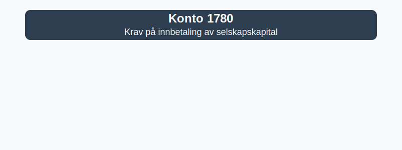

---
title: "1780-krav-pa-innbetaling-av-selskapskapital"
meta_title: "1780-krav-pa-innbetaling-av-selskapskapital"
meta_description: "**Konto 1780 - Krav på innbetaling av selskapskapital** er en konto i Norsk Standard Kontoplan som brukes til å registrere **krav på innbetaling av selskapsk..."
slug: 1780-krav-pa-innbetaling-av-selskapskapital
type: blog
layout: pages/single
---

**Konto 1780 - Krav på innbetaling av selskapskapital** er en konto i Norsk Standard Kontoplan som brukes til å registrere **krav på innbetaling av selskapskapital**.



## Hva er krav på innbetaling av selskapskapital?

*Krav på innbetaling av selskapskapital* oppstår når et selskap har et formelt krav mot sine aksjonærer om å innbetale aksjekapital som ikke er betalt ved stiftelsen eller emisjoner. Dette kravet representerer en utestående fordring selskapet har på aksjonærene.

### NÃ¥r benyttes konto 1780?

* Ved stiftelse av aksjeselskap når aksjekapitalen ikke er fullt innbetalt.
* Ved [kapitalforhøyelse](/blogs/regnskap/kapitalforhoyelse "Kapitalforhøyelse: Metoder og Regnskapsføring") når emisjonsinnbetalinger er utestående.
* Når aksjonærer skylder innskutt kapital etter avtaler om tilleggsinnskudd.
* For å sikre korrekt balanseføring av ikke-innbetalt kapital før betaling mottas.

## Regnskapsføring

| Transaksjon                                       | Debet                                               | Kredit                                            |
|---------------------------------------------------|-----------------------------------------------------|---------------------------------------------------|
| Registrering av krav på innbetaling av aksjekapital| Konto 1780 - Krav på innbetaling av selskapskapital | Konto 2000 - Aksjekapital                         |
| Innbetaling av aksjekapital av aksjonær           | Konto 1920 - Bankinnskudd                           | Konto 1780 - Krav på innbetaling av selskapskapital |

## Vurdering og balansepresentasjon

Saldo på konto 1780 presenteres som **kortsiktig fordring** under omløpsmidler, vurdert til pålydende, inntil kapitalen er innbetalt. Dette gir et riktig bilde av selskapets finansielle stilling.

## Eksempel

| Beskrivelse                 | Beløp (NOK) |
|-----------------------------|-------------|
| Krav på emisjonsinnbetaling | 500 000     |

>Bokføring ved stiftelse:

>```plaintext
>Debet: Konto 1780 - Krav på innbetaling av selskapskapital    500 000
>Kredit: Konto 2000 - Aksjekapital                              500 000
>```

>Bokføring ved mottak av betaling:

>```plaintext
>Debet: Konto 1920 - Bankinnskudd                                500 000
>Kredit: Konto 1780 - Krav på innbetaling av selskapskapital     500 000
>```

## Intern lenking og relaterte kontoer

Andre kontoer i NS 4102 som ofte benyttes sammen med konto 1780:

* [Konto 1700 - Forskuddsbetalte leier](/blogs/kontoplan/1700-forskuddsbetalte-leier "Konto 1700 - Forskuddsbetalte leier: Regnskapsføring av forhåndsbetalte leiekostnader")
* [Konto 1710 - Forskuddsbetalte renter](/blogs/kontoplan/1710-forskuddsbetalte-renter "Konto 1710 - Forskuddsbetalte renter: Regnskapsføring av forskuddsbetalte renteutgifter")
* [Konto 1750 - Påløpte leier](/blogs/kontoplan/1750-palopte-leier "Konto 1750 - Påløpte leier: Regnskapsføring av påløpte leiekostnader")
* [Konto 1760 - Påløpte renter](/blogs/kontoplan/1760-palopte-renter "Konto 1760 - Påløpte renter: Regnskapsføring av påløpte renteutgifter")
* [Konto 1790 - Interimskonto](/blogs/kontoplan/1790-interimskonto "Konto 1790 - Interimskonto: Regnskapsføring av interimskonto")
* [Konto 2280 - Stille interessentinnskudd og ansvarlig lånekapital](/blogs/kontoplan/2280-stille-interessentinnskudd-og-ansvarlig-lanekapital "Konto 2280 - Stille interessentinnskudd og ansvarlig lånekapital i Norsk Standard Kontoplan")
* [Hva er en Kontoplan?](/blogs/regnskap/hva-er-kontoplan "Hva er en Kontoplan? Komplett Guide til Kontoplaner i Norsk Regnskap")
* [Hva er Periodisering i Regnskap?](/blogs/regnskap/hva-er-periodisering "Hva er Periodisering i Regnskap? Guide til periodisering av kostnader og inntekter")
* [Hva er Egenkapital?](/blogs/regnskap/hva-er-egenkapital "Hva er Egenkapital? Komplett Guide til Egenkapital i Regnskap")

**Korrekt bruk** av konto 1780 gir oversikt over ikke-innbetalt kapital og sikrer at selskapets balanseregnskap reflekterer faktiske innbetalinger.
