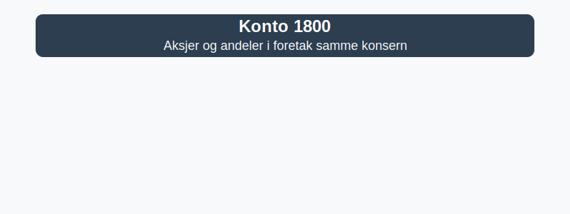

---
title: "Konto 1800 - Aksjer og andeler i foretak samme konsern"
meta_title: "1800-aksjer-og-andeler-i-foretak-samme-konsern"
meta_description: '**Konto 1800 - Aksjer og andeler i foretak samme konsern** er en konto i Norsk Standard Kontoplan som brukes til å registrere **aksjer og andeler** i andre for...'
slug: 1800-aksjer-og-andeler-i-foretak-samme-konsern
type: blog
layout: pages/single
---

**Konto 1800 - Aksjer og andeler i foretak samme konsern** er en konto i Norsk Standard Kontoplan som brukes til å registrere **aksjer og andeler** i andre foretak innen samme konsernstruktur.



## Hva er aksjer og andeler i foretak samme konsern?

*Konto 1800 - Aksjer og andeler i foretak samme konsern* omfatter **eierandeler** og **aksjeposter** i konserninterne selskaper, presentert som anleggsmidler i balansen. Denne kontoen er viktig for å synliggjøre konserninterne investeringer i egenregi.

## Regnskapsføring ved anskaffelse

Bokføring av konserninterne aksjekjøp følger samme prinsipper som for eksterne aksjeinvesteringer, med anskaffelseskost som inkluderer:

* **Kjøpesum** for aksjeposten
* **Transaksjonskostnader**, for eksempel juridiske og administrasjonskostnader
* **Valutagevinst/-tap** ved kjøp i utenlandsk valuta

```plaintext
Debet: Konto 1800 - Aksjer og andeler i foretak samme konsern   XXX kroner
Kredit: Konto 1920 - Bankinnskudd                                XXX kroner
```

## Vurdering og nedskrivning

>Aksjer og andeler skal vurderes til virkelig verdi hvis det er indikasjoner på varig verdifall. Eventuell nedskrivning bokføres på **konto 2980 - Nedskrivning aksjer og andeler**.

| Indikasjon                | Eksempel                                    |
|---------------------------|---------------------------------------------|
| Redusert konsernresultat  | Lavere avkastning i underliggende selskap  |
| Langvarig lav markedsverdi| Kursfall over lengre periode                |
| Endring i konsernstrategi | Planlagt salg eller restrukturering         |

## Konsernregnskap

>Ved utarbeidelse av [konsernregnskap](/blogs/regnskap/hva-er-konsern "Hva er Konsern?") elimineres investeringer i konto 1800 mot egenkapitalposten i datterselskapet.

## Relaterte artikler

* [Konto 1310 - Investeringer annet foretak i samme konsern](/blogs/kontoplan/1310-investeringer-annet-foretak-i-samme-konsern "Konto 1310 - Investeringer annet foretak i samme konsern")
* [Konto 1320 - Lån til foretak samme konsern](/blogs/kontoplan/1320-lan-til-foretak-samme-konsern "Konto 1320 - Lån til foretak samme konsern")
* [Konto 1330 - Investeringer i tilknyttede selskap](/blogs/kontoplan/1330-investeringer-i-tilknyttede-selskap "Konto 1330 - Investeringer i tilknyttede selskap")
* [Hva er Konsern?](/blogs/regnskap/hva-er-konsern "Hva er Konsern?")
* [Hva er Anleggsmidler?](/blogs/regnskap/hva-er-anleggsmidler "Hva er Anleggsmidler?")


