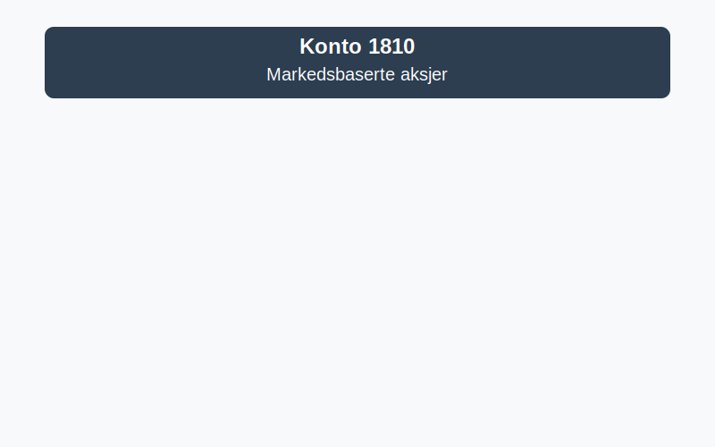
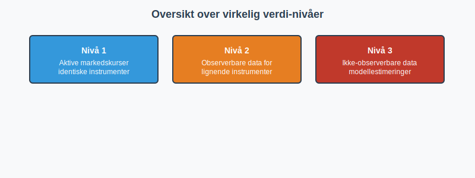

---
title: "1810-markedsbaserte-aksjer"
meta_title: "1810-markedsbaserte-aksjer"
meta_description: '**Konto 1810 - Markedsbaserte aksjer** er en konto i Norsk Standard Kontoplan som brukes for å registrere **markedsbaserte aksjer** som omsettes på regulerte ...'
slug: 1810-markedsbaserte-aksjer
type: blog
layout: pages/single
---

**Konto 1810 - Markedsbaserte aksjer** er en konto i Norsk Standard Kontoplan som brukes for å registrere **markedsbaserte aksjer** som omsettes på regulerte markeder, og som måles til virkelig verdi i [balansen](/blogs/regnskap/hva-er-balanseregnskap "Hva er Balanseregnskap?").



## Hva er markedsbaserte aksjer?

**Markedsbaserte aksjer** er egenkapitalinstrumenter utstedt av andre selskaper, som omsettes på offentlige eller regulerte markeder, som aksjebørser eller handelsplattformer. Disse aksjene verdsettes vanligvis til **virkelig verdi** basert på observerbare markedsdata.

### Typiske eksempler

* Aksjer notert på Oslo Børs eller andre internasjonale børser
* Aksjefond og børsnoterte fond (ETF) som handles daglig

## Klassifisering og måling

Markedsbaserte aksjer måles til virkelig verdi i henhold til regnskapsstandarder som IFRS 9 eller IAS 39. Kategorien for måling bestemmes av virksomhetens forretningsmodell og kontoplanens krav.

| MÃ¥lekategori                                     | Beskrivelse                                                    |
|--------------------------------------------------|----------------------------------------------------------------|
| Virkelig verdi over resultatet (FVPL)            | Gevinster og tap innregnes i resultatet løpende               |
| Virkelig verdi over utvidet resultat (FVOCI)     | Gevinster og tap innregnes i øvrig totalresultat              |



Virkelig verdi-nivåene definerer hvilke observerbare data som brukes:

| Nivå | Beskrivelse                                                       |
|------|-------------------------------------------------------------------|
| 1    | Kurser fra aktive markeder for identiske instrumenter            |
| 2    | Observerbare data for lignende instrumenter eller ikkeaktive markeder |
| 3    | Ikke-observerbare data basert på modellestimeringer                |

## Regnskapsføring av markedsbaserte aksjer

Ved anskaffelse og løpende vurdering brukes følgende bokføringseksempler:

```plaintext
Debet: Konto 1810 - Markedsbaserte aksjer (virkelig verdi oppdatering)
Kredit: Konto 8300 - Urealiserte gevinster/fall i virkelig verdi
```

> **Merk:** Gevinster og tap kan også innregnes i øvrig totalresultat hvis FVOCI er valgt.

## Relaterte artikler

* [Konto 1350 - Investeringer i aksjer og eiendeler](/blogs/kontoplan/1350-investeringer-i-aksjer-og-eiendeler "Konto 1350 - Investeringer i aksjer og eiendeler")
* [Konto 1360 - Obligasjoner](/blogs/kontoplan/1360-obligasjoner "Konto 1360 - Obligasjoner")
* [Konto 1820 - Andre aksjer](/blogs/kontoplan/1820-andre-aksjer "Konto 1820 - Andre aksjer")
* [Konto 1830 - Markedsbaserte obligasjoner](/blogs/kontoplan/1830-markedsbaserte-obligasjoner "Konto 1830 - Markedsbaserte obligasjoner")
* [Hva er Virkelig Verdi?](/blogs/regnskap/hva-er-virkelig-verdi "Hva er Virkelig Verdi? Verdsettelse og Regnskapsføring")
