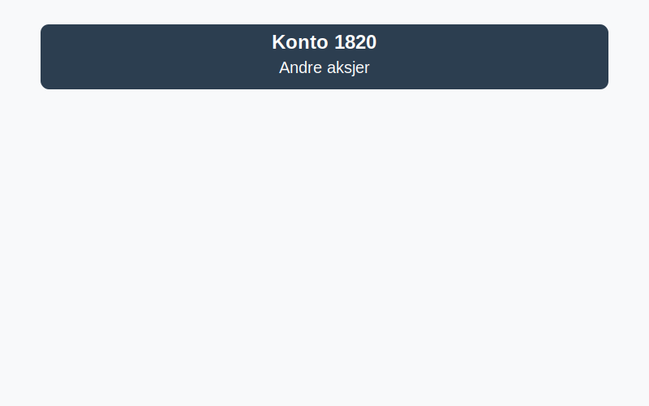

---
title: "1820-andre-aksjer"
meta_title: "1820-andre-aksjer"
meta_description: '**Konto 1820 - Andre aksjer** er en konto i Norsk Standard Kontoplan som brukes for å registrere **andre aksjer** og eierandeler som ikke er notert på reguler...'
slug: 1820-andre-aksjer
type: blog
layout: pages/single
---

**Konto 1820 - Andre aksjer** er en konto i Norsk Standard Kontoplan som brukes for å registrere **andre aksjer** og eierandeler som ikke er notert på regulerte markeder, og som normalt måles til anskaffelseskost i balansen.



## Hva er andre aksjer?

**Andre aksjer** omfatter egenkapitalinstrumenter i selskaper uten aktiv omsetning på børs eller andre regulerte markeder. Typiske eksempler inkluderer:

* Unoterte aksjer i startups og private selskaper
* Ansatteaksjer og insentivprogrammer
* Eierandeler i datterselskapslignende investeringer uten markedspris

## Klassifisering og vurdering

Andre aksjer vurderes vanligvis til **anskaffelseskost** med mindre det er indikasjoner på varig verdifall. Eventuelle nedskrivninger føres ved bruk av **laveste verdis prinsipp** dersom virkelig verdi er lavere enn kost.

| Vurderingstype                | Beskrivelse                                                                      |
|-------------------------------|----------------------------------------------------------------------------------|
| Anskaffelseskost              | Opprinnelig kjøpspris inkludert direkte transaksjonskostnader                    |
| Laveste verdis prinsipp (LVP) | Nedskrivning til virkelig verdi når verdifall er forventet å være varig          |

## Regnskapsføring av andre aksjer

Bokføring ved anskaffelse:

```plaintext
Debet: Konto 1820 - Andre aksjer                            XXX kroner
Kredit: Konto 1920 - Bankinnskudd                            XXX kroner
```

Ved nedskrivning:

```plaintext
Debet: Konto 2980 - Nedskrivning aksjer og andeler           XXX kroner
Kredit: Konto 1820 - Andre aksjer                            XXX kroner
```

> **Merk:** Reparasjon av nedskrivning skjer ikke reversering over resultatet for unoterte aksjer uten aktivt marked.

## Relaterte artikler

* [Konto 1800 - Aksjer og andeler i foretak samme konsern](/blogs/kontoplan/1800-aksjer-og-andeler-i-foretak-samme-konsern "Konto 1800 - Aksjer og andeler i foretak samme konsern")
* [Konto 1810 - Markedsbaserte aksjer](/blogs/kontoplan/1810-markedsbaserte-aksjer "Konto 1810 - Markedsbaserte aksjer")
* [Konto 1830 - Markedsbaserte obligasjoner](/blogs/kontoplan/1830-markedsbaserte-obligasjoner "Konto 1830 - Markedsbaserte obligasjoner")
* [Konto 1840 - Andre obligasjoner](/blogs/kontoplan/1840-andre-obligasjoner "Konto 1840 - Andre obligasjoner: Guide til andre obligasjoner i norsk kontoplan")
* [Konto 1350 - Investeringer i aksjer og eiendeler](/blogs/kontoplan/1350-investeringer-i-aksjer-og-eiendeler "Konto 1350 - Investeringer i aksjer og eiendeler")
