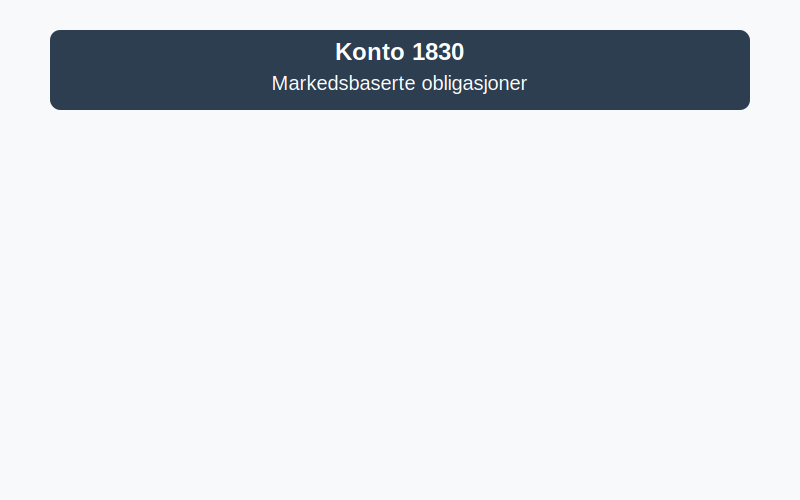

---
title: "Konto 1830 - Markedsbaserte obligasjoner"
meta_title: "1830-markedsbaserte-obligasjoner"
meta_description: '**Konto 1830 - Markedsbaserte obligasjoner** er en konto i Norsk Standard Kontoplan som brukes til Ã¥ registrere **markedsbaserte obligasjoner** som omsettes pÃ...'
slug: 1830-markedsbaserte-obligasjoner
type: blog
layout: pages/single
---

**Konto 1830 - Markedsbaserte obligasjoner** er en konto i Norsk Standard Kontoplan som brukes til å registrere **markedsbaserte obligasjoner** som omsettes på regulerte markeder, og som måles til **virkelig verdi** i [balansen](/blogs/regnskap/hva-er-balanseregnskap "Hva er Balanseregnskap?").



## Hva er markedsbaserte obligasjoner?

**Markedsbaserte obligasjoner** er rentebærende obligasjoner utstedt av stater, kommuner eller selskaper, som omsettes på regulerte markeder. Disse obligasjonene verdsettes til virkelig verdi basert på observerbare markedsdata.

## Typiske eksempler

* **Statsobligasjoner:** Utstedt av nasjonale myndigheter med lav kredittrisiko.
* **Kommunalobligasjoner:** Utstedt av kommuner eller fylkeskommuner.
* **Selskapsobligasjoner:** Utstedt av private selskaper med varierende kredittrating.
* **Inflasjonsobligasjoner:** Obligasjoner med rentejustering knyttet til inflasjonsindekser.
* **Konvertible obligasjoner:** Kan konverteres til aksjer på fastsatte vilkår.
* **Grønne obligasjoner:** Øremerket finansiering av miljøvennlige prosjekter.

## Klassifisering og måling

Markedsbaserte obligasjoner måles til virkelig verdi i henhold til gjeldende regnskapsstandarder (f.eks. IFRS 9). Valg av målekategori avhenger av virksomhetens forretningsmodell og kontoplanens krav.

| MÃ¥lekategori                                     | Beskrivelse                                                    |
|--------------------------------------------------|----------------------------------------------------------------|
| Virkelig verdi over resultatet (FVPL)            | Gevinster og tap innregnes i resultatet løpende                |
| Virkelig verdi over utvidet resultat (FVOCI)     | Gevinster og tap innregnes i øvrig totalresultat               |

| Nivå | Beskrivelse                                                       |
|------|-------------------------------------------------------------------|
| 1    | Kurser fra aktive markeder for identiske instrumenter             |
| 2    | Observerbare data for lignende instrumenter eller ikkeaktive markeder |
| 3    | Ikke-observerbare data basert på modellestimeringer               |

## Regnskapsføring av markedsbaserte obligasjoner

```plaintext
Debet: Konto 1830 - Markedsbaserte obligasjoner (virkelig verdi oppdatering)
Kredit: Konto 8300 - Urealiserte gevinster/fall i virkelig verdi
```

> **Merk:** Gevinster og tap kan også innregnes i øvrig totalresultat dersom FVOCI er valgt.

## Relaterte artikler

* [Konto 1800 - Aksjer og andeler i foretak samme konsern](/blogs/kontoplan/1800-aksjer-og-andeler-i-foretak-samme-konsern "Konto 1800 - Aksjer og andeler i foretak samme konsern")
* [Konto 1810 - Markedsbaserte aksjer](/blogs/kontoplan/1810-markedsbaserte-aksjer "Konto 1810 - Markedsbaserte aksjer")
* [Konto 1820 - Andre aksjer](/blogs/kontoplan/1820-andre-aksjer "Konto 1820 - Andre aksjer")
* [Konto 1840 - Andre obligasjoner](/blogs/kontoplan/1840-andre-obligasjoner "Konto 1840 - Andre obligasjoner: Guide til andre obligasjoner i norsk kontoplan")
* [Konto 1850 - Markedsbaserte obligasjoner](/blogs/kontoplan/1850-markedsbaserte-obligasjoner "Konto 1850 - Markedsbaserte obligasjoner: Guide til markedsbaserte obligasjoner i norsk kontoplan")
* [Konto 1360 - Obligasjoner](/blogs/kontoplan/1360-obligasjoner "Konto 1360 - Obligasjoner")
* [Hva er Virkelig Verdi?](/blogs/regnskap/hva-er-virkelig-verdi "Hva er Virkelig Verdi? Verdsettelse og Regnskapsføring")

