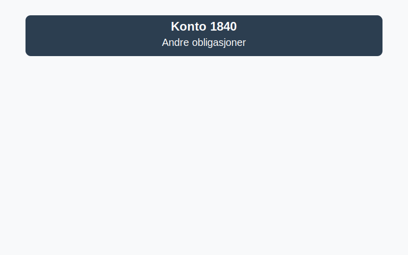

---
title: "1840-andre-obligasjoner"
meta_title: "1840-andre-obligasjoner"
meta_description: '**Konto 1840 - Andre obligasjoner** er en konto i Norsk Standard Kontoplan som brukes til å registrere **andre obligasjoner** som ikke dekkes av markedsbaserte...'
slug: 1840-andre-obligasjoner
type: blog
layout: pages/single
---

**Konto 1840 - Andre obligasjoner** er en konto i Norsk Standard Kontoplan som brukes til å registrere **andre obligasjoner** som ikke dekkes av markedsbaserte eller langsiktige obligasjoner. Disse instrumentene måles som regel til **anskaffelseskost** i [balansen](/blogs/regnskap/hva-er-balanseregnskap "Hva er Balanseregnskap?").



## Hva er andre obligasjoner?

**Andre obligasjoner** omfatter rentebærende gjeldsinstrumenter uten aktiv omsetning på regulerte markeder. Kontoen favner ulike former for obligasjonslån som holdes som omløps- eller anleggsmidler, og som ikke faller inn under konto 1360 - Obligasjoner eller konto 1830 - Markedsbaserte obligasjoner.

## Typiske eksempler på andre obligasjoner

* **Unoterte obligasjonslån** utstedt av selskaper uten børsnotering
* **Pantesikrede obligasjoner** med sikkerhet i eiendeler eller verdipapirer
* **Strukturerte obligasjoner** med innebygde derivater eller rentebytteavtaler
* **Særlige gjeldsinstrumenter** som ikke kvalifiserer for virkelig verdi-måling

## Klassifisering og vurdering i kontoplanen

| Kontotype                         | Kontonummer | Beskrivelse                                         |
|-----------------------------------|-------------|-----------------------------------------------------|
| Obligasjoner (langsiktige)        | 1360        | Langsiktige obligasjonsinvesteringer og rentebærende verdipapirer |
| Markedsbaserte obligasjoner       | 1830        | Obligasjoner målt til virkelig verdi på regulerte markeder      |
| **Andre obligasjoner**            | **1840**    | Gjeldsinstrumenter uten aktivt marked og ikke-langsiktige lån  |

| Vurderingsmetode                        | Beskrivelse                                               |
|-----------------------------------------|-----------------------------------------------------------|
| Anskaffelseskost (inkl. påløpte renter) | Obligasjonskjøp inkl. direkte transaksjonskostnader      |
| Laveste verdis prinsipp (LVP)           | Nedskrivning når virkelig verdi er lavere enn kostpris   |

## Regnskapsføring av andre obligasjoner

Bokføring ved anskaffelse:

```plaintext
Debet: Konto 1840 - Andre obligasjoner              XXX kroner
Kredit: Konto 1920 - Bankinnskudd                  XXX kroner
```

Ved nedskrivning etter LVP:

```plaintext
Debet: Konto 2980 - Nedskrivning obligasjoner       XXX kroner
Kredit: Konto 1840 - Andre obligasjoner              XXX kroner
```

> **Merk:** Reversering av nedskrivning skjer kun ved indikasjon på gjenopprettet verdi.

## Bokføringseksempel

En bedrift kjøper utestående obligasjonslån for 500 000 kr:

```plaintext
Debet: Konto 1840 - Andre obligasjoner              500 000 kr
Kredit: Konto 1920 - Bankinnskudd                  500 000 kr
```

## Relaterte artikler

* [Konto 1360 - Obligasjoner](/blogs/kontoplan/1360-obligasjoner "Konto 1360 - Obligasjoner: Guide til registrering av obligasjoner i norsk kontoplan")
* [Konto 1830 - Markedsbaserte obligasjoner](/blogs/kontoplan/1830-markedsbaserte-obligasjoner "Konto 1830 - Markedsbaserte obligasjoner: Guide til markedsbaserte obligasjoner i norsk kontoplan")
* [Konto 1850 - Markedsbaserte obligasjoner](/blogs/kontoplan/1850-markedsbaserte-obligasjoner "Konto 1850 - Markedsbaserte obligasjoner: Guide til markedsbaserte obligasjoner i norsk kontoplan")
* [Konto 1860 - Andre sertifikater](/blogs/kontoplan/1860-andre-sertifikater "Konto 1860 - Andre sertifikater: Guide til sertifikater i norsk kontoplan")
* [Hva er virkelig verdi?](/blogs/regnskap/hva-er-virkelig-verdi "Hva er Virkelig Verdi? Verdsettelse og Regnskapsføring")
* [Hva er Kontoplan?](/blogs/regnskap/hva-er-kontoplan "Hva er Kontoplan? Komplett Guide til Kontoplaner i Norsk Regnskap")
