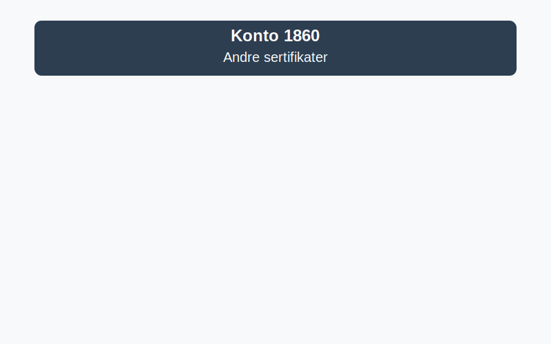

---
title: "1860-andre-sertifikater"
meta_title: "1860-andre-sertifikater"
meta_description: "**Konto 1860 - Andre sertifikater** er en konto i Norsk Standard Kontoplan som brukes til å registrere **sertifikater og kortsiktige rentebærende verdipapirer..."
slug: 1860-andre-sertifikater
type: blog
layout: pages/single
---

**Konto 1860 - Andre sertifikater** er en konto i Norsk Standard Kontoplan som brukes til å registrere **sertifikater og kortsiktige rentebærende verdipapirer** som ikke dekkes av aksjer eller obligasjoner.



## Hva er andre sertifikater?

**Andre sertifikater** omfatter kortsiktige gjeldsinstrumenter utstedt av banker, finansinstitusjoner eller stat, som omsettes i pengemarkeder. Denne kontoen dekker blant annet sertifikater med fast rente og kort løpetid.

## Typiske eksempler på sertifikater

* **Banksertifikater (Certificate of Deposit)** utstedt av banker med kort løpetid.
* **Statskasseveksler** utstedt av statskassen for kortsiktige statsgjeldsforpliktelser.
* **Pantesikrede sertifikater** med sikkerhet i eiendeler eller pant.
* **Andre rentebærende verdipapirer** som prises til anskaffelseskost eller virkelig verdi.

## Klassifisering og vurdering i kontoplanen

| Kontotype                           | Kontonummer | Beskrivelse                                                    |
|-------------------------------------|-------------|----------------------------------------------------------------|
| Markedsbaserte obligasjoner         | 1850        | Obligasjoner målt til virkelig verdi på regulerte markeder     |
| **Andre sertifikater**              | **1860**    | Sertifikater og kortsiktige rentebærende verdipapirer          |
| Andre obligasjoner                  | 1840        | Gjeldsinstrumenter uten aktivt marked og ikke-langsiktige lån  |
| Markedsbaserte obligasjoner         | 1830        | Obligasjoner målt til virkelig verdi på regulerte markeder     |
| Andre aksjer                        | 1820        | Aksjer uten aktivt marked                                      |

| Vurderingsmetode                            | Beskrivelse                                           |
|---------------------------------------------|-------------------------------------------------------|
| Anskaffelseskost (inkl. påløpte renter)     | Sertifikatkjøp inkl. direkte transaksjonskostnader    |
| Virkelig verdi (om aktivt marked finnes)    | MÃ¥ling til markedsverdi ved rapporteringstidspunktet |
| Laveste verdis prinsipp (LVP)               | Nedskrivning når virkelig verdi er lavere enn kostpris|

## Regnskapsføring av sertifikater

Bokføring ved anskaffelse:

```plaintext
Debet: Konto 1860 - Andre sertifikater            XXX kroner
Kredit: Konto 1920 - Bankinnskudd                 XXX kroner
```

Ved omvurdering til virkelig verdi:

```plaintext
Debet/Kredit: Konto 1860 - Andre sertifikater      YYY kroner
Debet/Kredit: Konto 8170 - Urealiserte gevinster/tap verdipapirer   YYY kroner
```

> **Merk:** Urealiserte gevinster og tap regnskapsføres på egen konto for verdipapirer. Se [Hva er virkelig verdi?](/blogs/regnskap/hva-er-virkelig-verdi "Hva er Virkelig Verdi? Verdsettelse og Regnskapsføring") for mer informasjon.

## Bokføringseksempel

En bedrift kjøper banksertifikater for 200 000 kr:

```plaintext
Debet: Konto 1860 - Andre sertifikater            200 000 kr
Kredit: Konto 1920 - Bankinnskudd                 200 000 kr
```

## Relaterte artikler

* [Konto 1840 - Andre obligasjoner](/blogs/kontoplan/1840-andre-obligasjoner "Konto 1840 - Andre obligasjoner: Guide til andre obligasjoner i norsk kontoplan")
* [Konto 1850 - Markedsbaserte obligasjoner](/blogs/kontoplan/1850-markedsbaserte-obligasjoner "Konto 1850 - Markedsbaserte obligasjoner: Guide til markedsbaserte obligasjoner i norsk kontoplan")
* [Konto 1830 - Markedsbaserte obligasjoner](/blogs/kontoplan/1830-markedsbaserte-obligasjoner "Konto 1830 - Markedsbaserte obligasjoner: Guide til markedsbaserte obligasjoner i norsk kontoplan")
* [Konto 1870 - Andre markedsbaserte finansielle instrumenter](/blogs/kontoplan/1870-andre-markedsbaserte-finansielle-instrumenter "Konto 1870 - Andre markedsbaserte finansielle instrumenter: Guide til finansielle instrumenter i norsk kontoplan")
* [Konto 1880 - Andre finansielle instrumenter](/blogs/kontoplan/1880-andre-finansielle-instrumenter "Konto 1880 - Andre finansielle instrumenter: Guide til finansielle instrumenter i norsk kontoplan")
* [Hva er virkelig verdi?](/blogs/regnskap/hva-er-virkelig-verdi "Hva er Virkelig Verdi? Verdsettelse og Regnskapsføring")
* [Hva er Kontoplan?](/blogs/regnskap/hva-er-kontoplan "Hva er Kontoplan? Komplett Guide til Kontoplaner i Norsk Regnskap")
* [Konto 2320 - Sertifikatlån](/blogs/kontoplan/2320-sertifikatlan "Konto 2320 - Sertifikatlån i Norsk Standard Kontoplan")
