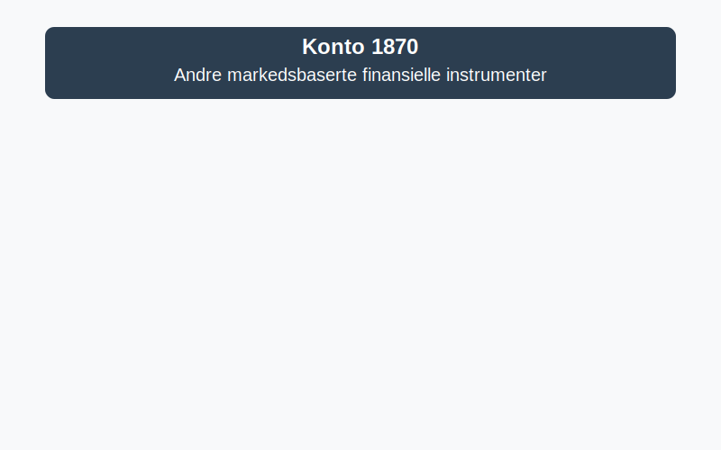

---
title: "Konto 1870 - Andre markedsbaserte finansielle instrumenter"
meta_title: "1870-andre-markedsbaserte-finansielle-instrumenter"
meta_description: '**Konto 1870 - Andre markedsbaserte finansielle instrumenter** er en konto i Norsk Standard Kontoplan som brukes til å registrere **markedsbaserte finansielle ...'
slug: 1870-andre-markedsbaserte-finansielle-instrumenter
type: blog
layout: pages/single
---

**Konto 1870 - Andre markedsbaserte finansielle instrumenter** er en konto i Norsk Standard Kontoplan som brukes til å registrere **markedsbaserte finansielle instrumenter** som ikke dekkes av aksjer eller obligasjoner.



## Hva er markedsbaserte finansielle instrumenter?

**Markedsbaserte finansielle instrumenter** omfatter kortsiktige verdipapirer som omsettes på regulerte markeder, inkludert sertifikater, obligasjoner og andre gjeldsinstrumenter med aktivt marked. Kontoen dekker instrumenter som ikke plasseres på konto 1820, 1830, 1840, 1850 eller 1860, men faller inn under fellesgruppe for kortsiktige markedsverdipapirer.

## Typiske eksempler

* **Kommersielle sertifikater** utstedt av bedrifter eller finansinstitusjoner med kort løpetid.
* **Statspapirer** som kasseveksler eller statsgjeldssertifikater.
* **Pengesertifikater** og andre rentebærende instrumenter med aktiv omsetning.
* **Andre instrumenter** som prissettes til markedsverdi ved rapporteringstidspunktet.

## Klassifisering og vurdering i kontoplanen

| Kontotype                                  | Kontonummer | Beskrivelse                                                      |
|--------------------------------------------|-------------|------------------------------------------------------------------|
| Andre aksjer                               | 1820        | Aksjer uten aktivt marked                                        |
| Markedsbaserte obligasjoner                | 1830        | Obligasjoner målt til virkelig verdi på regulerte markeder       |
| Andre obligasjoner                         | 1840        | Gjeldsinstrumenter uten aktivt marked og ikke-langsiktige lån    |
| Markedsbaserte obligasjoner                | 1850        | Obligasjoner og gjeldsinstrumenter målt til virkelig verdi       |
| Andre sertifikater                         | 1860        | Sertifikater og kortsiktige rentebærende verdipapirer            |
| **Markedsbaserte finansielle instrumenter**| **1870**    | Kortsiktige gjeldsinstrumenter omsettes på regulerte markeder    |

| Vurderingsmetode                            | Beskrivelse                                                 |
|---------------------------------------------|-------------------------------------------------------------|
| Anskaffelseskost (inkl. påløpte renter)     | Kjøpspris inkl. direkte transaksjonskostnader              |
| Virkelig verdi (om aktivt marked finnes)    | Måling til markedsverdi ved rapporteringstidspunktet        |
| Laveste verdis prinsipp (LVP)               | Nedskriving hvis virkelig verdi er lavere enn kostpris       |

## Regnskapsføring av markedsbaserte finansielle instrumenter

Bokføring ved anskaffelse:

```plaintext
Debet: Konto 1870 - Andre markedsbaserte finansielle instrumenter    XXX kroner
Kredit: Konto 1920 - Bankinnskudd                                     XXX kroner
```

Ved omvurdering til virkelig verdi:

```plaintext
Debet/Kredit: Konto 1870 - Andre markedsbaserte finansielle instrumenter    YYY kroner
Debet/Kredit: Konto 8170 - Urealiserte gevinster/tap verdipapirer           YYY kroner
```

> **Merk:** Urealiserte gevinster og tap regnskapsføres på egen konto for verdipapirer. Se [Hva er virkelig verdi?](/blogs/regnskap/hva-er-virkelig-verdi "Hva er Virkelig Verdi? Verdsettelse og Regnskapsføring") for mer informasjon.

## Bokføringseksempel

En bedrift kjøper markedsbaserte finansielle instrumenter for 300–¯000 kr:

```plaintext
Debet: Konto 1870 - Andre markedsbaserte finansielle instrumenter    300–¯000 kr
Kredit: Konto 1920 - Bankinnskudd                                     300–¯000 kr
```

## Relaterte artikler

* [Konto 1850 - Markedsbaserte obligasjoner](/blogs/kontoplan/1850-markedsbaserte-obligasjoner "Konto 1850 - Markedsbaserte obligasjoner: Guide til markedsbaserte obligasjoner i norsk kontoplan")
* [Konto 1860 - Andre sertifikater](/blogs/kontoplan/1860-andre-sertifikater "Konto 1860 - Andre sertifikater: Guide til sertifikater i norsk kontoplan")
* [Konto 1840 - Andre obligasjoner](/blogs/kontoplan/1840-andre-obligasjoner "Konto 1840 - Andre obligasjoner: Guide til andre obligasjoner i norsk kontoplan")
* [Konto 1830 - Markedsbaserte obligasjoner](/blogs/kontoplan/1830-markedsbaserte-obligasjoner "Konto 1830 - Markedsbaserte obligasjoner: Guide til markedsbaserte obligasjoner i norsk kontoplan")
* [Konto 1880 - Andre finansielle instrumenter](/blogs/kontoplan/1880-andre-finansielle-instrumenter "Konto 1880 - Andre finansielle instrumenter: Guide til finansielle instrumenter i norsk kontoplan")
* [Hva er virkelig verdi?](/blogs/regnskap/hva-er-virkelig-verdi "Hva er Virkelig Verdi? Verdsettelse og Regnskapsføring")
* [Hva er Kontoplan?](/blogs/regnskap/hva-er-kontoplan "Hva er Kontoplan? Komplett Guide til Kontoplaner i Norsk Regnskap")


