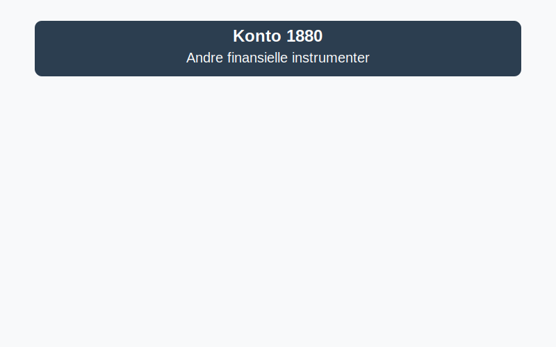

---
title: "Konto 1880 - Andre finansielle instrumenter"
seoTitle: "Konto 1880 | Andre finansielle instrumenter | Kontoplan"
description: "Konto 1880 brukes til å registrere andre kortsiktige finansielle instrumenter og derivater. Se typiske eksempler, vurdering og bokføring."
summary: "Konto 1880 gjelder andre kortsiktige finansielle instrumenter. Om typer, virkelig verdi og bokføring."
---

**Konto 1880 - Andre finansielle instrumenter** er en konto i Norsk Standard Kontoplan som brukes til å registrere **andre kortsiktige finansielle instrumenter** som ikke dekkes av spesifikke markedsbaserte kontoer som aksjer, obligasjoner eller sertifikater.



## Hva er andre finansielle instrumenter?

**Andre finansielle instrumenter** omfatter kortsiktige derivater og finansielle kontrakter som handles utenfor regulerte markeder eller som ikke dekkes av egne konti for aksjer, obligasjoner eller sertifikater. Kontoen fanger opp instrumenter som benyttes til sikring eller spekulasjon, men som ikke klassifiseres under andre kortsiktige finansielle poster.

## Typiske eksempler

* **Valutaterminer og futures** for sikring av valutarisiko.
* **Renteswapper og rentefutures** for styring av renterisiko.
* **Valutaswapper** for kombinert valutakurs- og renterisiko.
* **Andre derivater** som opsjoner og forwardkontrakter.

## Klassifisering og vurdering i kontoplanen

| Kontotype                                     | Kontonummer | Beskrivelse                                                                     |
|-----------------------------------------------|-------------|---------------------------------------------------------------------------------|
| Markedsbaserte finansielle instrumenter       | 1870        | Kortsiktige gjeldsinstrumenter omsettes på regulerte markeder                   |
| **Andre finansielle instrumenter**            | **1880**    | **Andre kortsiktige finansielle instrumenter uten aktivt marked eller egen konto** |

| Vurderingsmetode                               | Beskrivelse                                                 |
|-------------------------------------------------|-------------------------------------------------------------|
| Anskaffelseskost (inkl. påløpte renter)         | Kjøpspris inkl. direkte transaksjonskostnader               |
| Virkelig verdi (om aktivt marked finnes)        | Måling til markedsverdi ved rapporteringstidspunktet        |
| Laveste verdis prinsipp (LVP)                   | Nedskrivning hvis virkelig verdi er lavere enn kostpris      |

## Regnskapsføring av andre finansielle instrumenter

Bokføring ved anskaffelse:

```plaintext
Debet: Konto 1880 - Andre finansielle instrumenter          XXX kroner
Kredit: Konto 1920 - Bankinnskudd                           XXX kroner
```

Ved omvurdering til virkelig verdi:

```plaintext
Debet/Kredit: Konto 1880 - Andre finansielle instrumenter    YYY kroner
Debet/Kredit: Konto 8170 - Urealiserte gevinster/tap verdipapirer YYY kroner
```

> **Merk:** Urealiserte gevinster og tap regnskapsføres på egen konto for verdipapirer. Se [Hva er virkelig verdi?](/blogs/regnskap/hva-er-virkelig-verdi "Hva er Virkelig Verdi? Verdsettelse og Regnskapsføring") for mer informasjon.

## Bokføringseksempel

En bedrift inngår en valutaterminkontrakt for 100–¯000 EUR:

```plaintext
Debet: Konto 1880 - Andre finansielle instrumenter        900 000 kr
Kredit: Konto 1920 - Bankinnskudd                         900 000 kr
```

## Relaterte artikler

* [Konto 1870 - Andre markedsbaserte finansielle instrumenter](/blogs/kontoplan/1870-andre-markedsbaserte-finansielle-instrumenter "Konto 1870 - Andre markedsbaserte finansielle instrumenter: Guide til finansielle instrumenter i norsk kontoplan")
* [Konto 1860 - Andre sertifikater](/blogs/kontoplan/1860-andre-sertifikater "Konto 1860 - Andre sertifikater: Guide til sertifikater i norsk kontoplan")
* [Konto 1850 - Markedsbaserte obligasjoner](/blogs/kontoplan/1850-markedsbaserte-obligasjoner "Konto 1850 - Markedsbaserte obligasjoner: Guide til markedsbaserte obligasjoner i norsk kontoplan")
* [Konto 1840 - Andre obligasjoner](/blogs/kontoplan/1840-andre-obligasjoner "Konto 1840 - Andre obligasjoner: Guide til andre obligasjoner i norsk kontoplan")
* [Hva er virkelig verdi?](/blogs/regnskap/hva-er-virkelig-verdi "Hva er Virkelig Verdi? Verdsettelse og Regnskapsføring")
* [Hva er Kontoplan?](/blogs/regnskap/hva-er-kontoplan "Hva er Kontoplan? Komplett Guide til Kontoplaner i Norsk Regnskap")


