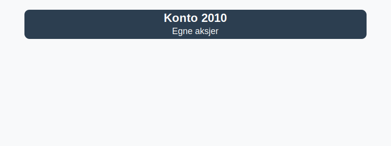

---
title: "Konto 2010 - Egne aksjer"
meta_title: "2010-egne-aksjer"
meta_description: '**Konto 2010 - Egne aksjer** er en konto i Norsk Standard Kontoplan som brukes til å registrere selskapets **egne aksjer** (også kalt **treasury shares**) som...'
slug: 2010-egne-aksjer
type: blog
layout: pages/single
---

**Konto 2010 - Egne aksjer** er en konto i Norsk Standard Kontoplan som brukes til å registrere selskapets **egne aksjer** (også kalt **treasury shares**) som selskapet har kjøpt tilbake.



## Hva er egne aksjer?

*Egne aksjer* er aksjer i selskapet som er kjøpt tilbake og holdes av selskapet selv. Disse aksjene reduserer selskapets registrerte **egenkapital** og kan ikke utbetales utbytte eller stemmes ved generalforsamlingen.

## Lovverk og begrensninger

Det finnes klare regler i **aksjeloven** om kjøp og innehav av egne aksjer:

| Regel                     | Beskrivelse                                                                 |
|---------------------------|-----------------------------------------------------------------------------|
| Maksimal andel            | Maksimalt 10 % av total aksjekapital kan kjøpes tilbake                      |
| Finansieringskrav         | Kjøp skal finansieres av fri egenkapital, jf. aksjeloven §–¯8-7              |
| Formålet med tilbakekjøp  | Skal være i selskapets interesse og godkjennes av generalforsamlingen, jf. aksjeloven §–¯8-8 |
| Salgsalternativ           | Egne aksjer kan videreselges eller slettes, men ikke utbetales utbytte      |

## Regnskapsføring

| Transaksjon               | Debet                           | Kredit                         |
|---------------------------|---------------------------------|--------------------------------|
| Kjøp av egne aksjer       | Konto 2010 - Egne aksjer        | Konto 1920 - Bankinnskudd      |
| Salg av egne aksjer       | Konto 1920 - Bankinnskudd       | Konto 2010 - Egne aksjer       |
| Gevinst ved salg          | Konto 1920 - Bankinnskudd       | Konto 2000 - Aksjekapital      |
| Tap ved salg              | Konto 2000 - Aksjekapital       | Konto 2010 - Egne aksjer       |

## Presentasjon i balansen

>Egne aksjer presenteres som en redusert post under **egenkapital** i [balansen](/blogs/regnskap/hva-er-balanseregnskap "Hva er Balanseregnskap?"), og vises med negativ verdi.

## Eksempel

| Beskrivelse         | Beløp (NOK) |
|---------------------|-------------|
| Kjøp av egne aksjer | 20 000      |
| Salg av egne aksjer | 5 000       |

>Bokføring ved kjøp av egne aksjer:
>
>```plaintext
>Debet: Konto 2010 - Egne aksjer     20 000
>Kredit: Konto 1920 - Bankinnskudd    20 000
>```
>
>Bokføring ved salg av egne aksjer:
>
>```plaintext
>Debet: Konto 1920 - Bankinnskudd      5 000
>Kredit: Konto 2010 - Egne aksjer       5 000
>```

## Relaterte artikler

* [Konto 2000 - Aksjekapital](/blogs/kontoplan/2000-aksjekapital "Konto 2000 - Aksjekapital: Aksjekapital i Norsk Standard Kontoplan")
* [Konto 2020 - Overkursfond](/blogs/kontoplan/2020-overkursfond "Konto 2020 - Overkursfond: Overkursfond i Norsk Standard Kontoplan")
* [Konto 2080 - Udekket tap](/blogs/kontoplan/2080-udekket-tap "Konto 2080 - Udekket tap: Komplett Guide til Udekket tap i Norsk Kontoplan")
* [Konto 1920 - Bankinnskudd](/blogs/kontoplan/1920-bankinnskudd "Konto 1920 - Bankinnskudd: Bankinnskudd i Norsk Standard Kontoplan")
* [Hva er egenkapital?](/blogs/regnskap/hva-er-egenkapital "Hva er Egenkapital? Komplett Guide til Egenkapital i Regnskap")
* [Hva er en Kontoplan?](/blogs/regnskap/hva-er-kontoplan "Hva er en Kontoplan? Komplett Guide til Kontoplaner i Norsk Regnskap")
* [Konto 7730 - Kostnader ved egne aksjer](/blogs/kontoplan/7730-kostnader-ved-egne-aksjer "Konto 7730 - Kostnader ved egne aksjer: Kostnader ved egne aksjer i Norsk Standard Kontoplan")


