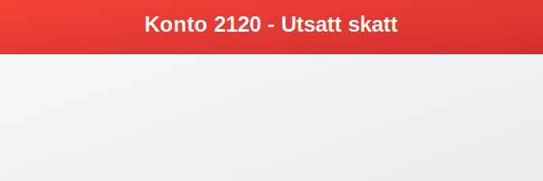

---
title: "Hva er Konto 2120 - Utsatt skatt?"
meta_title: "2120-utsatt-skatt"
meta_description: '**Konto 2120 - Utsatt skatt** er en viktig konto for å registrere **utsatt skatt** – en forpliktelse som oppstår når midlertidige forskjeller mellom regnsk...'
slug: 2120-utsatt-skatt
type: blog
layout: pages/single
---

**Konto 2120 - Utsatt skatt** er en viktig konto for å registrere **utsatt skatt** – en forpliktelse som oppstår når midlertidige forskjeller mellom regnskapsmessige og skattemessige verdier fører til økt fremtidig skatt. Kontoen sikrer korrekt periodisering av skattekostnader i [balansen](/blogs/regnskap/hva-er-balanse "Hva er Balanse?").



## Hva er utsatt skatt?

**Utsatt skatt** (Deferred Tax Liability) representerer en fremtidig skattekostnad knyttet til midlertidige forskjeller som vil reversere over tid.

### Hovedprinsipper

* **Midlertidige forskjeller**: Uoverensstemmelser mellom regnskapsmessig og skattemessig verdi.
* **Fremtidig skattekostnad**: Realiseres når forskjellene reverserer.
* **Periodisering**: Sikrer at skatt kostnadsføres når grunnlaget oppstår.

## Når oppstår utsatt skatt?

### 1. Avskrivningsforskjeller

* Lineær avskrivning i regnskap vs. degressiv saldogruppe i skatt.
* Utskilt avskrivningsgrunnlag som gir midlertidige forskjeller.

### 2. Midlertidige forskjeller i eiendeler og gjeld

* Nedskrivninger av eiendeler som ikke er skattemessig fradragsberettigede.
* Avsetninger som er regnskapsmessig kostnadsført, men ikke skattemessig.


## Kriterier for bestemmelse

For å fastsette utsatt skatt må virksomheten vurdere:

* **Reverserbarhet**: At den midlertidige forskjellen vil vende i fremtiden.
* **Juridisk hjemmel**: At skattemessig grunnlag finnes i gjeldende regelverk.

## Regnskapsføring av utsatt skatt

### Førstegangsregistrering

```
Debet: Konto 7740 - Skatteinntekt
Kredit: Konto 2120 - Utsatt skatt
```

### Reversering av utsatt skatt

```
Debet: Konto 2120 - Utsatt skatt
Kredit: Konto 7750 - Skattekostnad
```


## Beregning av utsatt skatt

**Utsatt skatt = Midlertidig forskjell × Skattesats**

| Post                              | Regnskapsmessig verdi | Skattemessig verdi | Forskjell  | Skattesats | Utsatt skatt |
|-----------------------------------|-----------------------:|-------------------:|-----------:|-----------:|-------------:|
| Avskrivningsforskjell             |             1 000 000  |            500 000 |     500 000| 25 %      |      125 000 |
| Nedskrivning av eiendel           |               200 000  |              0     |     200 000| 25 %      |       50 000 |
| **Total**                         |                        |                     |            |           | **175 000** |

## Presentasjon i regnskapet

Utsatt skatt presenteres som:

* **Langsiktig gjeld**: Når reversering forventes om mer enn 12 måneder.
* **Kortsiktig gjeld**: Når reversering forventes innen 12 måneder.
* **Nettoføring**: Kan nettoføres mot [utsatt skattfordel](/blogs/kontoplan/1070-utsatt-skattfordel "Konto 1070 - Utsatt skattfordel") for samme skattesubjekt.


## Sammenhengen med andre konti

### Relaterte aktivakonti

* [Konto 1070 - Utsatt skattfordel](/blogs/kontoplan/1070-utsatt-skattfordel "Konto 1070 - Utsatt skattfordel")
* [Konto 2500 - Betalbar skatt, ikke utlignet](/blogs/kontoplan/2500-betalbar-skatt-ikke-utlignet "Konto 2500 - Betalbar skatt, ikke utlignet")
* [Konto 2510 - Betalbar skatt, utlignet](/blogs/kontoplan/2510-betalbar-skatt-utlignet "Konto 2510 - Betalbar skatt, utlignet")
* [Konto 2530 - Refusjon skatt etter Skatteloven §31 5. ledd](/blogs/kontoplan/2530-refusjon-skatt-etter-skatteloven-31-5-ledd "Konto 2530 - Refusjon skatt etter Skatteloven §31 5. ledd")
* [Konto 8320 - Utsatt skatt](/blogs/kontoplan/8320-utsatt-skatt "Konto 8320 - Utsatt skatt")
* [Konto 8620 - Utsatt skatt, ekstraordinært resultat](/blogs/kontoplan/8620-utsatt-skatt-ekstraordinart-resultat "Konto 8620 - Utsatt skatt, ekstraordinært resultat")

### Tilhørende resultat- og gjeldskonti

* [Konto 7750 - Skattekostnad](/blogs/kontoplan/7750-skattekostnad "Konto 7750 - Skattekostnad")

## Internasjonale regnskapsstandarder

### IFRS vs. NGAAP

| Område                | IFRS                                 | NGAAP                                   |
|-----------------------|--------------------------------------|-----------------------------------------|
| Klassifisering        | Definert i IAS 12 'Income Taxes'     | Svarende definisjon i norsk GAAP       |
| Vurderingskriterier   | Mer sannsynlig enn ikke (>50 %)      | Sannsynlig realisering                  |
| Tidsramme             | Ingen spesifikk tidsbegrensning      | Innen rimelig tidshorisont              |

## Praktiske tips

* Utfør regelmessige evalueringer av realiserbarhet.
* Dokumenter alle beregninger og forutsetninger.
* Samordn skatte- og regnskapsføring for å minimere feil.

## Sammendrag

Konto 2120 - Utsatt skatt er avgjørende for å vise fremtidige skattekostnader riktig og sikrer et rettvisende bilde av virksomhetens økonomi.

